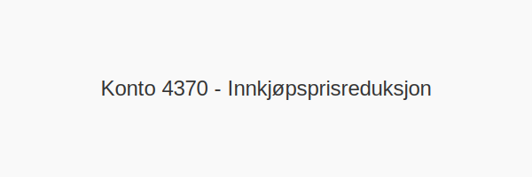

---
title: "Konto 4370 - Innkjøpsprisreduksjon"
meta_title: "4370-innkjopsprisreduksjon"
meta_description: '**Konto 4370 - Innkjøpsprisreduksjon** er en konto i Norsk Standard Kontoplan som brukes til å registrere **prisavslag** fra leverandører på kjøp av varer ...'
slug: 4370-innkjopsprisreduksjon
type: blog
layout: pages/single
---

**Konto 4370 - Innkjøpsprisreduksjon** er en konto i Norsk Standard Kontoplan som brukes til å registrere **prisavslag** fra leverandører på kjøp av varer for videresalg.

## Hva er innkjøpsprisreduksjon?

*Innkjøpsprisreduksjon* omfatter **prisavslag** fra leverandører ved anskaffelser av handelsvarer for videresalg.

| Konto | Beskrivelse               | MVA-sats |
|-------|---------------------------|----------|
| 4370  | Innkjøpsprisreduksjon     | Varierer |

## NÃ¥r skal konto 4370 benyttes?

* Når virksomheten mottar **prisavslag** fra leverandør på kjøp av varer for videresalg.
* Ved korrigering av kostnadsføring for handelsvarer hvor prisjustering påvirker lagerverdi.

## Regnskapsføring

| Transaksjon                             | Debet                                     | Kredit                                       |
|-----------------------------------------|-------------------------------------------|----------------------------------------------|
| Innkjøpsprisreduksjon ekskl. MVA        | Konto 4370 - Innkjøpsprisreduksjon        | Konto 2400 - Leverandørgjeld                 |
| Justering inngående merverdiavgift      | Konto 2400 - Leverandørgjeld              | Konto 1610/1613 - Inngående merverdiavgift    |
| Betaling etter prisreduksjon            | Konto 2400 - Leverandørgjeld              | Konto 1920 - Bankinnskudd                    |

## Eksempel på bokføring

| Beløp ekskl. MVA | MVA (25 %) | Total inkl. MVA |
|------------------|------------|-----------------|
| 1 000 NOK        | 250 NOK    | 1 250 NOK       |

## Intern lenking og relaterte kontoer

* [Konto 4300 - Innkjøp varer for videresalg høy sats](/blogs/kontoplan/4300-innkjop-varer-for-videresalg-hoy-sats "Konto 4300 - Innkjøp varer for videresalg høy sats")
* [Konto 4330 - Innkjøp varer for videresalg middels sats](/blogs/kontoplan/4330-innkjop-varer-for-videresalg-middels-sats "Konto 4330 - Innkjøp varer for videresalg middels sats")
* [Konto 4360 - Frakt, toll og spedisjon](/blogs/kontoplan/4360-frakt-toll-og-spedisjon "Konto 4360 - Frakt, toll og spedisjon")
* [Konto 4500 - Fremmedytelser og underentreprise](/blogs/kontoplan/4500-fremmedytelser-og-underentreprise "Konto 4500 - Fremmedytelser og underentreprise")
* [Konto 2400 - Leverandørgjeld](/blogs/kontoplan/2400-leverandorgjeld "Konto 2400 - Leverandørgjeld")
* [Konto 1920 - Bankinnskudd](/blogs/kontoplan/1920-bankinnskudd "Konto 1920 - Bankinnskudd")
* [Hva er en Kontoplan?](/blogs/regnskap/hva-er-kontoplan "Hva er en Kontoplan? Komplett Guide til Kontoplaner i Norsk Regnskap")

**Korrekt bokføring** av prisavslag ved kjøp av varer for videresalg sikrer riktig kostnads- og lagerhåndtering i regnskapet.

