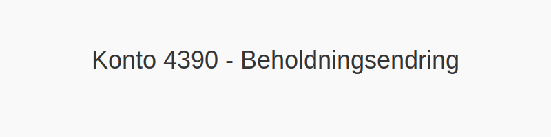

---
title: "Konto 4390 - Beholdningsendring"
meta_title: "4390-beholdningsendring"
meta_description: '**Konto 4390 - Beholdningsendring** er en konto i Norsk Standard Kontoplan som brukes til å registrere **endringer i beholdningen av ferdige varer** i resultat...'
slug: 4390-beholdningsendring
type: blog
layout: pages/single
---

**Konto 4390 - Beholdningsendring** er en konto i Norsk Standard Kontoplan som brukes til å registrere **endringer i beholdningen av ferdige varer** i resultatregnskapet.

## Hva er beholdningsendring for ferdige varer?

*Beholdningsendring* måler forskjellen i verdi mellom beholdningen av ferdige varer ved begynnelsen og slutten av en regnskapsperiode. En nøyaktig håndtering av beholdningsendringen er viktig for å sikre korrekt resultat og god styring av produksjon og salg.

**Formel for beholdningsendring:**

> **Beholdningsendring = Beholdning ved slutten av perioden − Beholdning ved begynnelsen av perioden**

## Regnskapsføring

| Transaksjon            | Debet                                                                                             | Kredit                                   |
|------------------------|---------------------------------------------------------------------------------------------------|------------------------------------------|
| Økning i beholdning    | [Konto 1440 - Ferdige egentilvirkede varer](/blogs/kontoplan/1440-ferdige-egentilvirkede-varer "Konto 1440 - Ferdige egentilvirkede varer") | Konto 4390 - Beholdningsendring         |
| Reduksjon i beholdning | Konto 4390 - Beholdningsendring                                                                 | [Konto 1440 - Ferdige egentilvirkede varer](/blogs/kontoplan/1440-ferdige-egentilvirkede-varer "Konto 1440 - Ferdige egentilvirkede varer") |

## Vurderingsmetoder

Valg av **vurderingsmetode** for ferdige varer påvirker beregningen av beholdningsendringen. De vanligste metodene er:

* **FIFO (First In, First Out)**
* **LIFO (Last In, First Out)**
* **Veiet gjennomsnittskost**

## Praktiske eksempler

1. **Positiv beholdningsendring:** Hvis beholdningen av ferdige varer øker fra 500 000 kr til 580 000 kr, blir beholdningsendringen **+ 80 000 kr**.
2. **Negativ beholdningsendring:** Hvis beholdningen av ferdige varer reduseres fra 600 000 kr til 550 000 kr, blir beholdningsendringen **− 50 000 kr**.

## Praktiske tips

* **Nøyaktige varetellinger:** Utfør regelmessig fysisk telling av ferdige varer.
* **Kontinuerlig avstemming:** Sammenlign regnskapsført beholdning med faktisk beholdning for å avdekke avvik.
* **Rapportering:** Dokumenter endringer tydelig i regnskapssystemet.

## Intern lenking og relaterte kontoer

* [Konto 4090 - Beholdningsendring](/blogs/kontoplan/4090-beholdningsendring "Konto 4090 - Beholdningsendring")
* [Konto 4190 - Beholdningsendring](/blogs/kontoplan/4190-beholdningsendring "Konto 4190 - Beholdningsendring")
* [Konto 4590 - Beholdningsendring](/blogs/kontoplan/4590-beholdningsendring "Konto 4590 - Beholdningsendring")
* [Konto 4990 - Beholdningsendring](/blogs/kontoplan/4990-beholdningsendring "Konto 4990 - Beholdningsendring")
* [Konto 7900 - Beholdningsendring anlegg under utførelse](/blogs/kontoplan/7900-beholdningsendring-anlegg-under-utforelse "Konto 7900 - Beholdningsendring anlegg under utførelse")
* [Konto 7910 - Ukurante varer](/blogs/kontoplan/7910-ukurante-varer "Konto 7910 - Ukurante varer")
* [Hva er Varelager?](/blogs/regnskap/hva-er-varelager "Hva er Varelager? Komplett Guide til Lagerføring og Verdivurdering")
* [Hva er en Kontoplan?](/blogs/regnskap/hva-er-kontoplan "Hva er en Kontoplan? Komplett Guide til Kontoplaner i Norsk Regnskap")

