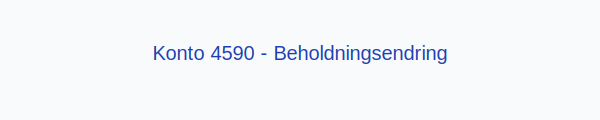
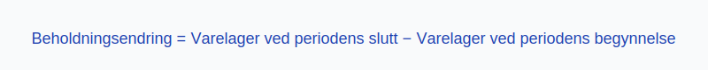

**Konto 4590 - Beholdningsendring** er en konto i Norsk Standard Kontoplan som brukes til å registrere **endringer i varelagerets beholdning** i resultatregnskapet.

## Hva er beholdningsendring?

*Beholdningsendring* (også kalt *lagerendring*) refererer til **differansen** mellom varelagerets verdi ved periodens slutt og ved periodens begynnelse. Dette gir innsikt i **produksjonsnivå** og **salgsvolum** i perioden.

>>> **Beholdningsendring = Varelager ved periodens slutt − Varelager ved periodens begynnelse**

### Formel for beholdningsendring

## Regnskapsføring

| Transaksjon            | Debet                                                                                                                                                    | Kredit                            |
|------------------------|----------------------------------------------------------------------------------------------------------------------------------------------------------|-----------------------------------|
| **Økning i varelager** | [Konto 1400 - Råvarer og innkjøpte halvfabrikater](/blogs/kontoplan/1400-raavarer-og-innkjopte-halvfabrikater "Konto 1400 - Råvarer og innkjøpte halvfabrikater"), [Konto 1420 - Varer under utvikling](/blogs/kontoplan/1420-varer-under-utvikling "Konto 1420 - Varer under utvikling"), [Konto 1440 - Ferdige egentilvirkede varer](/blogs/kontoplan/1440-ferdige-egentilvirkede-varer "Konto 1440 - Ferdige egentilvirkede varer"), [Konto 1460 - Innkjøpte varer for videresalg](/blogs/kontoplan/1460-innkjopte-varer-for-videresalg "Konto 1460 - Innkjøpte varer for videresalg") | Konto 4590 - Beholdningsendring |
| **Reduksjon i varelager**| Konto 4590 - Beholdningsendring                                                                                                                          | [Konto 1400 - Råvarer og innkjøpte halvfabrikater](/blogs/kontoplan/1400-raavarer-og-innkjopte-halvfabrikater "Konto 1400 - Råvarer og innkjøpte halvfabrikater"), [Konto 1420 - Varer under utvikling](/blogs/kontoplan/1420-varer-under-utvikling "Konto 1420 - Varer under utvikling"), [Konto 1440 - Ferdige egentilvirkede varer](/blogs/kontoplan/1440-ferdige-egentilvirkede-varer "Konto 1440 - Ferdige egentilvirkede varer"), [Konto 1460 - Innkjøpte varer for videresalg](/blogs/kontoplan/1460-innkjopte-varer-for-videresalg "Konto 1460 - Innkjøpte varer for videresalg") |

## Vurderingsmetoder for varelager

Valg av **vurderingsmetode** påvirker periodens beholdningsendring. De vanligste metodene er:

* **FIFO (First In, First Out)**
* **LIFO (Last In, First Out)**
* **Veiet gjennomsnittskost**

For mer om lagervurdering, se [Hva er Varelager?](/blogs/regnskap/hva-er-varelager "Hva er Varelager? Komplett Guide til Lagerføring og Verdivurdering").

## Eksempler på beholdningsendring

1. **Positiv beholdningsendring:** Varelageret øker fra **kr 100 000** til **kr 120 000**, noe som gir **+ kr 20 000**.
2. **Negativ beholdningsendring:** Varelageret reduseres fra **kr 150 000** til **kr 130 000**, noe som gir **− kr 20 000**.

## Praktiske tips

* **Dokumentasjon:** Sørg for nøyaktige varetellinger og konsistent verdivurdering ved periodens slutt.
* **Sikkerhetslager:** Ha et bufferlager for å unngå produksjonsstans ved uventet etterspørselsøkning.
* **Avstemming:** Sammenlign regnskapsført beholdning med fysisk telling jevnlig for å avdekke avvik.

## Vanlige feil ved regnskapsføring

* Manglende periodisering av beholdningsendringer.
* Feil vurderingsmetode som gir unøyaktig resultat.
* Utilstrekkelig dokumentasjon av varetellinger.

## Intern lenking og relaterte kontoer

* [Konto 1400 - Råvarer og innkjøpte halvfabrikater](/blogs/kontoplan/1400-raavarer-og-innkjopte-halvfabrikater "Konto 1400 - Råvarer og innkjøpte halvfabrikater")
* [Konto 1420 - Varer under utvikling](/blogs/kontoplan/1420-varer-under-utvikling "Konto 1420 - Varer under utvikling")
* [Konto 1440 - Ferdige egentilvirkede varer](/blogs/kontoplan/1440-ferdige-egentilvirkede-varer "Konto 1440 - Ferdige egentilvirkede varer")
* [Konto 1460 - Innkjøpte varer for videresalg](/blogs/kontoplan/1460-innkjopte-varer-for-videresalg "Konto 1460 - Innkjøpte varer for videresalg")
* [Hva er Varelager?](/blogs/regnskap/hva-er-varelager "Hva er Varelager? Komplett Guide til Lagerføring og Verdivurdering")
* [Hva er en Kontoplan?](/blogs/regnskap/hva-er-kontoplan "Hva er en Kontoplan? Komplett Guide til Kontoplaner i Norsk Regnskap")
* [Konto 4090 - Beholdningsendring](/blogs/kontoplan/4090-beholdningsendring "Konto 4090 - Beholdningsendring")
* [Konto 4190 - Beholdningsendring](/blogs/kontoplan/4190-beholdningsendring "Konto 4190 - Beholdningsendring")
* [Konto 4290 - Beholdningsendring](/blogs/kontoplan/4290-beholdningsendring "Konto 4290 - Beholdningsendring")
* [Konto 4390 - Beholdningsendring](/blogs/kontoplan/4390-beholdningsendring "Konto 4390 - Beholdningsendring")
* [Konto 4990 - Beholdningsendring](/blogs/kontoplan/4990-beholdningsendring "Konto 4990 - Beholdningsendring")
* [Konto 7900 - Beholdningsendring anlegg under utførelse](/blogs/kontoplan/7900-beholdningsendring-anlegg-under-utforelse "Konto 7900 - Beholdningsendring anlegg under utførelse")
* [Konto 7910 - Ukurante varer](/blogs/kontoplan/7910-ukurante-varer "Konto 7910 - Ukurante varer")

**Korrekt håndtering** av beholdningsendringer sikrer et nøyaktig resultatregnskap og gir bedre innsikt i produksjon og lagerstyring.
