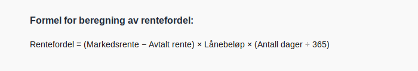

---
title: "Konto 5240 - Rentefordel"
seoTitle: "5240-rentefordel"
description: '**Konto 5240 - Rentefordel** er en konto i **Norsk Standard Kontoplan (NS 4102)** som brukes til å registrere **rentefordel** som **ansattgode**.'
---

**Konto 5240 - Rentefordel** er en konto i **Norsk Standard Kontoplan (NS 4102)** som brukes til å registrere **rentefordel** som **ansattgode**.

## Hva er rentefordel?

* **Rentefordel** oppstår når arbeidsgiver tilbyr lån til under markedsrente, og den økonomiske fordelen for arbeidstaker utgjør et **beskatningsbart ansattgode**.
* Differansen mellom **markedsrente** og avtalt rente multiplisert med **lånebeløp** og **antall dager** utgjør fordelen.
* Kostnaden belastes bedriften som en del av **lønnskostnader**.

## Nøkkelfunksjoner

| Egenskap      | Beskrivelse                                           |
|---------------|-------------------------------------------------------|
| Kontonummer   | 5240                                                  |
| Konto         | Rentefordel                                           |
| Kontotype     | Lønnskostnad / personal                               |
| Formål        | Registrere rentefordel som ansattgode                 |

## Beregning av rentefordel

Formelen for rentefordel beregnes slik:

> **Rentefordel** = (Markedsrente − Avtalt rente) × Lånebeløp × (Antall dager ÷ 365)

## Bokføring av rentefordel

| Transaksjon               | Debet                         | Kredit                        |
|---------------------------|-------------------------------|-------------------------------|
| Verdi av rentefordel      | Konto 5240 - Rentefordel      | Konto 2930 - Lønn             |
| Utbetaling av rente       | Konto 1920 - Bankinnskudd     | Konto 5240 - Rentefordel      |

## Eksempel på bokføring

En arbeidstaker får lån på 100–¯000 NOK til avtalt rente 1–¯% når markedsrenten er 5–¯%, over 180 dager:

| Beskrivelse                        | Debet (NOK) | Kredit (NOK) |
|------------------------------------|-----------:|-------------:|
| Verdi av rentefordel               |       6–¯575 |              |
| Utbetaling av rentekostnad (1–¯%)   |            |        1–¯000 |
| Periodisert rentefordel (resten)   |       5–¯575 |              |

## Praktiske hensyn

* **Dokumentasjon:** Sørg for dokumentasjon av låneavtale, rentevilkår og markedsrente.
* **Skatt:** Rentefordel er et **beskatningsbart** ansattgode og må rapporteres til **Skatteetaten**.
* **Periodisering:** Fordel fordelen korrekt over låneperioden.
* **Avtalevilkår:** Etabler klare retningslinjer for rentebetingelser på interne lån.

## Intern lenking og relaterte kontoer

* [Konto 5200 - Fri bil](/blogs/kontoplan/5200-fri-bil "Konto 5200 - Fri bil: Regnskapsføring av firmabil som ansattgode i Norsk kontoplan")
* [Konto 5210 - Fri telefon](/blogs/kontoplan/5210-fri-telefon "Konto 5210 - Fri telefon: Regnskapsføring av fri telefon som ansattgode i Norsk kontoplan")
* [Konto 5220 - Fri avis](/blogs/kontoplan/5220-fri-avis "Konto 5220 - Fri avis: Regnskapsføring av fri avis som ansattgode i Norsk kontoplan")
* [Konto 5230 - Fri losji og bolig](/blogs/kontoplan/5230-fri-losji-og-bolig "Konto 5230 - Fri losji og bolig: Regnskapsføring av fri losji og bolig som ansattgode i Norsk kontoplan")
* [Konto 5280 - Annen fordel i arbeidsforhold](/blogs/kontoplan/5280-annen-fordel-i-arbeidsforhold "Konto 5280 - Annen fordel i arbeidsforhold: Regnskapsføring av øvrige ansattfordeler i Norsk kontoplan")
* [Konto 5290 - Motkonto for gruppe 52](/blogs/kontoplan/5290-motkonto-for-gruppe-52 "Konto 5290 - Motkonto for gruppe 52: Regnskapsføring av motkonto for gruppe 52 ansattgoder i Norsk kontoplan")
* [Konto 5910 - Kantinekostnader](/blogs/kontoplan/5910-kantinekostnader "Konto 5910 - Kantinekostnader")
* [Konto 2930 - Lønn](/blogs/kontoplan/2930-lonn "Konto 2930 - Lønn")
* [Konto 5300 - Tantieme](/blogs/kontoplan/5300-tantieme "Konto 5300 - Tantieme: Bokføring av resultatbasert godtgjørelse i Norsk kontoplan")
* [Hva er en Kontoplan?](/blogs/regnskap/hva-er-kontoplan "Hva er en Kontoplan? Komplett Guide til Kontoplaner i Norsk Regnskap")

**Konto 5240 - Rentefordel** gir en standardisert måte å synliggjøre rentefordel som et **ansattgode** i regnskapet.

