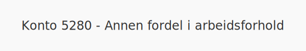

---
title: "Konto 5280 - Annen fordel i arbeidsforhold"
seoTitle: "Konto 5280 | Annen fordel i arbeidsforhold | Kontoplan"
description: "Konto 5280 brukes i Norsk Standard Kontoplan for å registrere øvrige fordeler i arbeidsforhold som ansattgoder. Her inngår personalrabatter, naturalytelser og andre skattepliktige fordeler."
summary: "Oversikt over Konto 5280 med eksempler, skatt og bokføring av andre fordeler i arbeidsforhold."
---

**Konto 5280 - Annen fordel i arbeidsforhold** er en konto i **Norsk Standard Kontoplan (NS 4102)** som brukes til å registrere **øvrige fordeler** som **ansattgoder**.

## Hva er andre fordeler i arbeidsforhold?

*Med *annen fordel i arbeidsforhold* menes enhver økonomisk fordel som arbeidstaker mottar utenom vanlig lønn, og som medfører et **beskatningsbart ansattgode**.*

Eksempler inkluderer blant annet:

| Type fordel                   | Beskrivelse                              |
|-------------------------------|------------------------------------------|
| Personalrabatt                | Rabatt på varer eller tjenester          |
| Kost og losji                 | Fri måltider eller dekning av måltider   |
| Trening og velvære            | Dekning av treningsavgifter              |
| Mobiltelefon og abonnement    | Dekning av telefonkostnader              |

## Nøkkelfunksjoner

| Egenskap     | Beskrivelse                                     |
|--------------|-------------------------------------------------|
| Kontonummer  | 5280                                            |
| Konto        | Annen fordel i arbeidsforhold                   |
| Kontotype    | Lønnskostnad / personal                         |
| Formål       | Registrere andre fordeler som ansattgoder       |

## Bokføring av ansattfordel

| Transaksjon            | Debet                       | Kredit                      |
|------------------------|-----------------------------|-----------------------------|
| Verdi av ansattfordel  | Konto 5280 - Annen fordel   | Konto 2930 - Lønn           |
| Utbetaling/refusjon    | Konto 1920 - Bankinnskudd   | Konto 5280 - Annen fordel   |

## Eksempel på bokføring

En ansatt får en personalrabatt på 2–¯000 NOK:

| Beskrivelse                    | Debet (NOK) | Kredit (NOK) |
|--------------------------------|-----------:|-------------:|
| Verdi av personalrabatt        |       2–¯000 |              |
| Utbetaling av kostnad          |            |        2–¯000 |

## Praktiske hensyn

* **Dokumentasjon:** Sørg for dokumentasjon av avtaler, fakturaer og beregningsgrunnlag.
* **Skatt:** Andre fordeler er et **beskatningsbart** ansattgode som skal rapporteres til **Skatteetaten**.
* **Retningslinjer:** Etabler klare interne retningslinjer for omfanget av ansattfordeler.
* **Periodisering:** Fordel fordelen korrekt over den aktuelle perioden.

## Intern lenking og relaterte kontoer

* [Konto 5200 - Fri bil](/blogs/kontoplan/5200-fri-bil "Konto 5200 - Fri bil: Regnskapsføring av firmabil som ansattgode i Norsk kontoplan")
* [Konto 5210 - Fri telefon](/blogs/kontoplan/5210-fri-telefon "Konto 5210 - Fri telefon: Regnskapsføring av fri telefon som ansattgode i Norsk kontoplan")
* [Konto 5220 - Fri avis](/blogs/kontoplan/5220-fri-avis "Konto 5220 - Fri avis: Regnskapsføring av fri avis som ansattgode i Norsk kontoplan")
* [Konto 5230 - Fri losji og bolig](/blogs/kontoplan/5230-fri-losji-og-bolig "Konto 5230 - Fri losji og bolig: Regnskapsføring av fri losji og bolig som ansattgode i Norsk kontoplan")
* [Konto 5240 - Rentefordel](/blogs/kontoplan/5240-rentefordel "Konto 5240 - Rentefordel: Regnskapsføring av rentefordel som ansattgode i Norsk kontoplan")
* [Konto 5290 - Motkonto for gruppe 52](/blogs/kontoplan/5290-motkonto-for-gruppe-52 "Konto 5290 - Motkonto for gruppe 52: Regnskapsføring av motkonto for gruppe 52 ansattgoder i Norsk kontoplan")
* [Konto 5900 - Gaver til ansatte](/blogs/kontoplan/5900-gaver-til-ansatte "Konto 5900 - Gaver til ansatte")
* [Konto 5910 - Kantinekostnader](/blogs/kontoplan/5910-kantinekostnader "Konto 5910 - Kantinekostnader")
* [Konto 5920 - Yrkesskadeforsikring](/blogs/kontoplan/5920-yrkesskadeforsikring "Konto 5920 - Yrkesskadeforsikring")
* [Konto 5930 - Andre forsikringer](/blogs/kontoplan/5930-andre-forsikringer "Konto 5930 - Andre forsikringer")
* [Konto 2930 - Lønn](/blogs/kontoplan/2930-lonn "Konto 2930 - Lønn")
* [Hva er en Kontoplan?](/blogs/regnskap/hva-er-kontoplan "Hva er en Kontoplan? Komplett Guide til Kontoplaner i Norsk Regnskap")

**Konto 5280 - Annen fordel i arbeidsforhold** gjør det enkelt å synliggjøre andre **ansattfordeler** i regnskapet.

