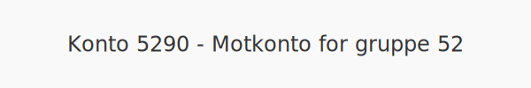

---
title: "Konto 5290 - Motkonto for gruppe 52"
seoTitle: "5290-motkonto-for-gruppe-52"
meta_description: '**Konto 5290 - Motkonto for gruppe 52** er en konto i **Norsk Standard Kontoplan (NS 4102)** som fungerer som **motkonto** for alle transaksjoner i gruppe 52 ...'
slug: 5290-motkonto-for-gruppe-52
type: blog
layout: pages/single
---

**Konto 5290 - Motkonto for gruppe 52** er en konto i **Norsk Standard Kontoplan (NS 4102)** som fungerer som **motkonto** for alle transaksjoner i gruppe 52 (ansattgoder).

## Hva er motkonto for gruppe 52?

*En *motkonto for gruppe 52* brukes til å balansere og avstemme transaksjoner som registreres på kontoene i gruppe 52 (ansattgoder).*
Motkontoen sørger for at alle fordelstransaksjoner får en egen postering som gjør det enklere å kontrollere og avstemme regnskapet.

## Nøkkelfunksjoner

| Egenskap     | Beskrivelse                                          |
|--------------|------------------------------------------------------|
| Kontonummer  | 5290                                                 |
| Konto        | Motkonto for gruppe 52                               |
| Kontotype    | Motkonto / ansattgoder                               |
| Formål       | Avstemme poster på kontoer i gruppe 52               |

## Når bør du bruke konto 5290?

* Når du registrerer fordeler i gruppe 52, som fri bil eller rentefordel, og ønsker å avstemme disse posteringene samlet.
* For å skille mellom individuelle ansattgoder (kontoene i gruppe 52) og samlede avstemmingsposter.
* Ved periodiske avstemminger for å sikre at totalverdien av ansattgoder er korrekt.

## Bokføringseksempler

| Transaksjon                                | Debet                            | Kredit                          |
|--------------------------------------------|----------------------------------|---------------------------------|
| Registrering av ansattgode (f.eks. fri bil)| Konto 5200 - Fri bil             | Konto 5290 - Motkonto           |
| Utbetaling/refusjon av ansattgode          | Konto 5290 - Motkonto            | Konto 1920 - Bankinnskudd       |

### Eksempel på tall

En ansatt får fri telefon til en total verdi på 1–¯000 NOK:

| Beskrivelse                  | Debet (NOK) | Kredit (NOK) |
|------------------------------|-----------:|-------------:|
| Verdi av fri telefon         |       1–¯000 |              |
| Utbetaling/refusjon          |            |        1–¯000 |

## Praktiske hensyn

* **Dokumentasjon:** Oppbevar dokumentasjon for alle ansattgoder som bokføres, inkludert avtaler og fakturaer.
* **Avstemming:** Bruk konto 5290 for å avstemme at totalverdien av gruppe 52 samsvarer med individuelle kontoer.
* **Rapportering:** Sørg for at motposteringer er synlige for revisjon og interne kontroller.
* **Periodisering:** Verifiser at periodeinndelingen er korrekt for ansattgodene.

## Intern lenking og relaterte kontoer

* [Konto 5200 - Fri bil](/blogs/kontoplan/5200-fri-bil "Konto 5200 - Fri bil: Regnskapsføring av firmabil som ansattgode i Norsk kontoplan")
* [Konto 5210 - Fri telefon](/blogs/kontoplan/5210-fri-telefon "Konto 5210 - Fri telefon: Regnskapsføring av fri telefon som ansattgode i Norsk kontoplan")
* [Konto 5220 - Fri avis](/blogs/kontoplan/5220-fri-avis "Konto 5220 - Fri avis: Regnskapsføring av fri avis som ansattgode i Norsk kontoplan")
* [Konto 5230 - Fri losji og bolig](/blogs/kontoplan/5230-fri-losji-og-bolig "Konto 5230 - Fri losji og bolig: Regnskapsføring av fri losji og bolig som ansattgode i Norsk kontoplan")
* [Konto 5240 - Rentefordel](/blogs/kontoplan/5240-rentefordel "Konto 5240 - Rentefordel: Regnskapsføring av rentefordel som ansattgode i Norsk kontoplan")
* [Konto 5280 - Annen fordel i arbeidsforhold](/blogs/kontoplan/5280-annen-fordel-i-arbeidsforhold "Konto 5280 - Annen fordel i arbeidsforhold: Regnskapsføring av øvrige ansattfordeler i Norsk kontoplan")
* [Konto 5290 - Motkonto for gruppe 52](/blogs/kontoplan/5290-motkonto-for-gruppe-52 "Konto 5290 - Motkonto for gruppe 52: Regnskapsføring av motkonto for gruppe 52 ansattgoder i Norsk kontoplan")
* [Konto 2930 - Lønn](/blogs/kontoplan/2930-lonn "Konto 2930 - Lønn")
* [Hva er en Kontoplan?](/blogs/regnskap/hva-er-kontoplan "Hva er en Kontoplan? Komplett Guide til Kontoplaner i Norsk Regnskap")

**Konto 5290 - Motkonto for gruppe 52** gir en enkel metode for å avstemme og kontrollere alle ansattgoder under gruppe 52 i regnskapet.

