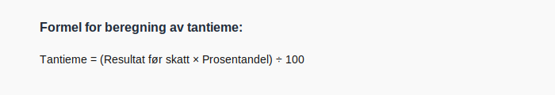

---
title: "Konto 5300 - Tantieme"
seoTitle: "5300-tantieme"
description: '**Konto 5300 - Tantieme** er en konto i **Norsk Standard Kontoplan (NS 4102)** som brukes til å registrere **tantieme** eller resultatbasert godtgjørelse til...'
---

**Konto 5300 - Tantieme** er en konto i **Norsk Standard Kontoplan (NS 4102)** som brukes til å registrere **tantieme** eller resultatbasert godtgjørelse til ledelse og styremedlemmer.

## Hva er Tantieme?

* **Tantieme** er en resultatavhengig godtgjørelse som ofte utbetales til ledende ansatte eller styremedlemmer basert på selskapets **årlige resultat**.
* Tantieme fastsettes som en **prosentandel** av overskuddet eller som et **fastsatt beløp** for oppnådde mål.
* Tantieme regnes som en **lønnsrelatert kostnad** og bokføres på konto 5300.

## Nøkkelfunksjoner

| Egenskap      | Beskrivelse                                                        |
|---------------|--------------------------------------------------------------------|
| Kontonummer   | 5300                                                               |
| Konto         | Tantieme                                                           |
| Kontotype     | Lønnskostnad / personal                                            |
| Formål        | Registrere resultatbasert godtgjørelse (tantieme) til ansatte      |

## Beregning av Tantieme

Formelen for tantieme beregnes slik:

> **Tantieme** = (Resultat før skatt × Prosentandel) ÷ 100

## Bokføring av Tantieme

| Transaksjon               | Debet                    | Kredit                      |
|---------------------------|--------------------------|-----------------------------|
| Verdi av tantieme         | Konto 5300 - Tantieme    | Konto 2930 - Lønn           |
| Utbetaling av tantieme    | Konto 2930 - Lønn        | Konto 1920 - Bankinnskudd   |

## Eksempel på bokføring

| Beskrivelse                              | Debet (NOK) | Kredit (NOK) |
|------------------------------------------|-----------:|-------------:|
| Verdi av tantieme (5 % av 1 000 000 NOK) |      50–¯000 |              |
| Utbetaling av tantieme                  |            |       50–¯000 |

## Praktiske hensyn

* **Avtalevilkår:** Tantieme må være klart definert i arbeids- eller styreavtaler med angitt beregningsgrunnlag og prosentandel.
* **Skatt og sosiale ytelser:** Tantieme regnes som **lønnsinntekt** og er gjenstand for **skattetrekk** og **arbeidsgiveravgift**.
* **Periodisering:** Periodiser kostnaden for det aktuelle regnskapsåret selv om utbetaling skjer i påfølgende år.
* **Dokumentasjon:** Dokumenter beregningsgrunnlag, styrets vedtak og eventuelle godkjennelser.

## Intern lenking og relaterte kontoer

* [Konto 2930 - Lønn](/blogs/kontoplan/2930-lonn "Konto 2930 - Lønn")
* [Konto 1920 - Bankinnskudd](/blogs/kontoplan/1920-bankinnskudd "Konto 1920 - Bankinnskudd")
* [Konto 5000 - Lønn til ansatte](/blogs/kontoplan/5000-lonn-til-ansatte "Konto 5000 - Lønn til ansatte: Bokføring og håndtering av lønnskostnader i Norsk kontoplan")
* [Konto 5200 - Fri bil](/blogs/kontoplan/5200-fri-bil "Konto 5200 - Fri bil: Regnskapsføring av firmabil som ansattgode i Norsk kontoplan")
* [Konto 5240 - Rentefordel](/blogs/kontoplan/5240-rentefordel "Konto 5240 - Rentefordel: Regnskapsføring av rentefordel som ansattgode i Norsk kontoplan")
* [Konto 5330 - Godtgjørelse til styre- og bedriftsforsamling](/blogs/kontoplan/5330-godtgjorelse-til-styre-og-bedriftsforsamling "Konto 5330 - Godtgjørelse til styre- og bedriftsforsamling: Bokføring av styrehonorar i Norsk kontoplan")
* [Hva er en Kontoplan?](/blogs/regnskap/hva-er-kontoplan "Hva er en Kontoplan? Komplett Guide til Kontoplaner i Norsk Regnskap")

**Konto 5300 - Tantieme** gir en standardisert måte å bokføre resultatbaserte godtgjørelser i regnskapet.

