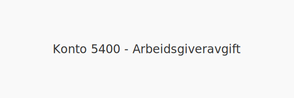
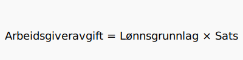

---
title: "Konto 5400 - Arbeidsgiveravgift"
seoTitle: "5400-arbeidsgiveravgift"
description: '**Konto 5400 - Arbeidsgiveravgift** er en lovpålagt avgift som arbeidsgivere betaler til folketrygden basert på [lønn](/blogs/kontoplan/2930-lonn Konto 2930...'
---

**Konto 5400 - Arbeidsgiveravgift** er en lovpålagt avgift som arbeidsgivere betaler til folketrygden basert på [lønn](/blogs/kontoplan/2930-lonn "Konto 2930 - Lønn"), pensjoner og naturalytelser.



## Hva er arbeidsgiveravgift?

*Arbeidsgiveravgift* finansierer folketrygden og beregnes av lønnsgrunnlag, pensjoner og naturalytelser. Avgiften er hjemlet i folketrygdloven og skal dekke fremtidige utgifter til blant annet sykepenger, alderspensjon og andre offentlige ytelser.

## Satser og beregning

| Geografisk sone                     | Arbeidsgiveravgiftssats |
|-------------------------------------|-------------------------|
| Sone 1 (Oslo og Akershus)           | 14,1–¯%                  |
| Sone 2                              | 10,6–¯%                  |
| Sone 3                              | 6,4–¯%                   |
| Sone 4                              | 5,1–¯%                   |
| Sone 5                              | 0–¯%                     |
| Sone 6                              | 0–¯%                     |



Formelen for å beregne arbeidsgiveravgift er:

```text
Arbeidsgiveravgift = Lønnsgrunnlag × Sats
```

## Regnskapsføring av arbeidsgiveravgift

| Transaksjon                          | Debet                                    | Kredit                         |
|--------------------------------------|------------------------------------------|--------------------------------|
| Beregning av arbeidsgiveravgift      | Konto 5400 - Arbeidsgiveravgift          | [Konto 2770 - Skyldig arbeidsgiveravgift](/blogs/kontoplan/2770-skyldig-arbeidsgiveravgift "Konto 2770 - Skyldig arbeidsgiveravgift") |
| Betaling til myndighetene            | [Konto 2770 - Skyldig arbeidsgiveravgift](/blogs/kontoplan/2770-skyldig-arbeidsgiveravgift "Konto 2770 - Skyldig arbeidsgiveravgift") | Konto 1920 - Bankinnskudd     |

## Eksempel på føring

En bedrift har lønnskostnad på 200–¯000–¯NOK ekskl. arbeidsgiveravgift (14,1–¯%).

```text
Debet: Konto 5400 - Arbeidsgiveravgift          28–¯200–¯NOK
Kredit: Konto 2770 - Skyldig arbeidsgiveravgift 28–¯200–¯NOK
```

## Intern lenking og relaterte kontoer

* [Konto 2770 - Skyldig arbeidsgiveravgift](/blogs/kontoplan/2770-skyldig-arbeidsgiveravgift "Konto 2770 - Skyldig arbeidsgiveravgift")
* [Konto 2780 - Påløpt arbeidsgiveravgift](/blogs/kontoplan/2780-palopte-arbeidsgiveravgift "Konto 2780 - Påløpt arbeidsgiveravgift")
* [Konto 2930 - Lønn](/blogs/kontoplan/2930-lonn "Konto 2930 - Lønn")
* [Konto 5420 - Innberetningspliktig pensjonskostnad](/blogs/kontoplan/5420-innberetningspliktig-pensjonskostnad "Konto 5420 - Innberetningspliktig pensjonskostnad: Innberetningspliktig pensjonskostnad i Norsk Kontoplan")
* [Hva er en Kontoplan?](/blogs/regnskap/hva-er-kontoplan "Hva er en Kontoplan? Komplett Guide til Kontoplaner i Norsk Regnskap")
* [Konto 5820 - Refusjon av arbeidsgiveravgift](/blogs/kontoplan/5820-refusjon-av-arbeidsgiveravgift "Konto 5820 - Refusjon av arbeidsgiveravgift")
* [Hva er en Faktura?](/blogs/regnskap/hva-er-en-faktura "Hva er en Faktura? En Guide til Norske Fakturakrav")


