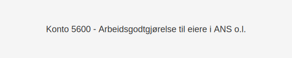

---
title: "5600-arbeidsgodtgjorelse-til-eiere-i-ans"
meta_title: "5600-arbeidsgodtgjorelse-til-eiere-i-ans"
meta_description: "**Konto 5600 - Arbeidsgodtgjørelse til eiere i ANS o.l.** er en konto i **Norsk Standard Kontoplan (NS 4102)** som benyttes for Ã¥ registrere **arbeidsgodtgjÃ..."
slug: 5600-arbeidsgodtgjorelse-til-eiere-i-ans
type: blog
layout: pages/single
---

**Konto 5600 - Arbeidsgodtgjørelse til eiere i ANS o.l.** er en konto i **Norsk Standard Kontoplan (NS 4102)** som benyttes for å registrere **arbeidsgodtgjørelse** som utbetales til **eiere** i ansvarlige selskaper (ANS) og lignende selskapsformer.

## Hva er arbeidsgodtgjørelse til eiere i ANS o.l.?

Arbeidsgodtgjørelse til eiere i ANS o.l. refererer til kompensasjon som utbetales til deltakere i ansvarlige selskaper for utført arbeid og tjenester. Denne godtgjørelsen skiller seg fra **lønnsføring** på kontoene 5000–5090, da den reflekterer eiernes egenrisiko og personlige ansvar.

## NÃ¥r bruker man konto 5600?

Konto 5600 brukes i følgende situasjoner:

* Når eiere i ANS yter **arbeidstjenester** og skal kompenseres separat fra lønn til ansatte.
* Når selskapet ønsker å **tydeliggjøre** eierkompensasjon adskilt fra vanlig lønn.
* Ved rapportering og avstemming av eiergodtgjørelse i balansen.

## Regnskapsføring av arbeidsgodtgjørelse

| Transaksjon                              | Debet                                                       | Kredit                           |
|------------------------------------------|-------------------------------------------------------------|---------------------------------|
| Påløpt arbeidsgodtgjørelse til eiere     | Konto 5600 - Arbeidsgodtgjørelse til eiere i ANS o.l.       | Konto 2910 - Gjeld til ansatte og eiere |
| Utbetaling til eiere                     | Konto 2910 - Gjeld til ansatte og eiere                     | Konto 1920 - Bankinnskudd       |

## Eksempel på bokføring

En ANS fordeler 100 000 NOK i arbeidsgodtgjørelse til eierne ved årsslutt:

| Beskrivelse                          | Debet (NOK) | Kredit (NOK) |
|--------------------------------------|-----------:|-------------:|
| Påløpt arbeidsgodtgjørelse til eiere |     100 000 |              |
| Utbetaling til eiere                 |            |     100 000 |

## Vurderinger og dokumentasjonskrav

| Vurdering           | Beskrivelse                                                                                  |
|---------------------|----------------------------------------------------------------------------------------------|
| Skatt               | Arbeidsgodtgjørelsen er **beskatningsbar** hos deltakerne                                    |
| Arbeidsgiveravgift  | Se [Konto 5400 - Arbeidsgiveravgift](/blogs/kontoplan/5400-arbeidsgiveravgift "Konto 5400 - Arbeidsgiveravgift")           |
| Dokumentasjon       | Avtale eller generalforsamlingsvedtak må dokumenteres                                       |
| Ansvar og risiko    | Eiernes personlige ansvar i ANS påvirker godtgjørelsens behandling                            |

## Intern lenking og relaterte kontoer

* [Konto 5000 - Lønn til ansatte](/blogs/kontoplan/5000-lonn-til-ansatte "Konto 5000 - Lønn til ansatte")
* [Konto 5500 - Annen kostnadsgodtgjørelse](/blogs/kontoplan/5500-annen-kostnadsgodtgjorelse "Konto 5500 - Annen kostnadsgodtgjørelse")
* [Ansvarlig Selskap (ANS)](/blogs/regnskap/ansvarlig-selskap "Ansvarlig Selskap (ANS): Komplett Guide til Norsk Regnskap og Ansvarsstruktur")
* [Hva er en Kontoplan?](/blogs/regnskap/hva-er-kontoplan "Hva er en Kontoplan? Komplett Guide til Kontoplaner i Norsk Regnskap")

## Oppsummering

**Konto 5600 - Arbeidsgodtgjørelse til eiere i ANS o.l.** gir et klart skille mellom eierkompensasjon og ordinær lønn. Ved å forstå regnskapsføring, vurderinger og dokumentasjonskrav kan ansvarlige selskaper sikre korrekt rapportering og kontroll.
