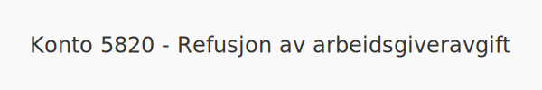

**Konto 5820 - Refusjon av arbeidsgiveravgift** er en konto i **Norsk Standard Kontoplan (NS 4102)** som brukes til å registrere **refusjon av arbeidsgiveravgift** fra myndighetene som en reduksjon av arbeidsgiveravgiftskostnader.

## Hva er refusjon av arbeidsgiveravgift?

*Refusjon av arbeidsgiveravgift* er tilbakebetaling fra myndighetene for arbeidsgiveravgift som er betalt inn, for eksempel ved overskudd eller korrigerte avgiftsgrunnlag. Dette kan oppstå når faktisk lønnsgrunnlag avviker fra tidligere innbetalinger.

## Nøkkelfunksjoner

| Egenskap      | Beskrivelse                                                       |
|---------------|-------------------------------------------------------------------|
| Kontonummer   | 5820                                                              |
| Konto         | Refusjon av arbeidsgiveravgift                                    |
| Kontotype     | Reduksjon av arbeidsgiveravgiftskostnader                         |
| Formål        | Registrere refusjon av arbeidsgiveravgift fra det offentlige      |

## Når bruker man konto 5820?

* Ved mottak av refusjon av arbeidsgiveravgift etter lavere faktiske avgiftskostnader
* Når arbeidsgiver har fått overskuddsrefusjon for tidligere innbetalt avgift
* Ved periodisering av refusjon av arbeidsgiveravgift i regnskapet

## Regnskapsføring

| Transaksjon                           | Debet                           | Kredit                          |
|---------------------------------------|---------------------------------|---------------------------------|
| Mottatt refusjon av arbeidsgiveravgift| Konto 1920 - Bankinnskudd       | Konto 5820 - Refusjon av arbeidsgiveravgift |

## Eksempel på bokføring

En virksomhet mottar en refusjon på 5 000 NOK for arbeidsgiveravgift:

| Beskrivelse                            | Debet (NOK) | Kredit (NOK) |
|----------------------------------------|------------:|-------------:|
| Mottatt refusjon av arbeidsgiveravgift |      5 000  |              |
| Konto 5820 - Refusjon av arbeidsgiveravgift |             |      5 000  |

## Praktiske hensyn

* **Dokumentasjon:** Oppbevar varsel om refusjon fra myndighetene og beregningsgrunnlaget
* **Avstem mot forpliktelser:** Kontroller at refusjon stemmer med innbetalt arbeidsgiveravgift
* **Sammenstilling:** Bruk konto 5820 sammen med konto 5400 - Arbeidsgiveravgift og konto 2770 - Skyldig arbeidsgiveravgift

## Intern lenking og relaterte kontoer

Andre kontoer i NS 4102 som ofte brukes sammen med konto 5820:

* [Konto 5400 - Arbeidsgiveravgift](/blogs/kontoplan/5400-arbeidsgiveravgift "Konto 5400 - Arbeidsgiveravgift")
* [Konto 2770 - Skyldig arbeidsgiveravgift](/blogs/kontoplan/2770-skyldig-arbeidsgiveravgift "Konto 2770 - Skyldig arbeidsgiveravgift")
* [Konto 2780 - Påløpt arbeidsgiveravgift](/blogs/kontoplan/2780-palopte-arbeidsgiveravgift "Konto 2780 - Påløpt arbeidsgiveravgift")
* [Hva er en Kontoplan?](/blogs/regnskap/hva-er-kontoplan "Hva er en Kontoplan? Komplett Guide til Kontoplaner i Norsk Regnskap")

**Konto 5820 - Refusjon av arbeidsgiveravgift** hjelper virksomheten med å synliggjøre refusjon fra myndighetene som reduserer **arbeidsgiveravgiftskostnadene** og sikrer korrekt periodisering av refunderte avgifter.
