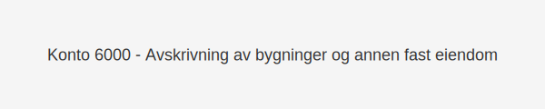

---
title: "Hva er Konto 6000 - Avskrivning på bygninger og annen fast eiendom?"
meta_title: "6000"
meta_description: '**Konto 6000 - Avskrivning på bygninger og annen fast eiendom** er en konto i norsk kontoplan som benyttes for å fordele **anskaffelseskostnaden** til bygning...'
slug: 6000
type: blog
layout: pages/single
---

**Konto 6000 - Avskrivning på bygninger og annen fast eiendom** er en konto i norsk kontoplan som benyttes for å fordele **anskaffelseskostnaden** til bygninger og annen **fast eiendom** over deres økonomiske levetid.



## NÃ¥r brukes Konto 6000?

*Konto 6000* benyttes når en virksomhet skal bokføre årlige avskrivninger på **bygninger** eller annen **fast eiendom** som eies eller leies på langsiktige kontrakter.

Eksempler på bruk:

* Ã…rlig avskrivning av industri- eller kontorbygg
* Avskrivning av leide bygg med tilbakeleie eller langsiktige avtaler
* Avskrivning av spesialtilpasset eiendom (for eksempel produksjonsanlegg)

## Definisjon og avskrivningsgrunnlag

> **Avskrivning** er en systematisk fordeling av anskaffelseskostnaden over eiendelens forventede levetid.

Følgende kostnadskomponenter inngår i avskrivningsgrunnlaget:

| Element                        | Inkludert | Kommentar                                                      |
|--------------------------------|:---------:|----------------------------------------------------------------|
| Anskaffelseskostnader          | Ja        | Inkluderer kjøpesum, frakt, installasjon og tilpasninger       |
| Påkostninger etter anskaffelse | Ja        | Forbedringer og påbygg som øker eiendommens verdi               |
| Vedlikeholdskostnader          | Nei       | Kostnader for å opprettholde eiendommen, føres separat         |


## Eksempler på avskrivningsperioder

| Bygningstype                            | Økonomisk levetid | Kommentar                               |
|-----------------------------------------|-------------------|-----------------------------------------|
| Standard industribygg og kontorbygg     | 25–50 år          | Vanlig økonomisk levetid for bygg       |
| Vernede eller fredete bygg              | 10–25 år          | Kortere perioder grunnet bevaringskrav  |
| Spesialtilpassede bygg (laboratorier)   | 15–30 år          | Teknisk utstyr med høy slitasje         |
| Utleiebygg med fast kontraktsperiode    | Kontraktens varighet | Avskrives i tråd med leieavtalen      |


## Regnskapsføring av avskrivning

Årlige avskrivninger bokføres med debet på konto 6000 og kredit på konto 2800:

```text
Debet  Konto 6000 - Avskrivning på bygninger og annen fast eiendom    XXX kroner
Kredit Konto 2800 - Kumulert avskrivning på bygninger og annen fast eiendom  XXX kroner
```

Ved salg eller utrangering av eiendommen følges samme prinsipper som for [Konto 1100 - Bygninger](/blogs/kontoplan/1100-bygninger "Konto 1100 - Bygninger").

## Relaterte artikler

* [Konto 1100 - Bygninger](/blogs/kontoplan/1100-bygninger "Konto 1100 - Bygninger")
* [Konto 1260 - Bygninger med annen avskrivningstid](/blogs/kontoplan/1260-bygninger-med-annen-avskrivningstid "Konto 1260 - Bygninger med annen avskrivningstid")
* [Hva er Avskrivning?](/blogs/regnskap/hva-er-avskrivning "Hva er Avskrivning i Regnskap? Metoder, Beregning og Praktiske Eksempler")
* [Hva er Anskaffelseskost?](/blogs/regnskap/hva-er-anskaffelseskost "Hva er Anskaffelseskost?")
* [Konto 6010 - Avskrivning på transportmidler, maskiner og inventar](/blogs/kontoplan/6010-avskrivning-pa-transportmidler-mask-og-invent "Konto 6010 - Avskrivning på transportmidler, maskiner og inventar")
* [Konto 6050 - Nedskrivning av varige driftsmidler](/blogs/kontoplan/6050-nedskrivning-av-varige-driftsmidler "Konto 6050 - Nedskrivning av varige driftsmidler")

