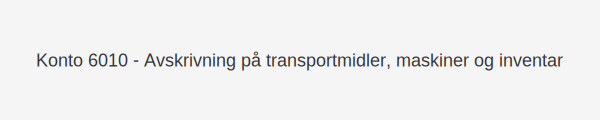

---
title: "Konto 6010 - Avskrivning på transportmidler, maskiner og inventar"
meta_title: "6010"
meta_description: '**Konto 6010 - Avskrivning på transportmidler, maskiner og inventar** er en konto i norsk kontoplan som benyttes for å fordele **anskaffelseskostnaden** til t...'
slug: 6010
type: blog
layout: pages/single
---

**Konto 6010 - Avskrivning på transportmidler, maskiner og inventar** er en konto i norsk kontoplan som benyttes for å fordele **anskaffelseskostnaden** til transportmidler, maskiner og inventar over deres forventede økonomiske levetid.



## NÃ¥r brukes Konto 6010?

*Konto 6010* benyttes når en virksomhet skal bokføre årlige avskrivninger på transportmidler, maskiner eller inventar som eies eller leies i virksomheten.

Eksempler på bruk:

* Ã…rlig avskrivning av firmabiler og lastebiler
* Avskrivning av produksjonsmaskiner
* Avskrivning av kontor- og butikkinventar

## Definisjon og avskrivningsgrunnlag

> **Avskrivning** er en systematisk fordeling av anskaffelseskostnaden over eiendelens forventede levetid.

Følgende kostnadskomponenter inngår i avskrivningsgrunnlaget:

| Element                        | Inkludert | Kommentar                                                    |
|--------------------------------|:---------:|--------------------------------------------------------------|
| Anskaffelseskostnader          | Ja        | Inkluderer kjøpesum, frakt, installasjon og klargjøring     |
| Påkostninger etter anskaffelse | Ja        | Forbedringer og tilpasninger som øker eiendelens kapasitet  |
| Vedlikeholdskostnader          | Nei       | Kostnader for løpende vedlikehold, føres på driftskostnader |

## Eksempler på avskrivningsperioder

| Eiendelstype                            | Økonomisk levetid | Kommentar                           |
|-----------------------------------------|-------------------|-------------------------------------|
| Personbiler og lette transportmidler    | 5–8 år            | Vanlig levetid for firmabiler       |
| Tunge lastebiler og anleggsmaskiner     | 5–10 år           | Basert på teknisk levetid           |
| Kontor- og butikkinventar               | 3–7 år            | Møbler, hyller og mindre utstyr     |
| Spesialmaskiner                         | 7–15 år           | Avhengig av bransje og slitasje     |

## Regnskapsføring av avskrivning

Årlige avskrivninger bokføres med debet på konto 6010 og kredit på konto 2800:

```text
Debet  Konto 6010 - Avskrivning på transportmidler, maskiner og inventar    XXX kroner
Kredit Konto 2800 - Kumulert avskrivning på transportmidler, maskiner og inventar    XXX kroner
```

## Relaterte artikler

* [Konto 6000 - Avskrivning på bygninger og annen fast eiendom](/blogs/kontoplan/6000-avskrivning-pa-bygninger-og-annen-fast-eiendom "Konto 6000 - Avskrivning på bygninger og annen fast eiendom")
* [Hva er Avskrivning?](/blogs/regnskap/hva-er-avskrivning "Hva er Avskrivning i Regnskap? Metoder, Beregning og Praktiske Eksempler")
* [Hva er Anskaffelseskost?](/blogs/regnskap/hva-er-anskaffelseskost "Hva er Anskaffelseskost? Komplett Guide til Beregning og Regnskapsføring")
* [Konto 1200 - Inventar og utstyr](/blogs/kontoplan/1200-inventar-og-utstyr "Konto 1200 - Inventar og utstyr")
* [Konto 6050 - Nedskrivning av varige driftsmidler](/blogs/kontoplan/6050-nedskrivning-av-varige-driftsmidler "Konto 6050 - Nedskrivning av varige driftsmidler")

