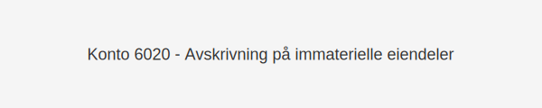

---
title: "Konto 6020 - Avskrivning på immaterielle eiendeler"
seoTitle: "6020-avskrivning-pa-immatrielle-eiendeler"
description: '**Konto 6020 - Avskrivning på immaterielle eiendeler** er en konto i norsk kontoplan som benyttes for å fordele **anskaffelseskostnaden** til immaterielle eie...'
---

**Konto 6020 - Avskrivning på immaterielle eiendeler** er en konto i norsk kontoplan som benyttes for å fordele **anskaffelseskostnaden** til immaterielle eiendeler over deres forventede økonomiske levetid.



## Når brukes Konto 6020?

*Konto 6020* benyttes når en virksomhet skal bokføre årlige avskrivninger (amortisering) på immaterielle eiendeler som eies, utvikles eller erverves av virksomheten.

Eksempler på immaterielle eiendeler:

* Programvare og lisenskostnader
* Varemerker og designrettigheter
* Patenter og konsesjoner
* Utviklingskostnader for FoU-prosjekter

## Definisjon og avskrivningsgrunnlag

> **Avskrivning (amortisering)** er en systematisk fordeling av anskaffelseskostnaden over eiendelens økonomiske levetid.

Følgende kostnadskomponenter inngår i avskrivningsgrunnlaget for immaterielle eiendeler:

| Kostnadstype                   | Beskrivelse                                         |
|--------------------------------|-----------------------------------------------------|
| Anskaffelseskostnad            | Inkluderer kjøpesum, toll, frakt og installasjonskostnader |
| Utviklingskostnader (FoU)      | Aktiverbare utviklingskostnader etter IAS 38/NRFS   |
| Programvare og lisenser        | Kjøp og intern utvikling                            |
| Juridiske og registreringskostnader | Gebyrer for varemerker, patenter og konsesjoner    |

## Standard amortiseringssatser og perioder

| Eiendelstype                   | Forventet levetid (år) | Anbefalt årlig satser (%) |
|--------------------------------|-----------------------:|---------------------------:|
| Programvare                    | 3–5                    | 20–33                      |
| Varemerker                     | 5–10                   | 10–20                      |
| Patenter og konsesjoner        | 10–20                  | 5–10                       |
| Utviklingskostnader (FoU)      | 5–10                   | 10–20                      |

## Bokføringseksempel

```plaintext
Debet: Konto 6020 - Avskrivning på immaterielle eiendeler
Kredit: Konto 1020 - Immaterielle eiendeler (opprinnelig anskaffelseskost)
```

## Regnskapsstandarder og merverdier

Bokføring av amortisering må følge gjeldende standarder som [IAS 38/NRFS](/blogs/regnskap/hva-er-amortisering "Hva er Amortisering?") og krav til [aktivering av immaterielle eiendeler](/blogs/regnskap/hva-er-imaterielle-eiendeler "Hva er Imaterielle Eiendeler?").

## Se også

* [Konto 1000 - Forskning og utvikling](/blogs/kontoplan/1000-forskning-og-utvikling "Konto 1000 - Forskning og utvikling")
* [Konto 1020 - Konsesjoner](/blogs/kontoplan/1020-konsesjoner "Konto 1020 - Konsesjoner")
* [Konto 1030 - Patenter](/blogs/kontoplan/1030-patenter "Konto 1030 - Patenter")
* [Konto 1050 - Varemerker](/blogs/kontoplan/1050-varemerker "Konto 1050 - Varemerker")
* [Konto 1060 - Andre rettigheter](/blogs/kontoplan/1060-andre-rettigheter "Konto 1060 - Andre rettigheter")


