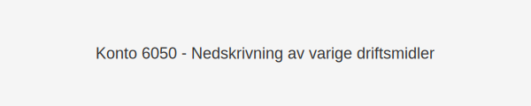

---
title: "6050-nedskrivning-av-varige-driftsmidler"
meta_title: "6050-nedskrivning-av-varige-driftsmidler"
meta_description: '**Konto 6050 - Nedskrivning av varige driftsmidler** er en konto i norsk kontoplan som benyttes for å bokføre **regnskapsmessige nedskrivninger** av varige dr...'
slug: 6050-nedskrivning-av-varige-driftsmidler
type: blog
layout: pages/single
---

**Konto 6050 - Nedskrivning av varige driftsmidler** er en konto i norsk kontoplan som benyttes for å bokføre **regnskapsmessige nedskrivninger** av varige driftsmidler når bokført verdi overstiger gjenvinnbart beløp.



## NÃ¥r brukes Konto 6050?

*Konto 6050* benyttes når en virksomhet må bokføre en nedskrivning av varige driftsmidler, for eksempel når eiendelers gjenvinnbare beløp faller under bokført verdi på grunn av teknisk slitasje, markedsendringer eller skade.

Eksempler på situasjoner som kan kreve nedskrivning:

* **Teknologisk foreldelse:** Maskiner eller utstyr blir raskt utdatert.
* **Markedssvingninger:** Redusert etterspørsel eller prisfall på produkter.
* **Fysisk skade:** Ulykke eller omfattende slitasje som reduserer verdi.
* **Regulatoriske krav:** Nye standarder som reduserer driftsmidlenes brukbarhet.

## Definisjon og regnskapsprinsipper

> **Nedskrivning** er en engangskostnad som reduserer bokført verdi av eiendelen til gjenvinnbart beløp, definert som høyeste av virkelig verdi minus salgsutgifter og bruksverdi.

## Bokføringseksempel

```plaintext
Debet: Konto 6050 - Nedskrivning av varige driftsmidler    200 000
Kredit: Konto 1200 - Maskiner og inventar                   200 000
```

*(Eksempel der maskiner med opprinnelig bokført verdi på 1 000 000 kr nedskrives til gjenvinnbart beløp på 800 000 kr.)*

## Regnskapsstandarder og referanser

Bokføring av nedskrivning må følge gjeldende standarder som [IAS 36/NRFS](/blogs/regnskap/hva-er-nedskrivning "Hva er Nedskrivning? Komplett Guide til Nedskrivning av Eiendeler") og prinsipper for [varige driftsmidler](/blogs/regnskap/hva-er-varige-driftsmidler "Hva er Varige Driftsmidler? Komplett Guide til Vurdering og Bokføring").

## Se også

* [Konto 6000 - Avskrivning på bygninger og annen fast eiendom](/blogs/kontoplan/6000-avskrivning-pa-bygninger-og-annen-fast-eiendom "Konto 6000 - Avskrivning på bygninger og annen fast eiendom")
* [Konto 6010 - Avskrivning på transportmidler, maskiner og inventar](/blogs/kontoplan/6010-avskrivning-pa-transportmidler-mask-og-invent "Konto 6010 - Avskrivning på transportmidler, maskiner og inventar")
* [Hva er Varige Driftsmidler?](/blogs/regnskap/hva-er-varige-driftsmidler "Hva er Varige Driftsmidler? Komplett Guide til Vurdering og Bokføring")
* [Hva er Nedskrivning?](/blogs/regnskap/hva-er-nedskrivning "Hva er Nedskrivning? Komplett Guide til Verdifall på Eiendeler")
