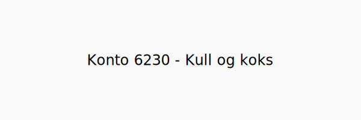

---
title: "6230-kull-koks"
meta_title: "6230-kull-koks"
meta_description: '**Konto 6230 - Kull og koks** er en konto i Norsk Standard Kontoplan som brukes til å registrere **kull-** og **kokskostnader** i virksomhetens drift.'
slug: 6230-kull-koks
type: blog
layout: pages/single
---

**Konto 6230 - Kull og koks** er en konto i Norsk Standard Kontoplan som brukes til å registrere **kull-** og **kokskostnader** i virksomhetens drift.

## Hva er Kull og koks?

*Kull og koks* brukes som brensel i industrielle prosesser og oppvarming, inkludert:

* **Bituminøst kull**: Et fossilt brensel med høyt energiinnhold brukt i kraftverk og industrien.
* **Anthracitt**: En renere type kull med høy forbrenningstemperatur, ofte brukt i prosesser som krever varmekontroll.
* **Koks**: Et produkt fremstilt ved forbrenning av kull uten lufttilførsel, brukt i smelteverk og metallurgisk industri.

## Regnskapsføring av kull- og kokskostnader

| Transaksjon                         | Debet                         | Kredit                       |
|-------------------------------------|-------------------------------|------------------------------|
| Kull- og kokskostnader              | Konto 6230 - Kull og koks     | Konto 2400 - Leverandørgjeld |
| Betaling av faktura for kull og koks| Konto 2400 - Leverandørgjeld  | Konto 1920 - Bankinnskudd    |

## Eksempel på bokføring

| Beløp ekskl. avgifter | Avgift (%) | Total inkl. avgift |
|-----------------------|------------|--------------------|
| 20 000 NOK            | 25 %       | 25 000 NOK         |

## Fordeler ved korrekt bruk

* **Kostnadskontroll** av fossilt brensel og industrielle råmaterialer.
* **Miljørapportering** ved å dokumentere forbruk og utslipp knyttet til kull og koks.
* **Budsjettstyring** for energikostnader i industrielle prosesser.

## Intern lenking og relaterte kontoer

Andre kontoer i NS 4102 som ofte brukes sammen med konto 6230:

* [Konto 6200 - Elektrisitet](/blogs/kontoplan/6200-elektrisitet "Konto 6200 - Elektrisitet")
* [Konto 6210 - Gass](/blogs/kontoplan/6210-gass "Konto 6210 - Gass")
* [Konto 6220 - Fyringsolje](/blogs/kontoplan/6220-fyringsolje "Konto 6220 - Fyringsolje")
* [Konto 6240 - Ved](/blogs/kontoplan/6240-ved "Konto 6240 - Ved")
* [Konto 6340 - Lys, varme](/blogs/kontoplan/6340-lys-varme "Konto 6340 - Lys, varme")
* [Konto 6250 - Bensin, dieselolje](/blogs/kontoplan/6250-bensin-dieselolje "Konto 6250 - Bensin, dieselolje")
* [Konto 2400 - Leverandørgjeld](/blogs/kontoplan/2400-leverandorgjeld "Konto 2400 - Leverandørgjeld")
* [Konto 1920 - Bankinnskudd](/blogs/kontoplan/1920-bankinnskudd "Konto 1920 - Bankinnskudd")
* [Konto 6260 - Vann](/blogs/kontoplan/6260-vann "Konto 6260 - Vann")
* [Konto 6320 - Renovasjon, vann, avløp mv.](/blogs/kontoplan/6320-renovasjon-vann-avlop-mv "Konto 6320 - Renovasjon, vann, avløp mv.")
* [Konto 6300 - Leie lokaler](/blogs/kontoplan/6300-leie-lokaler "Konto 6300 - Leie lokaler")
* [Hva er en Kontoplan?](/blogs/regnskap/hva-er-kontoplan "Hva er en Kontoplan? Komplett Guide til Kontoplaner i Norsk Regnskap")
* [Hva er en Faktura?](/blogs/regnskap/hva-er-en-faktura "Hva er en Faktura? En Guide til Norske Fakturakrav")
