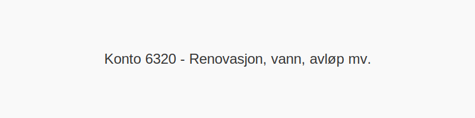

---
title: "Konto 6320 - Renovasjon, vann, avløp mv."
seoTitle: "6320-renovasjon-vann-avlop-mv"
meta_description: '**Konto 6320 - Renovasjon, vann, avløp mv.** er en konto i Norsk Standard Kontoplan som brukes til å registrere **kostnader til renovasjon, vann, avløp og ti...'
slug: 6320-renovasjon-vann-avlop-mv
type: blog
layout: pages/single
---

**Konto 6320 - Renovasjon, vann, avløp mv.** er en konto i Norsk Standard Kontoplan som brukes til å registrere **kostnader til renovasjon, vann, avløp og tilhørende kommunale avgifter** i virksomhetens drift.

## Hva dekker Konto 6320?

Renovasjon, vann og avløp omfatter en rekke kommunale tjenester og avgifter som sikrer avfallshåndtering, drikkevannsforsyning og rensing av spillvann. Konto 6320 benyttes til:

* **Renovasjon** – gebyrer for innsamling, behandling og gjenvinning av avfall.
* **Vannforsyning** – kostnader knyttet til produksjon og levering av drikkevann.
* **Avløpshåndtering** – avgifter for innsamlings- og renseprosesser av spillvann.
* **Tilknytningsavgifter** – engangs- eller løpende avgifter for tilkobling til kommunalt vann- og avløpsnett.
* **Andre kommunale gebyrer** – for eksempel avgift for spesialavfall eller slam.

## Nøkkelbegreper

| Begrep                 | Beskrivelse                                                               |
|------------------------|---------------------------------------------------------------------------|
| **Renovasjonsgebyr**   | Fast månedlig eller årlig avgift for avfallshåndtering.                  |
| **Vannavgift**         | Betaling for drikkevann levert til virksomhetens bygg og anlegg.         |
| **Avløpsavgift**       | Avgift for rensing av spillvann i kommunalt renseanlegg.                 |
| **Tilknytningsavgift** | Engangs- eller løpende kostnad for tilkobling til vann- og avløpsnett.    |

## Regnskapsføring av kommunale avgifter

| Transaksjon                                   | Debet                                    | Kredit                                                                            |
|-----------------------------------------------|------------------------------------------|-----------------------------------------------------------------------------------|
| Kommunale avgifter (renovasjon, vann, avløp)  | Konto 6320 - Renovasjon, vann, avløp mv. | [Konto 2400 - Leverandørgjeld](/blogs/kontoplan/2400-leverandorgjeld "Konto 2400 - Leverandørgjeld") |
| Betaling av kommunale avgiftsfaktura         | [Konto 2400 - Leverandørgjeld](/blogs/kontoplan/2400-leverandorgjeld "Konto 2400 - Leverandørgjeld")   | [Konto 1920 - Bankinnskudd](/blogs/kontoplan/1920-bankinnskudd "Konto 1920 - Bankinnskudd")        |

## Eksempel på bokføring

En bedrift mottar faktura på **4 500 NOK ekskl. avgift**, hvor avgiften er **12–¯%**.

| Beløp ekskl. avgift | Avgift (%) | Avgift (NOK) | Total inkl. avgift |
|---------------------|------------|--------------|--------------------|
| 4 500–¯NOK           | 12–¯%       | 540–¯NOK      | 5 040–¯NOK          |

## Fordeler ved korrekt bruk

* **Forbedret kostnadskontroll** av kommunale avgifter.
* **Enkel budsjettoppfølging** med tydelig oversikt over løpende gebyrer.
* **Dokumentasjon og sporbarhet** ved revisjoner og rapportering.
* **Effektiv sammenstilling** av driftskostnader knyttet til bygg og anlegg.

## Se også

* [Konto 6260 - Vann](/blogs/kontoplan/6260-vann "Konto 6260 - Vann")
* [Konto 6300 - Leie lokaler](/blogs/kontoplan/6300-leie-lokaler "Konto 6300 - Leie lokaler")
* [Konto 6340 - Lys, varme](/blogs/kontoplan/6340-lys-varme "Konto 6340 - Lys, varme")
* [Konto 6360 - Renhold](/blogs/kontoplan/6360-renhold "Konto 6360 - Renhold")
* [Hva er driftskostnader?](/blogs/regnskap/hva-er-driftskostnader "Hva er driftskostnader?")
* [Hva er en Kontoplan?](/blogs/regnskap/hva-er-kontoplan "Hva er en Kontoplan? Komplett Guide til Kontoplaner i Norsk Regnskap")
* [Hva er en Faktura?](/blogs/regnskap/hva-er-en-faktura "Hva er en Faktura? En Guide til Norske Fakturakrav")

