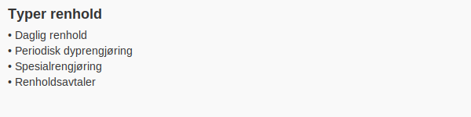
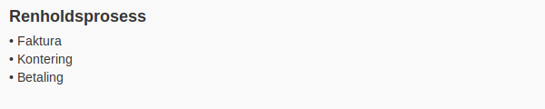
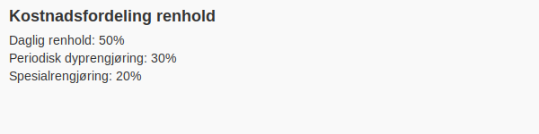

---
title: "Konto 6360 - Renhold"
seoTitle: "6360-renhold"
meta_description: '**Konto 6360 - Renhold** er en konto i Norsk Standard Kontoplan (NS 4102) som brukes for å registrere **kostnader til renhold og rengjøring** i virksomhetens...'
slug: 6360-renhold
type: blog
layout: pages/single
---

**Konto 6360 - Renhold** er en konto i Norsk Standard Kontoplan (NS 4102) som brukes for å registrere **kostnader til renhold og rengjøring** i virksomhetens daglige drift.

## Hva er renhold?

Renhold omfatter alle tiltak som bidrar til et **rent**, **sunt** og **trygt** arbeids- og oppholds­miljø. De vanligste kategoriene er:

* **Daglig renhold** – Rengjøring av kontorer, fellesarealer og produksjonslokaler.
* **Periodisk dyprengjøring** – Tepperens, vinduspuss, gulvpleie og andre spesial­oppgaver.
* **Spesialrengjøring** – Desinfeksjon, håndtering av farlig avfall og hygienetjenester.
* **Renholdsavtaler** – Fastprisavtaler og service­kostnader knyttet til eksterne leverandører.

## Regnskapsføring av renhold

Renholdskostnader bokføres typisk i tre steg: faktura, kontering og betaling.

| Steg      | Beskrivelse                                               |
|-----------|-----------------------------------------------------------|
| Faktura   | Mottatt fra renholdsleverandør                            |
| Kontering | Debit: Konto 6360 – Renhold Kredit: Konto 2400 – Leverandørgjeld |
| Betaling  | Debit: Konto 2400 – Leverandørgjeld Kredit: Konto 1920 – Bankinnskudd |

## Eksempel på bokføring

Anta at en renholds­faktura på **NOK 8 000** ekskl. MVA (25 %) mottas og betales.

| Postering                | Debet                    | Kredit                      |
|--------------------------|--------------------------|-----------------------------|
| Renholdskostnad          | Konto 6360 – Renhold     | Konto 2400 – Leverandørgjeld|
| MVA (25 %)               | Konto 2710 – Inngående MVA| Konto 2400 – Leverandørgjeld|
| Betaling av faktura      | Konto 2400 – Leverandørgjeld| Konto 1920 – Bankinnskudd   |

## Fordeler ved korrekt føring

Riktig bruk av konto 6360 gir:

* **Økt kontroll** over renholds­kostnader og budsjett.
* **Enkel budsjett­oppfølging** for trygge og ryddige lokaler.
* **Bedre HMS-dokumentasjon** ved internkontroll og revisjon.
* **Tydelig kostnadsfordeling** mellom avdelinger og prosjekter.

Se også [Hva er driftskostnader?](/blogs/regnskap/hva-er-driftskostnader "Hva er Driftskostnader?") for en generell gjennomgang av drifts­tjenester i regnskapet.

## Relaterte kontoer og intern lenking

Andre kontoer i NS 4102 som ofte brukes sammen med konto 6360:

* [Konto 6300 – Leie lokaler](/blogs/kontoplan/6300-leie-lokaler "Konto 6300 – Leie lokaler")
* [Konto 6320 – Renovasjon, vann, avløp mv.](/blogs/kontoplan/6320-renovasjon-vann-avlop-mv "Konto 6320 – Renovasjon, vann, avløp mv.")
* [Konto 6340 – Lys, varme](/blogs/kontoplan/6340-lys-varme "Konto 6340 – Lys, varme")
* [Hva er en Kontoplan?](/blogs/regnskap/hva-er-kontoplan "Hva er en Kontoplan? Komplett Guide til Kontoplaner i Norsk Regnskap")

