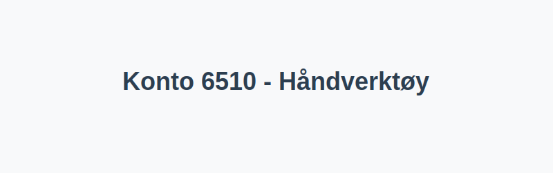

---
title: "Konto 6510 - Håndverktøy"
seoTitle: "6510-handverktoy"
description: '**Konto 6510 - Håndverktøy** er en konto i Norsk Standard Kontoplan som brukes til å registrere **kostnader til håndverktøy** og relaterte driftsmidler i v...'
---

**Konto 6510 - Håndverktøy** er en konto i Norsk Standard Kontoplan som brukes til å registrere **kostnader til håndverktøy** og relaterte driftsmidler i virksomhetens drift.



## Hva er håndverktøy?

*Håndverktøy* omfatter alle manuelle verktøy som ikke er motoriserte, for eksempel:

* **Hammer**
* **Skiftenøkkel**
* **Skrutrekker**
* **Tang**
* **Fil og rasper**
* **Høvler og stemjern**

## Regnskapsføring av håndverktøy

| Transaksjon                            | Debet                        | Kredit                       |
|----------------------------------------|------------------------------|------------------------------|
| Anskaffelse av håndverktøy             | Konto 6510 - Håndverktøy     | Konto 2400 - Leverandørgjeld |
| Betaling av faktura for håndverktøy    | Konto 2400 - Leverandørgjeld | Konto 1920 - Bankinnskudd    |

## Når skal verktøy føres på konto 6510 vs aktiveres?

I noen tilfeller kan verktøy av høy verdi eller langsiktig bruk aktiveres som anleggsmiddel i stedet for å kostnadsføres direkte:

1. **Lav verdi** (under anskaffelsesgrensen) og kort levetid: Kostnadsføres på konto 6510.
2. **Høy verdi** og forventet bruk over flere år: Aktiveres som anleggsmiddel, f.eks. på [Konto 1200 - Inventar og utstyr](/blogs/kontoplan/1200-inventar-og-utstyr "Konto 1200 - Inventar og utstyr").

## Eksempel på bokføring

Et selskap anskaffer nytt håndverktøy for 5 000 NOK eks. mva. med 25 % merverdiavgift:

| Beløp ekskl. avgifter | Avgift (%) | Total inkl. avgift |
|-----------------------|------------|--------------------|
| 5 000 NOK             | 25 %       | 6 250 NOK          |

```text
Debet  Konto 6510 - Håndverktøy               5 000 NOK
Debet  Konto 2710 - Inngående merverdiavgift   1 250 NOK
Kredit Konto 2400 - Leverandørgjeld           6 250 NOK
```

## Tips for kostnadskontroll og vedlikehold

* **Dokumenter** anskaffelser med serienummer og brukstid.
* **Etabler rutiner** for regelmessig inspeksjon og vedlikehold.
* **Registrer** bruksdatoer og lagerplass for–¯**sporbarhet**.
* **Budsjetter** årlige kostnader for utskifting av slitedeler.

## Relaterte artikler

* [Konto 6500 - Motordrevet verktøy](/blogs/kontoplan/6500-motordrevet-verktoy "Konto 6500 - Motordrevet verktøy")
* [Konto 6520 - Hjelpeverktøy](/blogs/kontoplan/6520-hjelpeverktoy "Konto 6520 - Hjelpeverktøy")
* [Konto 6530 - Spesialverktøy](/blogs/kontoplan/6530-spesialverktoy "Konto 6530 - Spesialverktøy")
* [Konto 6540 - Inventar](/blogs/kontoplan/6540-inventar "Konto 6540 - Inventar")
* [Konto 6550 - Driftsmateriale](/blogs/kontoplan/6550-driftsmateriale "Konto 6550 - Driftsmateriale")
* [Konto 6560 - Rekvisita](/blogs/kontoplan/6560-rekvisita "Konto 6560 - Rekvisita")
* [Konto 6800 - Kontorrekvisita](/blogs/kontoplan/6800-kontorrekvisita "Konto 6800 - Kontorrekvisita")
* [Konto 6820 - Trykksaker](/blogs/kontoplan/6820-trykksaker "Konto 6820 - Trykksaker")
* [Konto 6820 - Trykksaker](/blogs/kontoplan/6820-trykksaker "Konto 6820 - Trykksaker")
* [Konto 6570 - Arbeidsklær og verneutstyr](/blogs/kontoplan/6570-arbeidsklaer-og-verneutstyr "Konto 6570 - Arbeidsklær og verneutstyr")
* [Konto 6620 - Reparasjon og vedlikehold utstyr](/blogs/kontoplan/6620-reparasjon-og-vedlikehold-utstyr "Konto 6620 - Reparasjon og vedlikehold utstyr")
* [Konto 6600 - Reparasjon og vedlikehold bygninger](/blogs/kontoplan/6600-reparasjon-og-vedlikehold-bygninger "Konto 6600 - Reparasjon og vedlikehold bygninger")
* [Konto 2400 - Leverandørgjeld](/blogs/kontoplan/2400-leverandorgjeld "Konto 2400 - Leverandørgjeld")
* [Konto 1920 - Bankinnskudd](/blogs/kontoplan/1920-bankinnskudd "Konto 1920 - Bankinnskudd")
* [Konto 1200 - Inventar og utstyr](/blogs/kontoplan/1200-inventar-og-utstyr "Konto 1200 - Inventar og utstyr")
* [Hva er en Kontoplan?](/blogs/regnskap/hva-er-kontoplan "Hva er en Kontoplan? Komplett Guide til Kontoplaner i Norsk Regnskap")
* [Hva er Avskrivning?](/blogs/regnskap/hva-er-avskrivning "Hva er Avskrivning i Regnskap? Metoder, Beregning og Praktiske Eksempler")
* [Hva er en Faktura?](/blogs/regnskap/hva-er-en-faktura "Hva er en Faktura? En Guide til Norske Fakturakrav")


