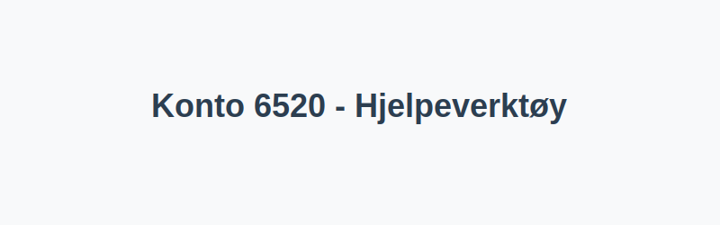

---
title: "6520-hjelpeverktoy"
meta_title: "6520-hjelpeverktoy"
meta_description: '**Konto 6520 - Hjelpeverktøy** er en konto i Norsk Standard Kontoplan som brukes til å registrere **kostnader knyttet til hjelpeverktøy** og tilhørende drif...'
slug: 6520-hjelpeverktoy
type: blog
layout: pages/single
---

**Konto 6520 - Hjelpeverktøy** er en konto i Norsk Standard Kontoplan som brukes til å registrere **kostnader knyttet til hjelpeverktøy** og tilhørende driftsmidler i virksomhetens drift.



## Hva er hjelpeverktøy?

*Hjelpeverktøy* omfatter verktøy og tilbehør som støtter hovedverktøy og produksjonsprosesser, for eksempel:

* **Måleverktøy** som målebånd, skyvelære og mikrometer
* **Stillaser og jigger** som holder materialer stabilt under arbeid
* **Løfte- og støtteutstyr** som jekk, jekkestropp og løfteanker
* **Sikkerhetsutstyr** som vernehansker, vernebriller og beskyttelseshjelmer
* **Smådeler og tilbehør** som bor, bits, slipemidler og fester

## Regnskapsføring av hjelpeverktøy

| Transaksjon                              | Debet                      | Kredit                       |
|------------------------------------------|----------------------------|------------------------------|
| Anskaffelse av hjelpeverktøy             | Konto 6520 - Hjelpeverktøy | Konto 2400 - Leverandørgjeld |
| Betaling av faktura for hjelpeverktøy    | Konto 2400 - Leverandørgjeld | Konto 1920 - Bankinnskudd    |

## Når skal hjelpeverktøy kostnadsføres vs. aktiveres?

I noen tilfeller kan hjelpeverktøy av høy verdi eller langsiktig bruk aktiveres som anleggsmiddel i stedet for å kostnadsføres direkte:

1. **Lav anskaffelsesverdi** (under aktiveringsgrensen) og kort levetid: Kostnadsføres på konto 6520.
2. **Høy anskaffelsesverdi** og forventet bruk over flere år: Aktiveres som anleggsmiddel, for eksempel på [Konto 1200 - Inventar og utstyr](/blogs/kontoplan/1200-inventar-og-utstyr "Konto 1200 - Inventar og utstyr").

## Eksempel på bokføring

| Beløp ekskl. avgifter | Avgift (%) | Total inkl. avgift |
|-----------------------|------------|--------------------|
| 3 000 NOK             | 25 %       | 3 750 NOK          |

```text
Debet  Konto 6520 - Hjelpeverktøy             3 000 NOK
Debet  Konto 2710 - Inngående merverdiavgift    750 NOK
Kredit Konto 2400 - Leverandørgjeld            3 750 NOK
```

## Fordeler med riktig konto

* **Presis kostnadskontroll** for hjelpeverktøy.
* **Bedre oversikt** over verktøybruk og vedlikehold.
* **Effektiv budsjettering** av utskiftnings- og vedlikeholdskostnader.

## Tips for administrasjon og vedlikehold

* **Systematisk registrering** av serie- eller inventarnummer og anskaffelsesdato.
* **Regelmessig inspeksjon** og vedlikehold for å forlenge levetiden.
* **Rutiner for utlån** og retur av hjelpeverktøy for sporbarhet.
* **Budsjettering** av utskiftningskostnader for å sikre kontinuerlig drift.

## Relaterte artikler

* [Konto 6500 - Motordrevet verktøy](/blogs/kontoplan/6500-motordrevet-verktoy "Konto 6500 - Motordrevet verktøy")
* [Konto 6510 - Håndverktøy](/blogs/kontoplan/6510-handverktoy "Konto 6510 - Håndverktøy")
* [Konto 6530 - Spesialverktøy](/blogs/kontoplan/6530-spesialverktoy "Konto 6530 - Spesialverktøy")
* [Konto 6540 - Inventar](/blogs/kontoplan/6540-inventar "Konto 6540 - Inventar")
* [Konto 6550 - Driftsmateriale](/blogs/kontoplan/6550-driftsmateriale "Konto 6550 - Driftsmateriale")
* [Konto 6560 - Rekvisita](/blogs/kontoplan/6560-rekvisita "Konto 6560 - Rekvisita")
* [Konto 6800 - Kontorrekvisita](/blogs/kontoplan/6800-kontorrekvisita "Konto 6800 - Kontorrekvisita")
* [Konto 6820 - Trykksaker](/blogs/kontoplan/6820-trykksaker "Konto 6820 - Trykksaker")
* [Konto 6820 - Trykksaker](/blogs/kontoplan/6820-trykksaker "Konto 6820 - Trykksaker")
* [Konto 6570 - Arbeidsklær og verneutstyr](/blogs/kontoplan/6570-arbeidsklaer-og-verneutstyr "Konto 6570 - Arbeidsklær og verneutstyr")
* [Konto 6620 - Reparasjon og vedlikehold utstyr](/blogs/kontoplan/6620-reparasjon-og-vedlikehold-utstyr "Konto 6620 - Reparasjon og vedlikehold utstyr")
* [Konto 6600 - Andre forsikringer](/blogs/kontoplan/6600-andre-forsikringer "Konto 6600 - Andre forsikringer")
* [Konto 6600 - Reparasjon og vedlikehold bygninger](/blogs/kontoplan/6600-reparasjon-og-vedlikehold-bygninger "Konto 6600 - Reparasjon og vedlikehold bygninger")
* [Konto 1200 - Inventar og utstyr](/blogs/kontoplan/1200-inventar-og-utstyr "Konto 1200 - Inventar og utstyr")
* [Hva er en Kontoplan?](/blogs/regnskap/hva-er-kontoplan "Hva er en Kontoplan? Komplett Guide til Kontoplaner i Norsk Regnskap")
* [Hva er Avskrivning?](/blogs/regnskap/hva-er-avskrivning "Hva er Avskrivning i Regnskap? Metoder, Beregning og Praktiske Eksempler")
* [Hva er en Faktura?](/blogs/regnskap/hva-er-en-faktura "Hva er en Faktura? En Guide til Norske Fakturakrav")
