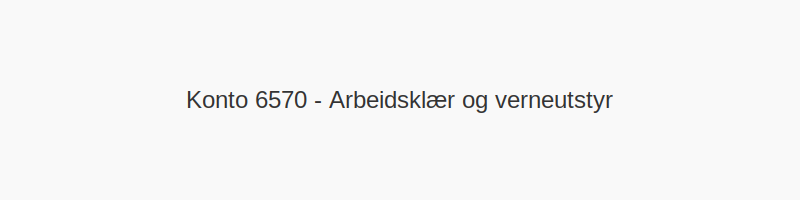

---
title: "6570-arbeidsklaer-og-verneutstyr"
meta_title: "6570-arbeidsklaer-og-verneutstyr"
meta_description: "**Konto 6570 - Arbeidsklær og verneutstyr** er en konto i Norsk Standard Kontoplan som brukes til å registrere **kostnader til arbeidsklær og verneutstyr** i..."
slug: 6570-arbeidsklaer-og-verneutstyr
type: blog
layout: pages/single
---

**Konto 6570 - Arbeidsklær og verneutstyr** er en konto i Norsk Standard Kontoplan som brukes til å registrere **kostnader til arbeidsklær og verneutstyr** i virksomhetens drift.

## Hva er arbeidsklær og verneutstyr?

*Arbeidsklær* omfatter spesialdesignede klær som beskytter mot vær, smuss og fysiske farer, for eksempel:

* **Vernejakker og -bukser**
* **Arbeidssko og vernesko**
* **Regn- og sikringstøy**

*Verneutstyr* dekker personlig verneutstyr som beskytter mot skader og helsefare, for eksempel:

* **Vernehjelm**
* **Vernebriller og ansiktsskjerm**
* **Hørselsvern**
* **Vernehansker**

## Regnskapsføring av arbeidsklær og verneutstyr

| Transaksjon                                      | Debet                                         | Kredit                       |
|--------------------------------------------------|-----------------------------------------------|------------------------------|
| Anskaffelse av arbeidsklær og verneutstyr        | Konto 6570 - Arbeidsklær og verneutstyr       | Konto 2400 - Leverandørgjeld |
| Betaling av faktura for arbeidsklær og verneutstyr | Konto 2400 - Leverandørgjeld                  | Konto 1920 - Bankinnskudd    |

## Avskrivning og levetid

| Type utstyr                                               | Anbefalt avskrivningsperiode |
|-----------------------------------------------------------|-------------------------------|
| Arbeidsklær (standard bekledning med begrenset levetid)   | 3 år                          |
| Verneutstyr (hjelm, vernesko, hansker, vernebriller)      | 5 år                          |

## Intern lenking og relaterte kontoer

Andre kontoer i NS 4102 som ofte brukes sammen med konto 6570:

* [Konto 6500 - Motordrevet verktøy](/blogs/kontoplan/6500-motordrevet-verktoy "Konto 6500 - Motordrevet verktøy")
* [Konto 6510 - Håndverktøy](/blogs/kontoplan/6510-handverktoy "Konto 6510 - Håndverktøy")
* [Konto 6520 - Hjelpeverktøy](/blogs/kontoplan/6520-hjelpeverktoy "Konto 6520 - Hjelpeverktøy")
* [Konto 6530 - Spesialverktøy](/blogs/kontoplan/6530-spesialverktoy "Konto 6530 - Spesialverktøy")
* [Konto 6540 - Inventar](/blogs/kontoplan/6540-inventar "Konto 6540 - Inventar")
* [Konto 6550 - Driftsmateriale](/blogs/kontoplan/6550-driftsmateriale "Konto 6550 - Driftsmateriale")
* [Konto 6560 - Rekvisita](/blogs/kontoplan/6560-rekvisita "Konto 6560 - Rekvisita")
* [Konto 6800 - Kontorrekvisita](/blogs/kontoplan/6800-kontorrekvisita "Konto 6800 - Kontorrekvisita")
* [Konto 6820 - Trykksaker](/blogs/kontoplan/6820-trykksaker "Konto 6820 - Trykksaker")
* [Konto 6820 - Trykksaker](/blogs/kontoplan/6820-trykksaker "Konto 6820 - Trykksaker")
* [Konto 6570 - Arbeidsklær og verneutstyr](/blogs/kontoplan/6570-arbeidsklaer-og-verneutstyr "Konto 6570 - Arbeidsklær og verneutstyr")
* [Konto 6600 - Andre forsikringer](/blogs/kontoplan/6600-andre-forsikringer "Konto 6600 - Andre forsikringer")
* [Konto 6600 - Reparasjon og vedlikehold bygninger](/blogs/kontoplan/6600-reparasjon-og-vedlikehold-bygninger "Konto 6600 - Reparasjon og vedlikehold bygninger")
* [Konto 2400 - Leverandørgjeld](/blogs/kontoplan/2400-leverandorgjeld "Konto 2400 - Leverandørgjeld")
* [Konto 1920 - Bankinnskudd](/blogs/kontoplan/1920-bankinnskudd "Konto 1920 - Bankinnskudd")
* [Hva er en Kontoplan?](/blogs/regnskap/hva-er-kontoplan "Hva er en Kontoplan? Komplett Guide til Kontoplaner i Norsk Regnskap")
* [Hva er Avskrivning?](/blogs/regnskap/hva-er-avskrivning "Hva er Avskrivning? Metoder, Beregning og Praktiske Eksempler")
* [Hva er Saldoavskrivning?](/blogs/regnskap/hva-er-saldoavskrivning "Hva er Saldoavskrivning i Regnskap? Fordeler og Ulemper")
