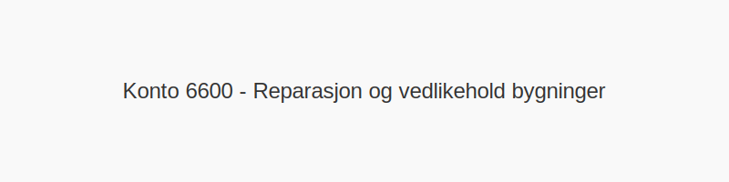

---
title: "Konto 6600 - Reparasjon og vedlikehold bygninger"
seoTitle: "6600-reparasjon-og-vedlikehold-bygninger"
description: '**Konto 6600 - Reparasjon og vedlikehold bygninger** er en konto i Norsk Standard Kontoplan som brukes til å registrere **kostnader til reparasjon og vedlikeho...'
---

**Konto 6600 - Reparasjon og vedlikehold bygninger** er en konto i Norsk Standard Kontoplan som brukes til å registrere **kostnader til reparasjon og vedlikehold av bygninger** i virksomhetens drift.

## Hva er Reparasjon og vedlikehold bygninger?

*Reparasjon og vedlikehold bygninger* omfatter alle kostnader knyttet til løpende vedlikeholdsarbeid og reparasjoner av bygninger, for eksempel:

* **Takreparasjoner og vedlikehold**
* **Malings- og fasadearbeid**
* **Vedlikehold av vinduer og dører**
* **Murer- og betongarbeid**
* **Rørleggerarbeid og lekkasjereparasjoner**

## Regnskapsføring av reparasjon og vedlikehold bygninger

| Transaksjon                                | Debet                                               | Kredit                          |
|--------------------------------------------|-----------------------------------------------------|---------------------------------|
| Kostnader for reparasjon og vedlikehold    | Konto 6600 - Reparasjon og vedlikehold bygninger    | Konto 2400 - Leverandørgjeld    |
| Betaling av faktura for vedlikeholdsarbeid | Konto 2400 - Leverandørgjeld                        | Konto 1920 - Bankinnskudd       |

## Eksempel på bokføring

| Beløp ekskl. avgifter | Avgift (%) | Total inkl. avgift |
|-----------------------|------------|--------------------|
| 50 000 NOK            | 25 %       | 62 500 NOK         |

## Fordeler ved korrekt bruk

* **Presis kostnadsfordeling** på vedlikeholdsprosjekter.
* **Bedre oversikt** over vedlikeholdsbehov og budsjett.
* **Forlenget levetid** på bygningens bygningsmasse.

## Intern lenking og relaterte kontoer

Andre kontoer i NS 4102 som ofte brukes sammen med konto 6600:

* [Konto 6300 - Leie lokaler](/blogs/kontoplan/6300-leie-lokaler "Konto 6300 - Leie lokaler")
* [Konto 6340 - Lys, varme](/blogs/kontoplan/6340-lys-varme "Konto 6340 - Lys, varme")
* [Konto 6360 - Renhold](/blogs/kontoplan/6360-renhold "Konto 6360 - Renhold")
* [Konto 6400 - Leie maskiner](/blogs/kontoplan/6400-leie-maskiner "Konto 6400 - Leie maskiner")
* [Konto 6410 - Leie inventar](/blogs/kontoplan/6410-leie-inventar "Konto 6410 - Leie inventar")
* [Konto 6440 - Leie transportmidler](/blogs/kontoplan/6440-leie-transportmidler "Konto 6440 - Leie transportmidler")
* [Konto 6500 - Motordrevet verktøy](/blogs/kontoplan/6500-motordrevet-verktoy "Konto 6500 - Motordrevet verktøy")
* [Konto 6510 - Håndverktøy](/blogs/kontoplan/6510-handverktoy "Konto 6510 - Håndverktøy")
* [Konto 6520 - Hjelpeverktøy](/blogs/kontoplan/6520-hjelpeverktoy "Konto 6520 - Hjelpeverktøy")
* [Konto 6530 - Spesialverktøy](/blogs/kontoplan/6530-spesialverktoy "Konto 6530 - Spesialverktøy")
* [Konto 6620 - Reparasjon og vedlikehold utstyr](/blogs/kontoplan/6620-reparasjon-og-vedlikehold-utstyr "Konto 6620 - Reparasjon og vedlikehold utstyr")
* [Konto 6600 - Andre forsikringer](/blogs/kontoplan/6600-andre-forsikringer "Konto 6600 - Andre forsikringer")
* [Konto 6700 - Revisjons- og regnskapshonorarer](/blogs/kontoplan/6700-revisjons-og-regnskapshonorarer "Konto 6700 - Revisjons- og regnskapshonorarer")
* [Hva er en Kontoplan?](/blogs/regnskap/hva-er-kontoplan "Hva er en Kontoplan? Komplett Guide til Kontoplaner i Norsk Regnskap")
* [Hva er en Faktura?](/blogs/regnskap/hva-er-en-faktura "Hva er en Faktura? En Guide til Norske Fakturakrav")

