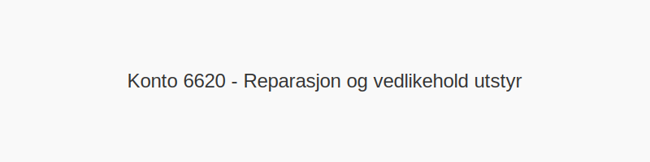

---
title: "6620-reparasjon-og-vedlikehold-utstyr"
meta_title: "6620-reparasjon-og-vedlikehold-utstyr"
meta_description: '**Konto 6620 - Reparasjon og vedlikehold utstyr** er en konto i Norsk Standard Kontoplan som brukes til å registrere **kostnader til reparasjon og vedlikehold ...'
slug: 6620-reparasjon-og-vedlikehold-utstyr
type: blog
layout: pages/single
---

**Konto 6620 - Reparasjon og vedlikehold utstyr** er en konto i Norsk Standard Kontoplan som brukes til å registrere **kostnader til reparasjon og vedlikehold av utstyr** i virksomhetens drift.

## Hva er Reparasjon og vedlikehold utstyr?

*Reparasjon og vedlikehold utstyr* omfatter alle kostnader knyttet til løpende vedlikeholdsarbeid og reparasjoner av driftsrelatert utstyr, for eksempel:

* **Service og vedlikehold av maskiner og verktøy**
* **Utskifting av slitedeler**
* **Kalibrering og justering av instrumenter**
* **Reparasjon av elektrisk og mekanisk utstyr**
* **Smøring og rengjøring av bevegelige deler**

## Regnskapsføring av reparasjon og vedlikehold utstyr

| Transaksjon                             | Debet                                            | Kredit                       |
|-----------------------------------------|--------------------------------------------------|------------------------------|
| Kostnader for reparasjon og vedlikehold | Konto 6620 - Reparasjon og vedlikehold utstyr    | Konto 2400 - Leverandørgjeld |
| Betaling av faktura for vedlikeholdsarbeid | Konto 2400 - Leverandørgjeld                   | Konto 1920 - Bankinnskudd    |

## Eksempel på bokføring

| Beløp ekskl. avgifter | Avgift (%) | Total inkl. avgift |
|-----------------------|------------|--------------------|
| 30 000 NOK            | 25 %       | 37 500 NOK         |

## Fordeler ved korrekt bruk

* **Presis kostnadsfordeling** på vedlikeholdsprosjekter for utstyr.
* **Økt driftssikkerhet** og reduserte driftsstopp.
* **Bedre oversikt** over vedlikeholdsbehov og budsjett for utstyr.
* **Lengre levetid** for maskiner og verktøy.

## Intern lenking og relaterte kontoer

Andre kontoer i NS 4102 som ofte brukes sammen med konto 6620:

* [Konto 6500 - Motordrevet verktøy](/blogs/kontoplan/6500-motordrevet-verktoy "Konto 6500 - Motordrevet verktøy")
* [Konto 6510 - Håndverktøy](/blogs/kontoplan/6510-handverktoy "Konto 6510 - Håndverktøy")
* [Konto 6520 - Hjelpeverktøy](/blogs/kontoplan/6520-hjelpeverktoy "Konto 6520 - Hjelpeverktøy")
* [Konto 6530 - Spesialverktøy](/blogs/kontoplan/6530-spesialverktoy "Konto 6530 - Spesialverktøy")
* [Konto 6600 - Reparasjon og vedlikehold bygninger](/blogs/kontoplan/6600-reparasjon-og-vedlikehold-bygninger "Konto 6600 - Reparasjon og vedlikehold bygninger")
* [Konto 6700 - Revisjons- og regnskapshonorarer](/blogs/kontoplan/6700-revisjons-og-regnskapshonorarer "Konto 6700 - Revisjons- og regnskapshonorarer")
* [Konto 2400 - Leverandørgjeld](/blogs/kontoplan/2400-leverandorgjeld "Konto 2400 - Leverandørgjeld")
* [Konto 1920 - Bankinnskudd](/blogs/kontoplan/1920-bankinnskudd "Konto 1920 - Bankinnskudd")
* [Hva er en Kontoplan?](/blogs/regnskap/hva-er-kontoplan "Hva er en Kontoplan? Komplett Guide til Kontoplaner i Norsk Regnskap")
* [Hva er en Faktura?](/blogs/regnskap/hva-er-en-faktura "Hva er en Faktura? En Guide til Norske Fakturakrav")
