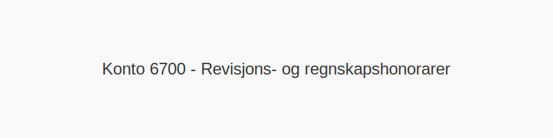

**Konto 6700 - Revisjons- og regnskapshonorarer** er en konto i Norsk Standard Kontoplan som brukes til å registrere **kostnader til revisjonshonorarer og regnskapsføring**. Disse kostnadene inkluderer honorarer til revisor, regnskapsfører og andre rådgivningstjenester knyttet til økonomisk rapportering og revisjon.

## Når brukes konto 6700?

Konto 6700 benyttes i situasjoner som:

* **Revisjonshonorarer** for ekstern revisor ved lovpålagt eller frivillig revisjon
* **Regnskapsføringshonorarer** til ekstern regnskapsfører for løpende bokføring og årsoppgjør
* **Skatterådgivning** og annen finansiell rådgivning som inngår i årsrapport og visse compliance-tjenester
* **Spesielle prosjekter** som intern revisjon, compliance og risikovurderinger

## Bokføringseksempler

| Transaksjon                                   | Debet (konto)                                          | Kredit (konto)         |
| --------------------------------------------- | ------------------------------------------------------ | ---------------------- |
| Faktura fra revisor for årsregnskap           | Konto 6700 - Revisjons- og regnskapshonorarer          | Konto 2400 - Leverandørgjeld |
| Betaling av revisjonshonorar                   | Konto 2400 - Leverandørgjeld                            | Konto 1920 - Bankinnskudd    |
| Faktura fra regnskapsfører for løpende bokføring | Konto 6700 - Revisjons- og regnskapshonorarer        | Konto 2400 - Leverandørgjeld |

*Ved tjenester som er MVA-pliktige*, bokfør inngående merverdiavgift på [Konto 2740 - Inngående merverdiavgift høy sats](/blogs/kontoplan/2740-inngaaende-merverdiavgift-hoy-sats "Konto 2740 - Inngående merverdiavgift høy sats").

## Viktige punkter

* **Lovpålagt revisjon** for aksjeselskaper må føres korrekt
* **Dokumentasjon** i form av fakturaer og avtaler er påkrevd i regnskapet
* **Skille mellom honorarer** til revisor og regnskapsfører for rapportering og kontroll
* **MVA-behandling** følger de standardiserte satsene for tjenester

## Relaterte kontoer

* [Konto 2700 - Utgående merverdiavgift](/blogs/kontoplan/2700-utgaende-merverdiavgift "Konto 2700 - Utgående merverdiavgift")
* [Konto 2740 - Inngående merverdiavgift høy sats](/blogs/kontoplan/2740-inngaaende-merverdiavgift-hoy-sats "Konto 2740 - Inngående merverdiavgift høy sats")
* [Konto 6600 - Reparasjon og vedlikehold bygninger](/blogs/kontoplan/6600-reparasjon-og-vedlikehold-bygninger "Konto 6600 - Reparasjon og vedlikehold bygninger")
* [Konto 6620 - Reparasjon og vedlikehold utstyr](/blogs/kontoplan/6620-reparasjon-og-vedlikehold-utstyr "Konto 6620 - Reparasjon og vedlikehold utstyr")
* [Konto 6720 - Honorarer for økonomisk og juridisk bistand](/blogs/kontoplan/6720-honorarer-for-okonomisk-og-juridisk-bistand "Konto 6720 - Honorarer for økonomisk og juridisk bistand")
* [Konto 6790 - Annen fremmed tjeneste](/blogs/kontoplan/6790-annen-fremmed-tjeneste "Konto 6790 - Annen fremmed tjeneste")
* [Hva er en Kontoplan?](/blogs/regnskap/hva-er-kontoplan "Hva er en Kontoplan? Komplett Guide til Kontoplaner i Norsk Regnskap")
