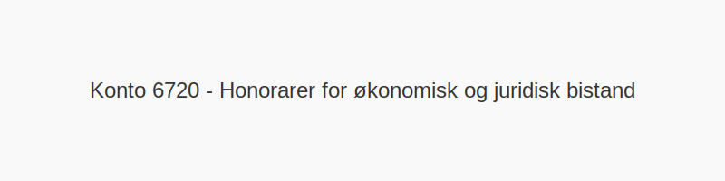

---
title: "Konto 6720 - Honorarer for økonomisk og juridisk bistand"
seoTitle: "6720-honorarer-for-okonomisk-og-juridisk-bistand"
description: '**Konto 6720 - Honorarer for økonomisk og juridisk bistand** er en konto i Norsk Standard Kontoplan som brukes til å registrere **honorarer knyttet til økono...'
---

**Konto 6720 - Honorarer for økonomisk og juridisk bistand** er en konto i Norsk Standard Kontoplan som brukes til å registrere **honorarer knyttet til økonomisk rådgivning, juridisk bistand og andre profesjonelle tjenester**.

## Når brukes konto 6720?

Konto 6720 benyttes i situasjoner som:

* **Økonomisk rådgivning**: Honorarer til finansielle rådgivere, økonomikonsulenter og analyse av regnskap.
* **Juridisk bistand**: Honorarer til advokater, juridiske rådgivere og kontraktsgjennomgang.
* **Due diligence** og andre compliance-tjenester ved fusjoner, oppkjøp og restrukturering.
* **Spesielle prosjekter** som intern revisjon eller risikovurderinger.

## Bokføringseksempler

| Transaksjon                                                   | Debet (konto)                                                       | Kredit (konto)         |
| ------------------------------------------------------------- | ------------------------------------------------------------------- | ---------------------- |
| Faktura fra økonomisk rådgiver for selskapsanalyse           | Konto 6720 - Honorarer for økonomisk og juridisk bistand            | Konto 2400 - Leverandørgjeld |
| Faktura fra advokat for juridisk kontraktsgjennomgang        | Konto 6720 - Honorarer for økonomisk og juridisk bistand            | Konto 2400 - Leverandørgjeld |
| Betaling av rådgivningshonorarer                              | Konto 2400 - Leverandørgjeld                                        | Konto 1920 - Bankinnskudd    |

*Ved tjenester som er MVA-pliktige*, bokfør inngående merverdiavgift på [Konto 2740 - Inngående merverdiavgift høy sats](/blogs/kontoplan/2740-inngaaende-merverdiavgift-hoy-sats "Konto 2740 - Inngående merverdiavgift høy sats").

## Viktige punkter

* **Korrekt klassifisering** av økonomiske og juridiske tjenester er avgjørende for nøyaktig rapportering.
* **Dokumentasjon** i form av detaljerte fakturaer og avtaler må oppbevares for revisjon og kontroll.
* Skille mellom honorarer for **rådgivningstjenester** og andre driftskostnader.
* MVA-behandling følger gjeldende **avgiftssatser**, avhengig av tjenestens art.

## Relaterte kontoer

* [Konto 6700 - Revisjons- og regnskapshonorarer](/blogs/kontoplan/6700-revisjons-og-regnskapshonorarer "Konto 6700 - Revisjons- og regnskapshonorarer")
* [Konto 6720 - Honorarer for økonomisk og juridisk bistand](/blogs/kontoplan/6720-honorarer-for-okonomisk-og-juridisk-bistand "Konto 6720 - Honorarer for økonomisk og juridisk bistand")
* [Konto 6790 - Annen fremmed tjeneste](/blogs/kontoplan/6790-annen-fremmed-tjeneste "Konto 6790 - Annen fremmed tjeneste")
* [Konto 2740 - Inngående merverdiavgift høy sats](/blogs/kontoplan/2740-inngaaende-merverdiavgift-hoy-sats "Konto 2740 - Inngående merverdiavgift høy sats")
* [Konto 2400 - Leverandørgjeld](/blogs/kontoplan/2400-leverandorgjeld "Konto 2400 - Leverandørgjeld")
* [Hva er en Kontoplan?](/blogs/regnskap/hva-er-kontoplan "Hva er en Kontoplan? Komplett Guide til Kontoplaner i Norsk Regnskap")

