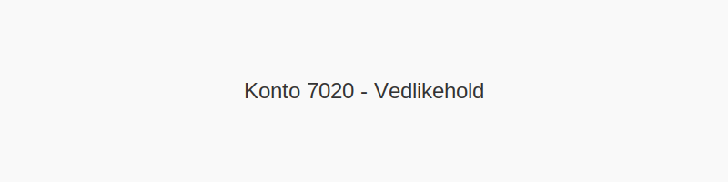

---
title: "7020-vedlikehold"
meta_title: "7020-vedlikehold"
meta_description: '**Konto 7020 - Vedlikehold** er en konto i **Norsk Standard Kontoplan (NS 4102)** som brukes til å registrere **vedlikeholdskostnader** i virksomhetens drift.'
slug: 7020-vedlikehold
type: blog
layout: pages/single
---

**Konto 7020 - Vedlikehold** er en konto i **Norsk Standard Kontoplan (NS 4102)** som brukes til å registrere **vedlikeholdskostnader** i virksomhetens drift.

## Hva dekker Konto 7020?

* **Vedlikehold av bygninger** – løpende vedlikeholdsarbeid og reparasjoner.
* **Vedlikehold av maskiner og utstyr** – service, utskifting av deler og kalibrering.
* **Serviceavtaler** – avtaler om periodisk vedlikehold hos eksterne leverandører.
* **Løpende inspeksjon og oppfølging** for å sikre driftssikkerhet og levetid.

## Merverdiavgift på vedlikehold

**Vedlikeholdstjenester** er som regel underlagt **25 % MVA** med full fradragsrett.

| Type vedlikehold                     | MVA-sats | Fradragsrett      |
|--------------------------------------|----------|-------------------|
| Løpende vedlikehold av bygninger     | 25 %     | Full fradragsrett |
| Service og reparasjon av utstyr      | 25 %     | Full fradragsrett |

## Regnskapsføring

| Transaksjon                                     | Debet                    | Kredit                       |
|-------------------------------------------------|--------------------------|------------------------------|
| Anskaffelse av vedlikeholdstjenester            | Konto 7020 - Vedlikehold | Konto 2400 - Leverandørgjeld |
| Betaling av faktura for vedlikeholdstjenester   | Konto 2400 - Leverandørgjeld | Konto 1920 - Bankinnskudd  |

## Eksempel på bokføring

| Beløp ekskl. avgifter | Avgift (%) | Total inkl. avgift |
|-----------------------|------------|--------------------|
| 10 000 NOK            | 25 %       | 12 500 NOK         |

## Beste praksis for vedlikehold

* **Etabler vedlikeholdsplaner** og rutiner for regelmessig service.
* **Bruk sertifiserte leverandører** for sikre og dokumenterte vedlikeholdsoppdrag.
* **Dokumenter alt vedlikeholdsarbeid** for sporbarhet og perioderapportering.
* **Planlegg inspeksjoner** for å unngå kostbare havarier og uventet driftsstans.

## Intern lenking og relaterte kontoer

Andre kontoer i NS 4102 som ofte brukes sammen med konto 7020:

* [Konto 6600 - Reparasjon og vedlikehold bygninger](/blogs/kontoplan/6600-reparasjon-og-vedlikehold-bygninger "Konto 6600 - Reparasjon og vedlikehold bygninger")
* [Konto 6620 - Reparasjon og vedlikehold utstyr](/blogs/kontoplan/6620-reparasjon-og-vedlikehold-utstyr "Konto 6620 - Reparasjon og vedlikehold utstyr")
* [Konto 3510 - Service](/blogs/kontoplan/3510-service "Konto 3510 - Service")
* [Konto 6500 - Motordrevet verktøy](/blogs/kontoplan/6500-motordrevet-verktoy "Konto 6500 - Motordrevet verktøy")
* [Konto 4500 - Fremmedytelser og underentreprise](/blogs/kontoplan/4500-fremmedytelser-og-underentreprise "Konto 4500 - Fremmedytelser og underentreprise")
* [Hva er en Kontoplan?](/blogs/regnskap/hva-er-kontoplan "Hva er en Kontoplan? Komplett Guide til Kontoplaner i Norsk Regnskap")
* [Hva er en Faktura?](/blogs/regnskap/hva-er-en-faktura "Hva er en Faktura? En Guide til Norske Fakturakrav")
