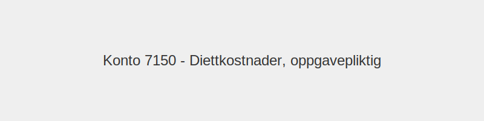

---
title: "Konto 7150 - Diettkostnader, oppgavepliktig"
seoTitle: "7150-diettkostnader-oppgavepliktig"
description: '**Konto 7150 - Diettkostnader, oppgavepliktig** er en konto i **Norsk Standard Kontoplan (NS 4102)** som brukes til å registrere **oppgavepliktige diettkostna...'
---

**Konto 7150 - Diettkostnader, oppgavepliktig** er en konto i **Norsk Standard Kontoplan (NS 4102)** som brukes til å registrere **oppgavepliktige diettkostnader**.



## Hva er diettkostnader?

* **Diettkostnader** omfatter utgifter til måltider og småforpleining (kaffe, frukt o.l.) ved tjenestereiser og andre arbeidsrelaterte oppdrag.
* **Oppgavepliktig diett** betyr at beløp utover Skatteetatens skattefrie normaltariffer må rapporteres via A-meldingen og vil bli beskattet som et ansattgode.

## Skatteregler for diett

Tabellen under viser Skatteetatens normaltariffer for diett ved innenlands reise:

| Type diett                       | Dokumentasjon          | Skatteetatens normaltariff  |
|----------------------------------|------------------------|-----------------------------|
| Enkelt diett (innenlands)        | Bilag med måltider     | 313 NOK per hel dag         |
| Dobbel diett (innenlands)        | Bilag med måltider     | 627 NOK per hel dag         |
| Måltidsfradrag ved delvis fravær | Bilag eller egenattest | 20 % av enkel diett         |

Beløp som overstiger normaltariffene regnes som **fordelsbeskatning** og skal **rapporteres i A-meldingen**.

## Regnskapsføring av diettkostnader

| Transaksjon                       | Debet                         | Kredit                        |
|-----------------------------------|-------------------------------|-------------------------------|
| Påløpte diettkostnader            | Konto 7150 - Diettkostnader   | Konto 2400 - Leverandørgjeld |
| Utbetaling til leverandør         | Konto 2400 - Leverandørgjeld  | Konto 1920 - Bankinnskudd    |

## Eksempel på bokføring

```plaintext
Debet: Konto 7150 - Diettkostnader      5 000 NOK
Kredit: Konto 2400 - Leverandørgjeld     5 000 NOK
```

## Nøkkelfunksjoner

| Egenskap      | Beskrivelse                                         |
|---------------|-----------------------------------------------------|
| Kontonummer   | 7150                                                |
| Konto         | Diettkostnader, oppgavepliktig                      |
| Kontotype     | Driftskostnad                                       |
| Formål        | Registrere oppgavepliktig diettkostnader            |

## Praktiske hensyn

* **Dokumentasjon:** Samle bilag for alle måltider og småforpleining.
* **Normaltariffer:** Følg Skatteetatens satser for hel eller delvis diett.
* **Rapportering:** Rapportér fordelsbeskatning av overskytende beløp i A-meldingen.

## Intern lenking og relaterte kontoer

* [Diett](/blogs/regnskap/diett "Diett: Guide til normaltariffer, regler og regnskapsføring av diett")
* [Konto 7100 - Bilgodtgjørelse, oppgavepliktig](/blogs/kontoplan/7100-bilgodtgjorelse-oppgavepliktig "Konto 7100 - Bilgodtgjørelse, oppgavepliktig: Regnskapsføring av bilgodtgjørelse som oppgavepliktig fordel i Norsk kontoplan")
* [Konto 7130 - Reisekostnad, oppgavepliktig](/blogs/kontoplan/7130-reisekostnad-oppgavepliktig "Konto 7130 - Reisekostnad, oppgavepliktig: Komplett Guide til Oppgavepliktige Reisekostnader")
* [Konto 7140 - Reisekostnad, ikke oppgavepliktig](/blogs/kontoplan/7140-reisekostnad-ikke-oppgavepliktig "Konto 7140 - Reisekostnad, ikke oppgavepliktig: Komplett Guide til Ikke Oppgavepliktige Reisekostnader")
* [Konto 7160 - Diettkostnader, ikke oppgavepliktig](/blogs/kontoplan/7160-diettkostnader-ikke-oppgavepliktig "Konto 7160 - Diettkostnader, ikke oppgavepliktig: Komplett Guide til Ikke Oppgavepliktige Diettkostnader")
* [A-meldingen](/blogs/regnskap/hva-er-a-melding "Hva er A-melding? Komplett Guide til A-meldingen")
* [Hva er en Kontoplan?](/blogs/regnskap/hva-er-kontoplan "Hva er en Kontoplan? Komplett Guide til Kontoplaner i Norsk Regnskap")

**Konto 7150 - Diettkostnader, oppgavepliktig** hjelper deg å synliggjøre **kostnader til diett og småforpleining** som et oppgavepliktig ansattgode i regnskapet.


