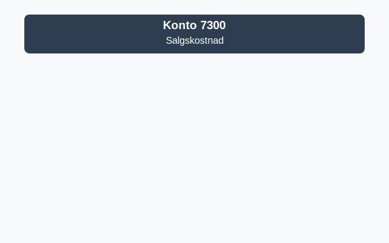

---
title: "Konto 7300 - Salgskostnad"
seoTitle: "7300-salgskostnad"
meta_description: '**Konto 7300 - Salgskostnad** er en konto i Norsk Standard Kontoplan (NS 4102) som brukes til å registrere **kostnader direkte knyttet til salgsinntekter**. S...'
slug: 7300-salgskostnad
type: blog
layout: pages/single
---

**Konto 7300 - Salgskostnad** er en konto i Norsk Standard Kontoplan (NS 4102) som brukes til å registrere **kostnader direkte knyttet til salgsinntekter**. Salgskostnad reflekterer utgiftene forbundet med å produsere, kjøpe inn og distribuere varer som er solgt.



## Hva er Salgskostnad?

**Salgskostnad** (Cost of Goods Sold, COGS) omfatter de direkte kostnadene ved produksjon eller innkjøp av varer som er solgt i en periode. Dette inkluderer typisk:

* **Varekostnad**: Innkjøpspris for solgte varer eller råvarer brukt i produksjon
* **Frakt og losji**: Kostnader for transport av varer til lager eller direkte til kunde
* **Rabatter og avslag**: Rabatter gitt fra leverandør som reduserer varekostnaden
* **Toll og avgifter**: Importavgifter og andre tollkostnader

## Komponenter av salgskostnad

| Komponent          | Konto       | Beskrivelse                                         |
|--------------------|-------------|-----------------------------------------------------|
| Varekostnad        | 4000-4390   | Innkjøp av varer for videresalg                      |
| Frakt og transport | 4060-4360   | Frakt, toll og spedisjonskostnader                   |
| Rabatter           | 4070-4370   | Innkjøpsprisreduksjoner                              |
| Lagerendring       | 4090-4990   | Beholdningsendring av varer under tilvirkning og ferdigvarer |

## Bokføring av salgskostnad

Regnskapsføring av salgskostnad følger prinsippet om sammenstilling av inntekter og kostnader:

```plaintext
Debet: Konto 7300 - Salgskostnad
Kredit: Konto 1400-1460 eller 4390 (lager/beholdningsendring)
```

## Eksempel

En butikk selger 500 enheter av produkt X. Innkjøpsprisen per enhet er 200 NOK, og totalt saldoendring i lager er -100 enheter.

| Beskrivelse           | Utregning           | Beløp (NOK) |
|-----------------------|---------------------|-------------|
| Kostnad solgte varer  | 500 enheter × 200   | 100 000     |
| Tillegg frakt         |                     | 2 500       |
| Lagerendring          | -100 enheter × 200  | -20 000     |
| **Total salgskostnad**|                     | **82 500**  |

## Rapportering og analyse

I resultatregnskapet presenteres **salgskostnad** som en del av driftskostnader, ofte under egen linje «Salgskostnad». Nøkkeltall som **bruttofortjeneste** beregnes ved å trekke salgskostnad fra salgsinntekt.

## Relaterte artikler

* [Konto 3000 - Salgsinntekt handelsvarer avgiftspl. høy sats](/blogs/kontoplan/3000-salgsinntekt-handelsvarer-avgiftspl-hoy-sats "Konto 3000 - Salgsinntekt handelsvarer avgiftspl. høy sats")
* [Hva er Driftskostnader?](/blogs/regnskap/hva-er-driftskostnader "Hva er Driftskostnader? En guide til norske driftskostnader")
* [Konto 4090 - Beholdningsendring](/blogs/kontoplan/4090-beholdningsendring "Konto 4090 - Beholdningsendring av varer og ferdigvarer")
* [Hva er Varekostnad?](/blogs/regnskap/hva-er-varekostnad "Hva er Varekostnad? Guide til kostnad for varer i regnskap")


