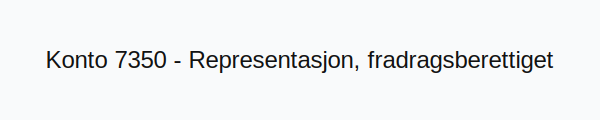

---
title: "7350-representasjon-fradragsberettiget"
meta_title: "7350-representasjon-fradragsberettiget"
meta_description: "**Konto 7350 - Representasjon, fradragsberettiget** er en konto i **Norsk Standard Kontoplan (NS 4102)** som brukes til å registrere **fradragsberettigede rep..."
slug: 7350-representasjon-fradragsberettiget
type: blog
layout: pages/single
---

**Konto 7350 - Representasjon, fradragsberettiget** er en konto i **Norsk Standard Kontoplan (NS 4102)** som brukes til å registrere **fradragsberettigede representasjonskostnader**.

## Hva er representasjon, fradragsberettiget?

*Fradragsberettiget representasjon* omfatter representasjonskostnader som ifølge skatteloven kan trekkes fra som kostnad i regnskapet, normalt begrenset til 50 % av de faktiske utgiftene.

## Regnskapsføring av representasjonskostnader

| Transaksjon                                  | Debet                                             | Kredit                         |
|----------------------------------------------|---------------------------------------------------|--------------------------------|
| Representasjon (50 % av total kostnad)       | Konto 7350 - Representasjon, fradragsberettiget   | Konto 2400 - Leverandørgjeld   |
| Betaling av representasjonskostnad           | Konto 2400 - Leverandørgjeld                      | Konto 1920 - Bankinnskudd      |

## Regler og begrensninger

* **Skattelovens begrensning:** Kun 50 % av representasjonskostnadene er fradragsberettiget.
* **Dokumentasjonskrav:** Oppbevar kvitteringer, deltakerlister og formål for representasjonen.
* **Forretningsrelatert:** Kostnadene må være knyttet til forretningsmessig representasjon.

## Praktiske hensyn

* Planlegg representasjon med tanke på kostnadskontroll og dokumentasjon.
* Skille tydelig mellom fradragsberettiget og ikke-fradragsberettiget representasjon.
* Sørg for periodisering av kostnadene dersom de påløper over regnskapsperioder.

## Intern lenking og relaterte kontoer

* [Konto 2400 - Leverandørgjeld](/blogs/kontoplan/2400-leverandorgjeld "Konto 2400 - Leverandørgjeld")
* [Konto 1920 - Bankinnskudd](/blogs/kontoplan/1920-bankinnskudd "Konto 1920 - Bankinnskudd")
* [Hva er en Kontoplan?](/blogs/regnskap/hva-er-kontoplan "Hva er en Kontoplan? Komplett Guide til Kontoplaner i Norsk Regnskap")
* [Konto 7360 - Representasjon, ikke fradragsberettiget](/blogs/kontoplan/7360-representasjon-ikke-fradragsberettiget "Konto 7360 - Representasjon, ikke fradragsberettiget")
* [Konto 7400 - Kontingenter, fradragsberettiget](/blogs/kontoplan/7400-kontingenter-fradragsberettiget "Konto 7400 - Kontingenter, fradragsberettiget")
* [Konto 7700 - Styre- og bedriftsforsamlingsmøter](/blogs/kontoplan/7700-styre-og-bedriftsforsamlingsmoter "Konto 7700 - Styre- og bedriftsforsamlingsmøter")

**Konto 7350 - Representasjon, fradragsberettiget** sikrer korrekt registrering av representasjonskostnader som er tillatt fradrag i henhold til gjeldende regelverk.
