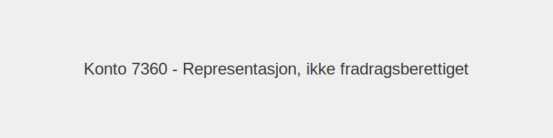

---
title: "Konto 7360 - Representasjon, ikke fradragsberettiget"
meta_title: "7360-representasjon-ikke-fradragsberettiget"
meta_description: '**Konto 7360 - Representasjon, ikke fradragsberettiget** er en konto i **Norsk Standard Kontoplan (NS 4102)** som brukes til å registrere **representasjonskos...'
slug: 7360-representasjon-ikke-fradragsberettiget
type: blog
layout: pages/single
---

**Konto 7360 - Representasjon, ikke fradragsberettiget** er en konto i **Norsk Standard Kontoplan (NS 4102)** som brukes til å registrere **representasjonskostnader som ikke er fradragsberettiget**.

## Hva er representasjon, ikke fradragsberettiget?

*Ikke fradragsberettiget representasjon* omfatter representasjonskostnader som ifølge skatteloven ikke kan trekkes fra som kostnad i regnskapet.

## Eksempler på ikke fradragsberettiget representasjon

| Type representasjonskostnad         | Beskrivelse                                         | Regelverk                         |
|-------------------------------------|-----------------------------------------------------|-----------------------------------|
| Gaver og blomster                   | Gaver til kunder eller samarbeidspartnere            | Ikke fradragsberettiget           |
| Underholdning, kultur og idrett     | Billetter til arrangementer og underholdning         | Ikke fradragsberettiget           |
| Alkoholservering                    | Vin, øl og [brennevin](/blogs/regnskap/brennevin "Brennevin - Regnskap, Skatt og Særavgifter for Sprit i Norge") ved representasjon | Ikke fradragsberettiget           |

## Bokføring og dokumentasjon

| Transaksjon                                | Debet                                                | Kredit                         |
|--------------------------------------------|------------------------------------------------------|--------------------------------|
| Representasjonskostnad (100 % av kostnad)  | Konto 7360 - Representasjon, ikke fradragsberettiget | Konto 2400 - Leverandørgjeld   |
| Betaling av representasjonskostnad         | Konto 2400 - Leverandørgjeld                         | Konto 1920 - Bankinnskudd      |

## Regler og begrensninger

* **Ingen fradragsrett:** Utgifter til representasjon kan ikke fradragsføres.
* **Dokumentasjonskrav:** Oppbevar kvitteringer, deltakerlister og formål.
* **Begrenset omfang:** Kostnadene må være klart forretningsrelatert og moderat i omfang.

## Praktiske anbefalinger

* Planlegg representasjonsaktiviteter med tanke på kostnadskontroll.
* Skille tydelig mellom fradragsberettiget og ikke fradragsberettiget representasjon (se [Konto 7350 - Representasjon, fradragsberettiget](/blogs/kontoplan/7350-representasjon-fradragsberettiget "Konto 7350 - Representasjon, fradragsberettiget")).
* Vurder alternativ som reise eller diett for møtekostnader (se [Konto 7160 - Diettkostnader, ikke oppgavepliktig](/blogs/kontoplan/7160-diettkostnader-ikke-oppgavepliktig "Konto 7160 - Diettkostnader, ikke oppgavepliktig")).

## Intern lenking og relaterte kontoer

* [Konto 2400 - Leverandørgjeld](/blogs/kontoplan/2400-leverandorgjeld "Konto 2400 - Leverandørgjeld")
* [Konto 1920 - Bankinnskudd](/blogs/kontoplan/1920-bankinnskudd "Konto 1920 - Bankinnskudd")
* [Konto 7350 - Representasjon, fradragsberettiget](/blogs/kontoplan/7350-representasjon-fradragsberettiget "Konto 7350 - Representasjon, fradragsberettiget")
* [Hva er en Kontoplan?](/blogs/regnskap/hva-er-kontoplan "Hva er en Kontoplan? Komplett Guide til Kontoplaner i Norsk Regnskap")
* [Konto 7400 - Kontingenter, fradragsberettiget](/blogs/kontoplan/7400-kontingenter-fradragsberettiget "Konto 7400 - Kontingenter, fradragsberettiget")
* [Konto 7700 - Styre- og bedriftsforsamlingsmøter](/blogs/kontoplan/7700-styre-og-bedriftsforsamlingsmoter "Konto 7700 - Styre- og bedriftsforsamlingsmøter")

