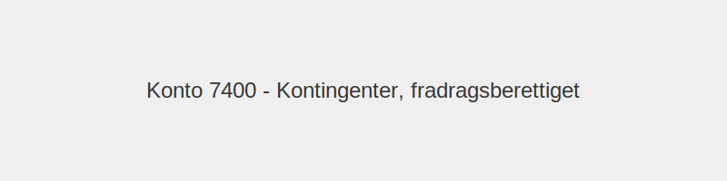

---
title: "Konto 7400 - Kontingenter, fradragsberettiget"
seoTitle: "7400-kontingenter-fradragsberettiget"
description: '**Konto 7400 - Kontingenter, fradragsberettiget** er en konto i **Norsk Standard Kontoplan (NS 4102)** som brukes til å registrere **kontingenter som er fradr...'
---

**Konto 7400 - Kontingenter, fradragsberettiget** er en konto i **Norsk Standard Kontoplan (NS 4102)** som brukes til å registrere **kontingenter som er fradragsberettiget**.

## Hva er kontingenter, fradragsberettiget?

*Fradragsberettigede kontingenter* er medlemsavgifter til profesjonelle organisasjoner, bransjeforeninger og andre medlemskap som ifølge skatteloven kan trekkes fra som kostnad i regnskapet.

## Regnskapsføring av kontingenter

| Transaksjon                          | Debet                                        | Kredit                      |
|--------------------------------------|----------------------------------------------|-----------------------------|
| Kontingentkostnad                    | Konto 7400 - Kontingenter, fradragsberettiget | Konto 2400 - Leverandørgjeld |
| Betaling av kontingent               | Konto 2400 - Leverandørgjeld                 | Konto 1920 - Bankinnskudd   |

## Regler og begrensninger

* **Skattelovens krav:** Kontingenter må være fradragsberettigede i henhold til skattelovens bestemmelser.
* **Dokumentasjon:** Oppbevar kvitteringer eller faktura og informasjon om medlemskapets formål.
* **Forretningsrelevant medlemskap:** Medlemskapet må ha en tilknytning til forretningsvirksomheten.

## Praktiske anbefalinger

* Vurder kun organisasjoner med direkte relevans til foretakets virksomhet.
* Sørg for å periodisere kontingenter på riktig regnskapsperiode.
* Sammenlign kostnader og fordeler ved ulike medlemskap før du tar en beslutning.

## Intern lenking og relaterte kontoer

* [Konto 2400 - Leverandørgjeld](/blogs/kontoplan/2400-leverandorgjeld "Konto 2400 - Leverandørgjeld")
* [Konto 1920 - Bankinnskudd](/blogs/kontoplan/1920-bankinnskudd "Konto 1920 - Bankinnskudd")
* [Konto 7410 - Kontingenter, ikke fradragsberettiget](/blogs/kontoplan/7410-kontingenter-ikke-fradragsberettiget "Konto 7410 - Kontingenter, ikke fradragsberettiget")
* [Hva er en Kontoplan?](/blogs/regnskap/hva-er-kontoplan "Hva er en Kontoplan? Komplett Guide til Kontoplaner i Norsk Regnskap")

**Konto 7400 - Kontingenter, fradragsberettiget** gir oversikt over fradragsberettigede medlemsavgifter som er tillatt kostnadsført i regnskapet.

