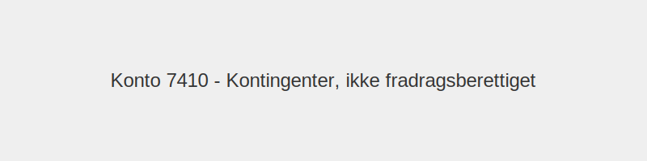

---
title: "Konto 7410 - Kontingenter, ikke fradragsberettiget"
meta_title: "7410-kontingenter-ikke-fradragsberettiget"
meta_description: '**Konto 7410 - Kontingenter, ikke fradragsberettiget** er en konto i **Norsk Standard Kontoplan (NS 4102)** som brukes til å registrere **kontingenter som ikk...'
slug: 7410-kontingenter-ikke-fradragsberettiget
type: blog
layout: pages/single
---

**Konto 7410 - Kontingenter, ikke fradragsberettiget** er en konto i **Norsk Standard Kontoplan (NS 4102)** som brukes til å registrere **kontingenter som ikke er fradragsberettiget**.

## Hva er kontingenter, ikke fradragsberettiget?

*Ikke-fradragsberettigede kontingenter* er medlemsavgifter til organisasjoner, foreninger eller medlemskap som ifølge skatteloven **ikke** kan trekkes fra som kostnad i regnskapet.

## Regnskapsføring av ikke-fradragsberettigede kontingenter

| Transaksjon                | Debet                                          | Kredit                      |
|----------------------------|------------------------------------------------|-----------------------------|
| Kontingentkostnad          | Konto 7410 - Kontingenter, ikke fradragsberettiget | Konto 2400 - Leverandørgjeld |
| Betaling av kontingent     | Konto 2400 - Leverandørgjeld                   | Konto 1920 - Bankinnskudd   |

## Skatteregler og begrensninger

* **Fravær av fradragsrett:** Kontingenter til politiske partier, sosiale klubber, idrettslag og lignende er ikke fradragsberettiget.
* **Dokumentasjonskrav:** Oppbevar fakturaer eller kvitteringer selv om kostnaden ikke gir skattefradrag.
* **Formålsvurdering:** Medlemskapet må vurderes opp mot virksomhetens forretningsformål.

## Praktiske anbefalinger

* Vurder nøye om medlemskapets kostnader står i forhold til fordelene, selv om det ikke gir skattemessig fradrag.
* Sørg for å periodisere kostnadene i riktig regnskapsperiode.
* Dokumenter formål og nødvendighet ved hvert medlemskap.

## Intern lenking og relaterte kontoer

* [Konto 2400 - Leverandørgjeld](/blogs/kontoplan/2400-leverandorgjeld "Konto 2400 - Leverandørgjeld")
* [Konto 1920 - Bankinnskudd](/blogs/kontoplan/1920-bankinnskudd "Konto 1920 - Bankinnskudd")
* [Konto 7400 - Kontingenter, fradragsberettiget](/blogs/kontoplan/7400-kontingenter-fradragsberettiget "Konto 7400 - Kontingenter, fradragsberettiget")
* [Hva er en Kontoplan?](/blogs/regnskap/hva-er-kontoplan "Hva er en Kontoplan? Komplett Guide til Kontoplaner i Norsk Regnskap")

**Konto 7410 - Kontingenter, ikke fradragsberettiget** brukes til å registrere kostnader for medlemskap som ikke gir skattemessig fradrag.

