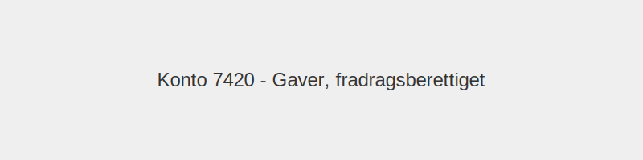

---
title: "7420-gaver-fradragsberettiget"
meta_title: "7420-gaver-fradragsberettiget"
meta_description: "**Konto 7420 - Gaver, fradragsberettiget** er en konto i **Norsk Standard Kontoplan (NS 4102)** som brukes til å registrere **fradragsberettigede gaver**."
slug: 7420-gaver-fradragsberettiget
type: blog
layout: pages/single
---

**Konto 7420 - Gaver, fradragsberettiget** er en konto i **Norsk Standard Kontoplan (NS 4102)** som brukes til å registrere **fradragsberettigede gaver**.

## Hva er gaver, fradragsberettiget?

*Fradragsberettigede gaver* er gaver gitt av virksomheten til kunder, leverandører eller ansatte hvor gaven oppfyller kravene for **skattefradrag** i henhold til skattelovens regler. Dette kan være smågaver som ikke overstiger beløpsgrensene, firmagaver ved jubileer eller andre anledninger som gir skattemessige fordeler.

## Regnskapsføring av gaver

| Transaksjon             | Debet                                  | Kredit                       |
|-------------------------|----------------------------------------|------------------------------|
| Gavekostnad             | Konto 7420 - Gaver, fradragsberettiget | Konto 2400 - Leverandørgjeld |
| Betaling av gave        | Konto 2400 - Leverandørgjeld           | Konto 1920 - Bankinnskudd    |

## Skatteregler og begrensninger

* **Grenseverdi for smågaver:** Inntil NOK 200 per mottaker per år for gaver uten skattemessig konsekvens.
* **Firmagaver:** Maksimalt NOK 400 per mottaker per år ved jubileum eller høytid.
* **Dokumentasjon:** Oppbevar kvitteringer og liste over mottakere for å dokumentere fradragsrett.
* **Formål:** Gaven må være knyttet til virksomhetens forretningsdrift.

For mer informasjon om skattefrie gaver til ansatte, se [Konto 5900 - Gaver til ansatte](/blogs/kontoplan/5900-gaver-til-ansatte "Konto 5900 - Gaver til ansatte").

**Merk:** For gaver som ikke er fradragsberettiget, se [Konto 7430 - Gaver, ikke fradragsberettiget](/blogs/kontoplan/7430-gaver-ikke-fradragsberettiget "Konto 7430 - Gaver, ikke fradragsberettiget").

## Praktiske eksempler

1. Virksomheten gir kunder gavekort på NOK 150 ved større bestillinger.
2. Leverandører får firmagave på NOK 350 ved samarbeidets 10-årsjubileum.
3. Ansatte mottar profilartikler til en verdi av NOK 200 i forbindelse med bedriftsarrangement.
