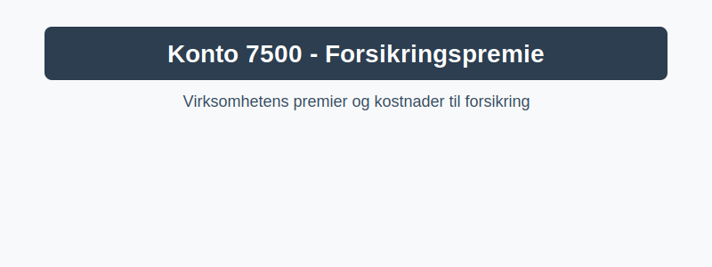

---
title: "Konto 7500 - Forsikringspremie"
seoTitle: "7500-forsikringspremie"
description: '**Konto 7500 - Forsikringspremie** er en **konto** i **Norsk Standard Kontoplan (NS 4102)** som brukes til å registrere virksomhetens kostnader til **forsikri...'
---

**Konto 7500 - Forsikringspremie** er en **konto** i **Norsk Standard Kontoplan (NS 4102)** som brukes til å registrere virksomhetens kostnader til **forsikringspremier** og sikre korrekt periodisering og regnskapsføring.



## Hva er forsikringspremie?

*Forsikringspremie* er det beløpet en virksomhet betaler til et forsikringsselskap for å oppnå forsikringsdekning i en periode. Premien dekker ulike risikoforsikringer som beskytter virksomhetens eiendeler, drift og ansvar mot potensielle tap.

## Typer forsikringspremier

De vanligste typene *forsikringspremier* som bokføres på konto 7500 inkluderer:

* **Ansvarsforsikring:** Dekker erstatningsansvar ved skade på tredjepart.
* **Brann- og naturskadeforsikring:** Beskyttelse mot brann, vannskader og naturhendelser.
* **Maskinforsikring:** Forsikring for reparasjon eller erstatning av maskiner og utstyr.
* **Avbruddsforsikring:** Kompensasjon ved driftsstans som følge av skade.
* **Kreditforsikring:** Dekning for tap ved kunders manglende betaling.

## Påløp og periodisering av forsikringspremie

Forsikringspremier betales ofte på forhånd for flere måneder. Derfor må kostnaden *periodiseres* for å fordele premien over gjeldende forsikringsperiode.

| Transaksjon                             | Debet                            | Kredit                         |
|-----------------------------------------|----------------------------------|--------------------------------|
| Påløpt forsikringspremie                | Konto 7500 - Forsikringspremie   | Konto 2900 - Påløpte kostnader |
| Periodisert premie (månedlig fordeling) | Konto 6200 - Forsikringskostnad  | Konto 2900 - Påløpte kostnader |

## Regnskapsføring av forsikringspremie

Grunnleggende bokføringsførsel ved kjøp og periodisering av premie:

```
Debet: Konto 7500 - Forsikringspremie
Kredit: Konto 2400 - Leverandørgjeld
```

```
Debet: Konto 6200 - Forsikringskostnad
Kredit: Konto 7500 - Forsikringspremie
```

## Nøkkelfunksjoner

| Egenskap         | Beskrivelse                                                    |
|------------------|----------------------------------------------------------------|
| **Kontonummer**   | 7500                                                           |
| **Navn**          | Forsikringspremie                                             |
| **Kontotype**     | Kostnad                                                       |
| **Formål**        | Registrere virksomhetens kostnader til forsikringspremier    |

## Intern lenking og relaterte kontoer

Andre kontoer i NS 4102 som ofte brukes sammen med konto 7500:

* [Konto 7040 - Forsikringer](/blogs/kontoplan/7040-forsikringer "Konto 7040 - Forsikringer")
* [Konto 5920 - Yrkesskadeforsikring](/blogs/kontoplan/5920-yrkesskadeforsikring "Konto 5920 - Yrkesskadeforsikring")
* [Konto 5930 - Andre forsikringer](/blogs/kontoplan/5930-andre-forsikringer "Konto 5930 - Andre forsikringer")
* [Hva er en kontoplan?](/blogs/regnskap/hva-er-kontoplan "Hva er en kontoplan? Komplett guide til kontoplaner i norsk regnskap")

**Konto 7500 - Forsikringspremie** gir oversikt over virksomhetens premiebetalinger og sikrer korrekt fordeling av kostnader over forsikringsperioden.


