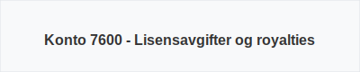

---
title: "Hva er Konto 7600 - Lisensavgifter og royalties?"
seoTitle: "7600-lisensavgifter-og-royalties"
description: '**Konto 7600 - Lisensavgifter og royalties** er en kostnadskonto i norsk kontoplan som benyttes for å registrere utgifter til **lisensavgifter** og **royalties...'
---

**Konto 7600 - Lisensavgifter og royalties** er en kostnadskonto i norsk kontoplan som benyttes for å registrere utgifter til **lisensavgifter** og **royalties** knyttet til bruk av immaterielle rettigheter.



## Hva er lisensavgifter og royalties?

Lisensavgifter og royalties er løpende kostnader som betales for å benytte andres immaterielle rettigheter, som patenter, lisenser, varemerker eller opphavsrettigheter. Slike kostnader kan både ha fast beløp og variere basert på omsetning eller produksjonsvolum.

## Kriterier for kostnadsføring

For at kostnader skal bokføres på konto 7600, må de oppfylle følgende kriterier:

* Kostnaden er knyttet til retten til å bruke immaterielle verdier.
* Utgiften er periodisert på rette regnskapsår.
* Eventuelle variabler (f.eks. royaltyprosent) beregnes i henhold til kontrakt.

## Typiske typer lisensavgifter og royalties

| Type kostnad              | Beskrivelse                           | Bokføringseksempel                   |
|---------------------------|---------------------------------------|--------------------------------------|
| **Fast lisensavgift**     | Engangsbetaling for rettighet         | Konto 7600 debet, konto 2400 kreditt |
| **Løpende royalty**       | Prosentandel av omsetning             | Konto 7600 debet, konto 3000 kreditt |
| **Minimumbetaling**       | Garanti for minsteinntekt til rettighetshaver | Konto 7600 debet, konto 2400 kreditt |

## Skattemessig behandling

* **Fradragsrett** for lisensavgifter og royalties forutsetter dokumentasjon.
* **Periodisering** av royaltykostnader følger kontraktsbestemmelser.

## Intern lenking

Se også:
* [Hva er Konto 1040 - Lisenser?](/blogs/kontoplan/1040-lisenser "Hva er Konto 1040 - Lisenser?")
* [Konto 1030 - Patenter](/blogs/kontoplan/1030-patenter "Konto 1030 - Patenter")
* [Konto 7610 - Patentkostnad ved egen patent](/blogs/kontoplan/7610-patentkostnad-ved-egen-patent "Konto 7610 - Patentkostnad ved egen patent")
* [Konto 7620 - Kostnader ved varemerker o.l.](/blogs/kontoplan/7620-kostnader-ved-varemerker-o-l "Konto 7620 - Kostnader ved varemerker o.l.")
* [Konto 7630 - Kontroll-, prøve- og stempelavgifter](/blogs/kontoplan/7630-kontroll-prove-og-stempelavgifter "Konto 7630 - Kontroll-, prøve- og stempelavgifter")

## Eksempel på bokføring

**Eksempel:** Et selskap betaler 5 % royalty av 1 000 000 NOK omsetning.

```text
Debet: Konto 7600 - Lisensavgifter og royalties (50 000 NOK)
Kredit: Konto 2400 - Leverandørgjeld (50 000 NOK)
```


