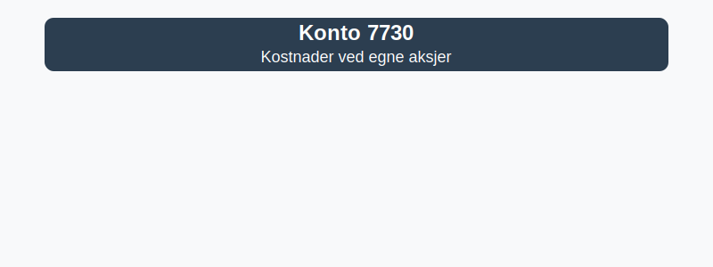

---
title: "7730-kostnader-ved-egne-aksjer"
meta_title: "7730-kostnader-ved-egne-aksjer"
meta_description: '**Konto 7730 - Kostnader ved egne aksjer** er en konto i **Norsk Standard Kontoplan (NS 4102)** som brukes til å registrere **kostnader ved egne aksjer** som ...'
slug: 7730-kostnader-ved-egne-aksjer
type: blog
layout: pages/single
---

**Konto 7730 - Kostnader ved egne aksjer** er en konto i **Norsk Standard Kontoplan (NS 4102)** som brukes til å registrere **kostnader ved egne aksjer** som oppstår i forbindelse med tilbakekjøp og håndtering av egne aksjer (treasury shares).

## Hva er kostnader ved egne aksjer?

*Kostnader ved egne aksjer* omfatter de direkte utgiftene selskapet pådrar seg i forbindelse med kjøp tilbake, registrering og håndtering av egne aksjer. Vanlige kostnadskomponenter inkluderer:

* Meglerhonorarer og transaksjonskostnader.
* Avgifter til Foretaksregisteret for registrering av tilbakekjøp.
* RÃ¥dgiverhonorarer (advokat, juridisk bistand).
* Andre administrative gebyrer knyttet til transaksjonen.

## Regnskapsføring av kostnader ved egne aksjer

| Transaksjon                                   | Debet                                           | Kredit                       |
|-----------------------------------------------|-------------------------------------------------|------------------------------|
| Transaksjonskostnader ved tilbakekjøp         | Konto 7730 - Kostnader ved egne aksjer          | Konto 1920 - Bankinnskudd    |
| Avgifter ved registrering av egne aksjer      | Konto 7730 - Kostnader ved egne aksjer          | Konto 2400 - Leverandørgjeld |
| Rådgiverhonorarer (advokat, juridisk bistand) | Konto 7730 - Kostnader ved egne aksjer          | Konto 2400 - Leverandørgjeld |
| Utbetaling av påløpte kostnader               | Konto 2400 - Leverandørgjeld                    | Konto 1920 - Bankinnskudd    |

## Regler og begrensninger

* Kostnader må finansieres av fri egenkapital, jf. aksjeloven § 8-7.
* Kostnader knyttet til egne aksjer reduserer selskapets egenkapital.
* Dokumentasjonskrav: Oppbevar fakturaer, handelsbekreftelser og avtaler som dokumentasjon.

## Praktiske hensyn

* Planlegg tilbakekjøp for å minimere transaksjonskostnader.
* Sammenlign priser fra flere meglerhus for best pris.
* Vurder tidspunkt for kjøp for å oppnå effektiv intern kapitalforvaltning.

## Intern lenking og relaterte kontoer

* [Konto 2010 - Egne aksjer](/blogs/kontoplan/2010-egne-aksjer "Konto 2010 - Egne aksjer: Treasury shares i Norsk Standard Kontoplan")
* [Konto 2000 - Aksjekapital](/blogs/kontoplan/2000-aksjekapital "Konto 2000 - Aksjekapital: Aksjekapital i Norsk Standard Kontoplan")
* [Konto 2020 - Overkursfond](/blogs/kontoplan/2020-overkursfond "Konto 2020 - Overkursfond: Overkursfond i Norsk Standard Kontoplan")
* [Konto 2080 - Udekket tap](/blogs/kontoplan/2080-udekket-tap "Konto 2080 - Udekket tap: Udekket tap i Norsk Standard Kontoplan")
* [Konto 2400 - Leverandørgjeld](/blogs/kontoplan/2400-leverandorgjeld "Konto 2400 - Leverandørgjeld: Leverandørgjeld i Norsk Standard Kontoplan")
* [Konto 1920 - Bankinnskudd](/blogs/kontoplan/1920-bankinnskudd "Konto 1920 - Bankinnskudd: Bankinnskudd i Norsk Standard Kontoplan")
* [Hva er en Kontoplan?](/blogs/regnskap/hva-er-kontoplan "Hva er en Kontoplan? Komplett Guide til Kontoplaner i Norsk Regnskap")

**Konto 7730 - Kostnader ved egne aksjer** gir en detaljert oversikt over kostnadene selskapet pådrar seg ved kjøp og håndtering av egne aksjer.
