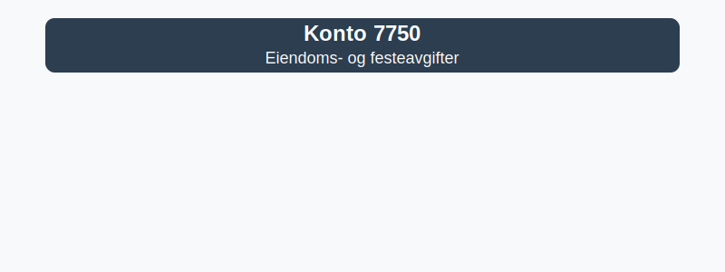

---
title: "Konto 7750 - Eiendoms- og festeavgifter"
meta_title: "7750-eiendoms-og-festeavgifter"
meta_description: '**Konto 7750 - Eiendoms- og festeavgifter** er en konto i Norsk Standard Kontoplan som brukes til å registrere **eiendoms- og festeavgifter**, inkludert kommun...'
slug: 7750-eiendoms-og-festeavgifter
type: blog
layout: pages/single
---

**Konto 7750 - Eiendoms- og festeavgifter** er en konto i Norsk Standard Kontoplan som brukes til å registrere **eiendoms- og festeavgifter**, inkludert kommunale eiendomsskatter og festeavgifter for grunnleie.



## Hva er eiendoms- og festeavgifter?

*Eiendomsavgift* er en kommunal avgift som ilegges eiere av fast eiendom basert på eiendommens beregnede verdi.
*Festeavgift* er leiebetaling til grunneier for langsiktig bruk av grunn (festetomt).

## Beregning og klassifisering

Avgiftene beregnes vanligvis årlig og kan klassifiseres som følger:

| Type avgift         | Ansvarlig           | Periode                     |
|---------------------|---------------------|-----------------------------|
| *Eiendomsavgift*    | Kommunen            | Årlig                       |
| *Festeavgift*       | Grunneier           | Årlig eller etter avtale     |

## Regnskapsføring

Regnskapsføring av eiendoms- og festeavgifter kan se slik ut:

| Transaksjon                          | Debet                                | Kredit                       |
|--------------------------------------|--------------------------------------|------------------------------|
| Årlig eiendoms- og festeavgifter     | Konto 7750 - Eiendoms- og festeavgifter | Konto 2400 - Leverandørgjeld |
| Betaling av avgiftsfaktura           | Konto 2400 - Leverandørgjeld          | Konto 1920 - Bankinnskudd     |

## Eksempel på bokføring

```plaintext
Debet: Konto 7750 - Eiendoms- og festeavgifter    25 000 NOK
Kredit: Konto 1920 - Bankinnskudd                 25 000 NOK
```

## Intern lenking og relaterte kontoer

Andre kontoer i samme avgifts- og kostnadsgruppe:

* [Konto 7500 - Forsikringspremie](/blogs/kontoplan/7500-forsikringspremie "Konto 7500 - Forsikringspremie")
* [Konto 7550 - Garantikostnad](/blogs/kontoplan/7550-garantikostnad "Konto 7550 - Garantikostnad")
* [Konto 7560 - Servicekostnad](/blogs/kontoplan/7560-servicekostnad "Konto 7560 - Servicekostnad")
* [Konto 7600 - Lisensavgifter og royalties](/blogs/kontoplan/7600-lisensavgifter-og-royalties "Konto 7600 - Lisensavgifter og royalties")
* [Konto 7610 - Patentkostnad ved egen patent](/blogs/kontoplan/7610-patentkostnad-ved-egen-patent "Konto 7610 - Patentkostnad ved egen patent")
* [Konto 7620 - Kostnader ved varemerker o.l.](/blogs/kontoplan/7620-kostnader-ved-varemerker-o-l "Konto 7620 - Kostnader ved varemerker o.l.")
* [Konto 7700 - Styre- og bedriftsforsamlingsmøter](/blogs/kontoplan/7700-styre-og-bedriftsforsamlingsmoter "Konto 7700 - Styre- og bedriftsforsamlingsmøter")
* [Konto 7710 - Generalforsamling](/blogs/kontoplan/7710-generalforsamling "Konto 7710 - Generalforsamling")
* [Konto 7730 - Kostnader ved egne aksjer](/blogs/kontoplan/7730-kostnader-ved-egne-aksjer "Konto 7730 - Kostnader ved egne aksjer")
* [Konto 7740 - Øreavrunding, MVA - oppgjør](/blogs/kontoplan/7740-oreavrunding-mva-oppgjor "Konto 7740 - Øreavrunding, MVA - oppgjør")
* [Konto 7745 - Øreavrunding, avgiftspliktig](/blogs/kontoplan/7745-oreavrunding-avgiftspliktig "Konto 7745 - Øreavrunding, avgiftspliktig")
* [Konto 7746 - Øreavrunding, avgiftsfritt](/blogs/kontoplan/7746-oreavrunding-avgiftsfritt "Konto 7746 - Øreavrunding, avgiftsfritt")
* [Hva er en Kontoplan?](/blogs/regnskap/hva-er-kontoplan "Hva er en Kontoplan? Komplett Guide til Kontoplaner i Norsk Regnskap")


