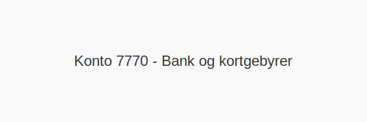

---
title: "Konto 7770 - Bank og kortgebyrer"
seoTitle: "7770-bank-og-kortgebyrer"
description: '**Konto 7770 - Bank og kortgebyrer** er en konto i Norsk Standard Kontoplan som brukes til å registrere **bank- og kortgebyrer**, det vil si kostnader knyttet ...'
---

**Konto 7770 - Bank og kortgebyrer** er en konto i Norsk Standard Kontoplan som brukes til å registrere **bank- og kortgebyrer**, det vil si kostnader knyttet til banktjenester og korttransaksjoner.



## Hva er bank- og kortgebyrer?

>*Bank- og kortgebyrer* er kostnader virksomheten pådrar seg for banktjenester og behandling av kortbetalinger, som faste kontoavgifter, transaksjonsgebyrer, årsavgifter og terminalgebyrer.

## Typer bank- og kortgebyrer

| Type gebyr            | Beskrivelse                                                        |
|-----------------------|--------------------------------------------------------------------|
| Kontoavgift           | Gebyr for å opprette og vedlikeholde bankkonto                     |
| Transaksjonsgebyr     | Gebyr per betalingstransaksjon (nettbank, kortbetaling)            |
| Årsavgift for kort    | Årlig avgift for debit- eller kredittkort                          |
| Terminalgebyr         | Avgift for bruk eller leie av kortautomat/terminal                 |
| Valutagebyr           | Gebyr ved innløsning av utenlandsk valuta                          |

## Regnskapsføring av bank- og kortgebyrer

Eksempel på bokføring av bankgebyr:

```plaintext
Debet: Konto 7770 - Bank og kortgebyrer
Kredit: Konto 1920 - Bankinnskudd
```

Eksempel på bokføring av kortgebyr:

```plaintext
Debet: Konto 7770 - Bank og kortgebyrer
Kredit: Konto 2400 - Leverandørgjeld (eller annen relevant gjeldskonto)
```

## Rutiner og kontrolltiltak

For å holde oversikt over bank- og kortgebyrer bør virksomheten:
* **Gjennomgå** månedlige kontoutskrifter nøye
* **Avstemme** gebyrer mot avtalevilkår og fakturaer fra banken
* **Forhandle** med bank og kortleverandører for gunstigere betingelser
* **Søke** elektroniske rapporter fra leverandører for detaljert innsikt

## Tips for å redusere gebyrer

* **Velg** bankkonto med lave faste gebyrer
* **Samle** transaksjoner eller forhandle lavere pris per transaksjon ved høyt volum
* **Vurdere** alternative betalingstjenester som tilbyr konkurransedyktige gebyrer
* **Bruke** digital rapportering for å identifisere unødvendige kostnader

## Intern lenking og relaterte kontoer

* [Konto 7770 - Bank og kortgebyrer](/blogs/kontoplan/7770-bank-og-kortgebyrer "Konto 7770 - Bank og kortgebyrer")
* [Konto 1920 - Bankinnskudd](/blogs/kontoplan/1920-bankinnskudd "Konto 1920 - Bankinnskudd")
* [Konto 2380 - Kassekreditt](/blogs/kontoplan/2380-kassekreditt "Konto 2380 - Kassekreditt")
* [Konto 3920 - Utgående gebyrer, avgiftspliktig](/blogs/kontoplan/3920-utgaende-gebyrer-avgiftspliktig "Konto 3920 - Utgående gebyrer, avgiftspliktig")
* [Konto 3970 - Utgående gebyrer, avgiftsfritt](/blogs/kontoplan/3970-utgaende-gebyrer-avgiftsfritt "Konto 3970 - Utgående gebyrer, avgiftsfritt")
* [Konto 7780 - Renter og gebyrer inkasso](/blogs/kontoplan/7780-renter-og-gebyrer-inkasso "Konto 7780 - Renter og gebyrer inkasso: Regnskapsføring av renter og gebyrer ved inkasso")
* [Konto 7790 - Diverse kostnader](/blogs/kontoplan/7790-diverse-kostnader "Konto 7790 - Diverse kostnader: Registrering av diverse kostnader i Norsk Standard Kontoplan")
* [Hva er en Kontoplan?](/blogs/regnskap/hva-er-kontoplan "Hva er en Kontoplan? Komplett Guide til Kontoplaner i Norsk Regnskap")


