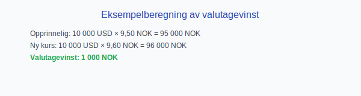

---
title: "Hva er Konto 8060 - Valutagevinst (Agio)?"
seoTitle: "8060-valutagevinst-agio"
description: '**Konto 8060 - Valutagevinst (Agio)** er en konto i Norsk Standard Kontoplan som brukes for å registrere **gevinst ved valutakursendringer** (ofte kalt *agio*)...'
---

**Konto 8060 - Valutagevinst (Agio)** er en konto i Norsk Standard Kontoplan som brukes for å registrere **gevinst ved valutakursendringer** (ofte kalt *agio*) som oppstår ved omregning av utenlandsk valuta.

## Hva er Valutagevinst (Agio)?

**Valutagevinst** oppstår når **valutakursen** endres slik at en utenlandsk valuta har høyere verdi i NOK.

**Agio** er forskjellen mellom kjøps- og salgskurs for valuta som realiserer gevinst.

## Når bokføres valutagevinst?

* Ved omregning av kontante bank- eller kassebeholdninger i utenlandsk valuta.
* Ved oppgjør av leverandør- eller kundefordringer denominert i fremmed valuta.
* Ved lukking av valutaposisjoner som resulterer i positiv kursdifferanse.

## Regnskapsføringseksempler

| Hendelse                                     | Debet                       | Kredit                            |
|----------------------------------------------|-----------------------------|-----------------------------------|
| Gevinst ved valutakursendring på bankinnskudd | Konto 1920 - Bankinnskudd   | Konto 8060 - Valutagevinst (Agio) |
| Gevinst ved valutatransaksjon på leverandørgjeld | Konto 2400 - Leverandørgjeld | Konto 8060 - Valutagevinst (Agio) |

## Eksempelberegning

En virksomhet har 10 000 USD på bankkonto. Opprinnelig omregningskurs var 9,50 NOK/USD, og på balansedagen er kursen 9,60 NOK/USD:

| Beskrivelse                             | Beløp (USD) | Kurs (NOK) | NOK-verdi      |
|-----------------------------------------|-------------|------------|----------------|
| Opprinnelig valutabeholdning            | 10 000      | 9,50       | 95 000         |
| Ny kurs for omregning                   | 10 000      | 9,60       | 96 000         |
| **Valutagevinst (Agio)**                |             |            | **1 000 NOK**  |

## Relaterte artikler

* [Konto 8050 - Annen renteinntekt](/blogs/kontoplan/8050-annen-renteinntekt "Konto 8050 - Annen renteinntekt: Regnskapsføring av annen renteinntekt")
* [Konto 8160 - Valutatap (Disagio)](/blogs/kontoplan/8160-valutatap-disagio "Konto 8160 - Valutatap (Disagio)")
* [Hva er en Kontoplan?](/blogs/regnskap/hva-er-kontoplan "Hva er en Kontoplan? Komplett Guide til Kontoplaner i Norsk Regnskap")

