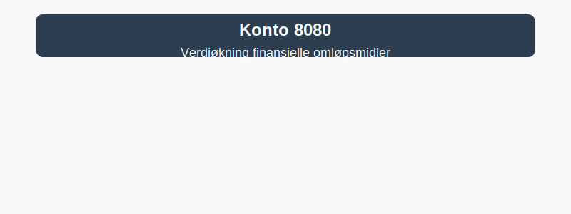

---
title: "Hva er Konto 8080 - Verdiøkning finansielle omløpsmidler?"
seoTitle: "Konto 8080 | Verdiøkning finansielle omløpsmidler | Kontoplan"
description: "Konto 8080 brukes til urealiserte gevinster på finansielle omløpsmidler ved måling til virkelig verdi. Se bokføring, periodisering og praktiske hensyn."
summary: "Konto 8080: urealiserte gevinster på finansielle omløpsmidler og bokføring."
---

**Konto 8080 - Verdiøkning finansielle omløpsmidler** er en konto i Norsk Standard Kontoplan som brukes for å resultatføre **urealiserte gevinster** på **finansielle omløpsmidler**.

## Hva er Verdiøkning finansielle omløpsmidler?

*Verdiøkning finansielle omløpsmidler* dekker endringer i virkelig verdi på finansielle omløpsmidler som ikke er realisert ved salg.

Typiske eksempler:
* **Aksjer og andeler** notert på børs eller andre markedsplasser
* **Obligasjoner og sertifikater** med variabel eller fast rente
* **Pengemarkedsfond** og andre likvide rentepapirer
* **Andre finansielle instrumenter** klassifisert som omløpsmidler

## Regnskapsføring av Verdiøkning finansielle omløpsmidler

| Transaksjon                                         | Debet                                                         | Kredit                                                           |
|-----------------------------------------------------|---------------------------------------------------------------|------------------------------------------------------------------|
| Verdiøkning (urealisert gevinst) på finansielle omløpsmidler | Konto 8080 - Verdiøkning finansielle omløpsmidler               | Konto 2170 - Urealisert gevinst finansielle omløpsmidler         |

## Praktiske hensyn

* **Periodisering:** Urealiserte gevinster bokføres ved regnskapsavslutning.
* **Dokumentasjon:** Bruk markedsverdipapirer eller kurser fra anerkjente kilder som grunnlag.
* **Presentasjon i årsregnskap:** Urealisert gevinst vises som egen linje under finansposter.
* **Risiko:** Monitorer markedsvolatilitet og vurder behov for sikring.

## Forskjell fra beslektede kontoer

| Konto | Beskrivelse                                                                                      | Hovedforskjell                                |
|-------|--------------------------------------------------------------------------------------------------|-----------------------------------------------|
| 8070  | [Annen finansinntekt](/blogs/kontoplan/8070-annen-finansinntekt "Konto 8070 - Annen finansinntekt")   | Realiserte gevinster og utbytte               |
| 8060  | [Valutagevinst (Agio)](/blogs/kontoplan/8060-valutagevinst-agio "Konto 8060 - Valutagevinst (Agio): Guide til valutagevinst i norsk regnskap") | Gevinst ved valutakursendringer               |
| 8080  | Verdiøkning finansielle omløpsmidler                                                              | Urealiserte gevinster på finansielle omløpsmidler |

## Relaterte artikler

* [Konto 8070 - Annen finansinntekt](/blogs/kontoplan/8070-annen-finansinntekt "Konto 8070 - Annen finansinntekt")
* [Konto 8060 - Valutagevinst (Agio)](/blogs/kontoplan/8060-valutagevinst-agio "Konto 8060 - Valutagevinst (Agio): Guide til valutagevinst i norsk regnskap")
* [Hva er Periodisering i Regnskap?](/blogs/regnskap/hva-er-periodisering "Hva er Periodisering i Regnskap? Guide til periodisering av kostnader og inntekter")
* [Hva er en Kontoplan?](/blogs/regnskap/hva-er-kontoplan "Hva er en Kontoplan? Komplett Guide til Kontoplaner i Norsk Regnskap")
* [Konto 8110 - Nedskrivning finansielle omløpsmidler](/blogs/kontoplan/8110-nedskrivning-finansielle-omlopsmidler "Konto 8110 - Nedskrivning finansielle omløpsmidler")

