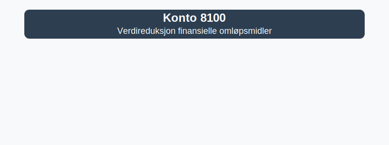

---
title: "Konto 8100 - Verdireduksjon finansielle omløpsmidler"
seoTitle: "8100-verdireduksjon-finansielle-omlopsmidler"
meta_description: '**Konto 8100 - Verdireduksjon finansielle omløpsmidler** er en konto i Norsk Standard Kontoplan som brukes til å registrere **nedskrivning** eller verdiforrin...'
slug: 8100-verdireduksjon-finansielle-omlopsmidler
type: blog
layout: pages/single
---

**Konto 8100 - Verdireduksjon finansielle omløpsmidler** er en konto i Norsk Standard Kontoplan som brukes til å registrere **nedskrivning** eller verdiforringelse av **finansielle omløpsmidler**.



## Hva er verdireduksjon finansielle omløpsmidler?

Verdireduksjon (nedskrivning) av finansielle omløpsmidler innebærer at bokført verdi reduseres når virkelig verdi eller netto salgsverdi er lavere enn anskaffelseskost. Dette sikrer at omløpsmidlene presenteres til en *realistisk verdi* i balansen.

## Når skal konto 8100 benyttes?

* Ved indikasjoner på varig verdifall på markedsbaserte aksjer, obligasjoner eller andre finansielle instrumenter
* Når virkelig verdi er lavere enn bokført verdi ved periodisk vurdering
* I henhold til prinsipper for [nedskrivning](/blogs/regnskap/hva-er-nedskrivning "Hva er Nedskrivning? Komplett Guide til Nedskrivning av Eiendeler")

## Regnskapsføring av verdireduksjon

Verdireduksjon bokføres som en kostnad i resultatregnskapet og reduserer balanseverdien på den aktuelle eiendelen.

| Steg | Beskrivelse                                                                           |
|------|---------------------------------------------------------------------------------------|
| 1    | Identifisere indikatorer på verdifall                                                |
| 2    | Beregne virkelig verdi eller netto salgsverdi                                         |
| 3    | Bokføre nedskrivning: `Debet 8100`, `Kredit` aktuell eiendelskonto (f.eks. 1810, 1830) |

## Klassifisering i kontoplanen

| Kontotype                                 | Kontonummer | Beskrivelse                                                  |
|-------------------------------------------|-------------|--------------------------------------------------------------|
| Verdireduksjon finansielle omløpsmidler   | 8100        | Nedskrivning av aksjer, obligasjoner og andre finansielle omløpsmidler |
| Markedsbaserte aksjer                     | 1810        | Aksjer notert på børs                                         |
| Markedsbaserte obligasjoner               | 1830        | Obligasjonslån notert på børs                                |
| Obligasjoner                              | 1360        | Langsiktige og kortsiktige obligasjonslån                    |
| Andre finansielle instrumenter            | 1880        | Andre markedsbaserte og unoterte finansielle instrumenter    |

## Eksempel på beregning av verdireduksjon

| Eiendelstype    | Anskaffelseskost | Virkelig verdi | Verdireduksjon |
|-----------------|------------------|----------------|----------------|
| Aksjer          | 100 000 kr       | 80 000 kr      | 20 000 kr      |
| Obligasjoner    | 50 000 kr        | 48 000 kr      | 2 000 kr       |
| Sertifikater    | 30 000 kr        | 30 000 kr      | 0 kr           |
| **Totalt**      | **180 000 kr**   | **158 000 kr** | **22 000 kr**  |

## Eksempel på bokføring

```plaintext
Debet: Konto 8100 - Verdireduksjon finansielle omløpsmidler   22 000 kr
Kredit: Konto 1810 - Markedsbaserte aksjer                    20 000 kr
Kredit: Konto 1360 - Obligasjoner                             2 000 kr
```

## Relaterte artikler

* [Konto 1580 - Avsetning tap på fordringer](/blogs/kontoplan/1580-avsetning-tap-pa-fordringer "Konto 1580 - Avsetning tap på fordringer")
* [Konto 1810 - Markedsbaserte aksjer](/blogs/kontoplan/1810-markedsbaserte-aksjer "Konto 1810 - Markedsbaserte aksjer")
* [Konto 1830 - Markedsbaserte obligasjoner](/blogs/kontoplan/1830-markedsbaserte-obligasjoner "Konto 1830 - Markedsbaserte obligasjoner")
* [Konto 1360 - Obligasjoner](/blogs/kontoplan/1360-obligasjoner "Konto 1360 - Obligasjoner")
* [Konto 1880 - Andre finansielle instrumenter](/blogs/kontoplan/1880-andre-finansielle-instrumenter "Konto 1880 - Andre finansielle instrumenter")
* [Hva er Nedskrivning?](/blogs/regnskap/hva-er-nedskrivning "Hva er Nedskrivning? Komplett Guide til Nedskrivning av Eiendeler")
* [Konto 8110 - Nedskrivning finansielle omløpsmidler](/blogs/kontoplan/8110-nedskrivning-finansielle-omlopsmidler "Konto 8110 - Nedskrivning finansielle omløpsmidler")
* [Konto 8120 - Nedskrivning finansielle anleggsmidler](/blogs/kontoplan/8120-nedskrivning-finansielle-anleggsmidler "Konto 8120 - Nedskrivning finansielle anleggsmidler")


