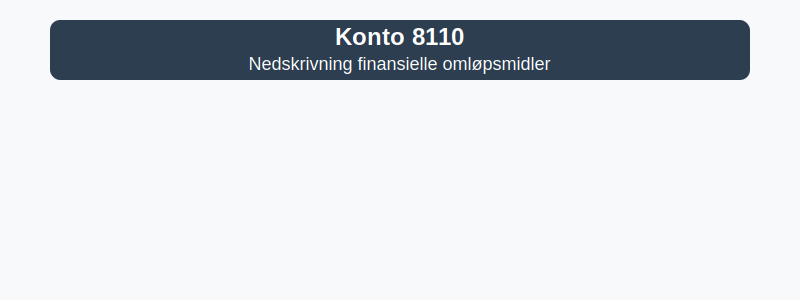

---
title: "Konto 8110 - Nedskrivning finansielle omløpsmidler"
meta_title: "8110-nedskrivning-finansielle-omlopsmidler"
meta_description: '**Konto 8110 - Nedskrivning finansielle omløpsmidler** er en konto i Norsk Standard Kontoplan som brukes for å registrere **realiserte tap** og **varige verdi...'
slug: 8110-nedskrivning-finansielle-omlopsmidler
type: blog
layout: pages/single
---

**Konto 8110 - Nedskrivning finansielle omløpsmidler** er en konto i Norsk Standard Kontoplan som brukes for å registrere **realiserte tap** og **varige verdifall** på **finansielle omløpsmidler**. Kontoen skiller seg fra [Konto 8100 - Verdireduksjon finansielle omløpsmidler](/blogs/kontoplan/8100-verdireduksjon-finansielle-omlopsmidler "Konto 8100 - Verdireduksjon finansielle omløpsmidler") ved at nedskrivning i 8110 gjenspeiler tapsførte beløp som anses som varige.



## Hva er Nedskrivning finansielle omløpsmidler?

* **Nedskrivning** av finansielle omløpsmidler forekommer når det er dokumentert at et verdifall er **varig** og ikke forventes å reverseres.
* Denne kontoen benyttes for **realiserte tap** eller **endelig nedskrivning** etter vurdering av kredittrisiko eller markedsforhold.

## NÃ¥r skal konto 8110 benyttes?

* Ved konstaterte tap på aksjer og obligasjoner hvor virkelig verdi er varig lavere enn bokført verdi
* Ved avvik mellom forventet innbetaling og bokført fordring på kunder eller andre låneforpliktelser
* I forbindelse med [nedskrivning](/blogs/regnskap/hva-er-nedskrivning "Hva er Nedskrivning? Komplett Guide til Nedskrivning av Eiendeler") etter gjeldende regnskapsprinsipper

## Regnskapsføring av nedskrivning

| Steg | Handling                                                                                 |
|------|------------------------------------------------------------------------------------------|
| 1    | Kartlegg indikatorer på varig verdifall                                                 |
| 2    | Beregn nedskrivningsbehov som differanse mellom bokført verdi og virkelig verdi         |
| 3    | Bokfør nedskrivning: `Debet 8110`, `Kredit` aktuell eiendelskonto (f.eks. 1810, 1830)     |

## Eksempel på bokføring

```plaintext
Debet: Konto 8110 - Nedskrivning finansielle omløpsmidler    15 000 kr
Kredit: Konto 1810 - Markedsbaserte aksjer                    15 000 kr
```

## Klassifisering i kontoplanen

| Kontotype                             | Kontonummer | Beskrivelse                                                   |
|---------------------------------------|-------------|---------------------------------------------------------------|
| Nedskrivning finansielle omløpsmidler | 8110        | Realiserte tap og varige verdifall på finansielle omløpsmidler |
| Markedsbaserte aksjer                 | 1810        | Aksjer notert på børs                                          |
| Markedsbaserte obligasjoner           | 1830        | Obligasjoner notert på børs                                    |
| Obligasjoner                          | 1360        | Langsiktige og kortsiktige obligasjonslån                      |

## Relaterte artikler

* [Konto 8100 - Verdireduksjon finansielle omløpsmidler](/blogs/kontoplan/8100-verdireduksjon-finansielle-omlopsmidler "Konto 8100 - Verdireduksjon finansielle omløpsmidler")
* [Konto 8080 - Verdiøkning finansielle omløpsmidler](/blogs/kontoplan/8080-verdiokning-finansielle-omlopsmidler "Konto 8080 - Verdiøkning finansielle omløpsmidler")
* [Hva er Nedskrivning?](/blogs/regnskap/hva-er-nedskrivning "Hva er Nedskrivning? Komplett Guide til Nedskrivning av Eiendeler")
* [Konto 8120 - Nedskrivning finansielle anleggsmidler](/blogs/kontoplan/8120-nedskrivning-finansielle-anleggsmidler "Konto 8120 - Nedskrivning finansielle anleggsmidler")

