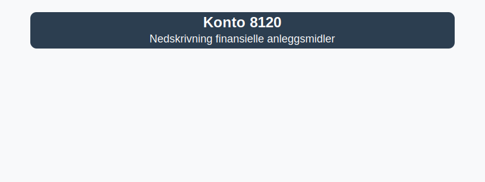

---
title: "Konto 8120 - Nedskrivning finansielle anleggsmidler"
meta_title: "8120-nedskrivning-finansielle-anleggsmidler"
meta_description: '**Konto 8120 - Nedskrivning finansielle anleggsmidler** er en konto i Norsk Standard Kontoplan som brukes for å registrere **realiserte tap** og **varige verdi...'
slug: 8120-nedskrivning-finansielle-anleggsmidler
type: blog
layout: pages/single
---

**Konto 8120 - Nedskrivning finansielle anleggsmidler** er en konto i Norsk Standard Kontoplan som brukes for å registrere **realiserte tap** og **varige verdifall** på **finansielle anleggsmidler**. Kontoen skiller seg fra [Konto 8110 - Nedskrivning finansielle omløpsmidler](/blogs/kontoplan/8110-nedskrivning-finansielle-omlopsmidler "Konto 8110 - Nedskrivning finansielle omløpsmidler") ved at nedskrivningen gjelder langsiktige investeringer i aksjer, obligasjoner og andre finansielle instrumenter som klassifiseres som anleggsmidler.



## Hva er Nedskrivning finansielle anleggsmidler?

* **Nedskrivning** av finansielle anleggsmidler forekommer når det dokumenteres at et verdifall er **varig** og ikke forventes å reverseres.
* Denne kontoen benyttes for **realiserte tap** eller **endelig nedskrivning** etter vurdering av kredittrisiko eller markedsforhold på langsiktige investeringer.

## NÃ¥r skal Konto 8120 benyttes?

* Ved konstaterte tap på aksjer, obligasjoner eller andre finansielle instrumenter som klassifiseres som anleggsmidler
* Når langsiktig investering ikke lenger forventes å gi fremtidige økonomiske fordeler
* I forbindelse med [nedskrivning](/blogs/regnskap/hva-er-nedskrivning "Hva er Nedskrivning? Komplett Guide til Nedskrivning av Eiendeler") etter gjeldende regnskapsprinsipper

## Regnskapsføring av nedskrivning

| Steg | Handling                                                                                 |
|------|------------------------------------------------------------------------------------------|
| 1    | Kartlegg indikatorer på varig verdifall                                                 |
| 2    | Beregn nedskrivningsbehov som differanse mellom bokført verdi og virkelig verdi         |
| 3    | Bokfør nedskrivning: `Debet 8120`, `Kredit` aktuell eiendelskonto (f.eks. 1800, 1810, 1830) |

## Eksempel på bokføring

```plaintext
Debet: Konto 8120 - Nedskrivning finansielle anleggsmidler   50 000 kr
Kredit: Konto 1830 - Markedsbaserte obligasjoner              50 000 kr
```

*(Eksempel der langsiktig investering i obligasjoner med bokført verdi på 200 000 kr nedskrives til virkelig verdi på 150 000 kr.)*

## Klassifisering i kontoplanen

| Kontotype                             | Kontonummer | Beskrivelse                                                   |
|---------------------------------------|-------------|---------------------------------------------------------------|
| Nedskrivning finansielle anleggsmidler | 8120        | Realiserte tap og varige verdifall på finansielle anleggsmidler |
| Aksjer og andeler i konsern           | 1800        | Aksjer og andeler i foretak i samme konsern                   |
| Markedsbaserte aksjer                 | 1810        | Aksjer notert på børs                                         |
| Andre aksjer                          | 1820        | Unoterte aksjer                                               |
| Markedsbaserte obligasjoner           | 1830        | Obligasjoner notert på børs                                   |
| Andre obligasjoner                    | 1840        | Unoterte obligasjoner                                         |
| Andre finansielle instrumenter        | 1880        | Andre finansielle instrumenter                                |

## Relaterte artikler

* [Konto 8100 - Verdireduksjon finansielle omløpsmidler](/blogs/kontoplan/8100-verdireduksjon-finansielle-omlopsmidler "Konto 8100 - Verdireduksjon finansielle omløpsmidler")
* [Konto 8110 - Nedskrivning finansielle omløpsmidler](/blogs/kontoplan/8110-nedskrivning-finansielle-omlopsmidler "Konto 8110 - Nedskrivning finansielle omløpsmidler")
* [Hva er Nedskrivning?](/blogs/regnskap/hva-er-nedskrivning "Hva er Nedskrivning? Komplett Guide til Nedskrivning av Eiendeler")
* [Konto 8120 - Nedskrivning finansielle anleggsmidler](/blogs/kontoplan/8120-nedskrivning-finansielle-anleggsmidler "Konto 8120 - Nedskrivning finansielle anleggsmidler")

