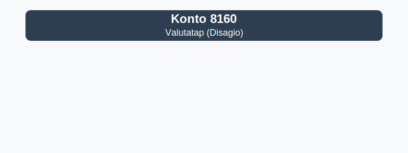

---
title: "Hva er Konto 8160 - Valutatap (Disagio)?"
seoTitle: "Konto 8160 | Valutatap (Disagio) | Kontoplan"
description: "Konto 8160 brukes til bokføring av valutatap (disagio) ved kursfall i utenlandsk valuta. Se regler, eksempler og typiske føringer."
summary: "Konto 8160: valutatap (disagio). Kort guide til bokføring og eksempler."
---

**Konto 8160 - Valutatap (Disagio)** er en konto i Norsk Standard Kontoplan som brukes for å registrere **tap ved valutakursendringer** (ofte kalt *disagio*) som oppstår ved omregning av utenlandsk valuta.

## Hva er Valutatap (Disagio)?

**Valutatap** oppstår når **valutakursen** endres slik at en utenlandsk valuta har lavere verdi i NOK.

**Disagio** er forskjellen mellom kjøps- og salgskurs for valuta som realiserer tap.

## Når bokføres Valutatap?

* Ved omregning av kontante bank- eller kassebeholdninger i utenlandsk valuta som har falt i verdi.
* Ved oppgjør av leverandør- eller kundefordringer denominert i fremmed valuta som gir negativ kursdifferanse.
* Ved lukking av valutaposisjoner som resulterer i negativ kursdifferanse.

## Regnskapsføringseksempler

| Hendelse                                         | Debet                            | Kredit                         |
|--------------------------------------------------|----------------------------------|--------------------------------|
| Tap ved valutakursendring på bankinnskudd        | Konto 8160 - Valutatap (Disagio) | Konto 1920 - Bankinnskudd      |
| Tap ved valutatransaksjon på leverandørgjeld     | Konto 8160 - Valutatap (Disagio) | Konto 2400 - Leverandørgjeld   |

## Eksempelberegning

En virksomhet har 10 000 USD på bankkonto. Opprinnelig omregningskurs var 9,60 NOK/USD, og på balansedagen er kursen 9,50 NOK/USD:

| Beskrivelse                              | Beløp (USD) | Kurs (NOK) | NOK-verdi     |
|------------------------------------------|-------------|------------|---------------|
| Opprinnelig valutabeholdning             | 10 000      | 9,60       | 96 000        |
| Ny kurs for omregning                    | 10 000      | 9,50       | 95 000        |
| **Valutatap (Disagio)**                  |             |            | **1 000 NOK** |

## Relaterte artikler

* [Konto 8060 - Valutagevinst (Agio)](/blogs/kontoplan/8060-valutagevinst-agio "Konto 8060 - Valutagevinst (Agio): Guide til valutagevinst i norsk regnskap")
* [Konto 8170 - Annen finanskostnad](/blogs/kontoplan/8170-annen-finanskostnad "Konto 8170 - Annen finanskostnad: Guide til andre finanskostnader")
* [Hva er Periodisering i Regnskap?](/blogs/regnskap/hva-er-periodisering "Hva er Periodisering i Regnskap? Guide til periodisering av kostnader og inntekter")
* [Hva er en Kontoplan?](/blogs/regnskap/hva-er-kontoplan "Hva er en Kontoplan? Komplett Guide til Kontoplaner i Norsk Regnskap")

