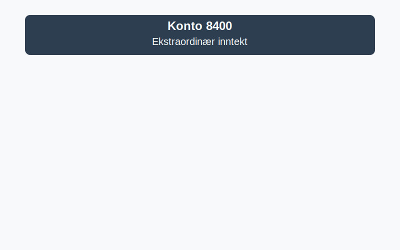

---
title: "Konto 8400 - Ekstraordinær inntekt"
seoTitle: "Konto 8400 | Ekstraordinær inntekt | Kontoplan"
description: "Konto 8400 i norsk kontoplan brukes til å registrere ekstraordinær inntekt, som engangsgevinster utenfor ordinær drift. Lær føring, eksempler og presentasjon i resultatregnskapet."
summary: "Kort guide til konto 8400 for ekstraordinære inntekter, med bokføring og presentasjon."
---

**Konto 8400 - Ekstraordinær inntekt** er en konto i Norsk Standard Kontoplan som brukes til å registrere **ekstraordinær inntekt**, dvs. engangs- eller uforutsigbare poster utenom ordinær drift.

## Hva er ekstraordinær inntekt?

*Ekstraordinær inntekt* er inntekter som ikke oppstår fra selskapets ordinære forretningsvirksomhet, men stammer fra engangshendelser som salg av anleggsmidler, forsikringsoppgjør eller andre uforutsette gevinster.

## Typer ekstraordinær inntekt

* **Salg av anleggsmidler:** Gevinst ved salg av driftsmidler som maskiner, kjøretøy eller eiendom.
* **Forsikringsutbetalinger:** Erstatninger ved skade eller tap.
* **Skatteendringer eller etterreguleringer:** Periodisering av skattegoder som faller utenfor ordinær skattebehandling.
* **Andre engangsgevinster:** Engangsposter fra juridiske avgjørelser, eiendomssalg eller restruktureringsgevinster.

## Regnskapsføring av ekstraordinær inntekt

| Transaksjon                       | Debet                                      | Kredit                                              |
|-----------------------------------|--------------------------------------------|-----------------------------------------------------|
| Gevinst ved salg av anleggsmidler | Konto 1230 - Anleggsmidler                 | Konto 8400 - Ekstraordinær inntekt                  |
| Forsikringsutbetaling              | Konto 1500 - Bankinnskudd                  | Konto 8400 - Ekstraordinær inntekt                  |
| Skattefordel ved etterregulering   | Konto 2800 - Utsatt skatt                  | Konto 8400 - Ekstraordinær inntekt                  |
| Andre engangsgevinster             | Avhenger av art                             | Konto 8400 - Ekstraordinær inntekt                  |

_*Eksempeltransaksjoner; bruk relevante kontonumre og beskrivelser basert på virksomhetens behov.*_

## Presentasjon i balansen

Ekstraordinær inntekt vises i resultatregnskapet under **ekstraordinære poster**, og påvirker egenkapitalen i balansen etter [god regnskapsskikk](/blogs/regnskap/god-regnskapsskikk "God Regnskapsskikk - Prinsipper, Standarder og Beste Praksis i Norge").

## Se også

* [Hva er Periodisering i Regnskap? Komplett Guide til Periodiseringsprinsippet](/blogs/regnskap/hva-er-periodisering "Hva er Periodisering i Regnskap? Komplett Guide til Periodiseringsprinsippet")
* [Hva er Inntekter? Komplett Guide til Inntektstyper og Regnskapsføring](/blogs/regnskap/hva-er-inntekter "Hva er Inntekter? Komplett Guide til Inntektstyper og Regnskapsføring")

## Relaterte artikler

* [Konto 1530 - Opptjent ikke fakturert inntekt](/blogs/kontoplan/1530-opptjent-ikke-fakturert-inntekt "Konto 1530 - Opptjent ikke fakturert inntekt")
* [Hva er balanse?](/blogs/regnskap/hva-er-balanse "Hva er Balanse? En Guide til Balanseregnskap")
* [Konto 8500 - Ekstraordinær kostnad](/blogs/kontoplan/8500-ekstraordinaer-kostnad "Konto 8500 - Ekstraordinær kostnad")

