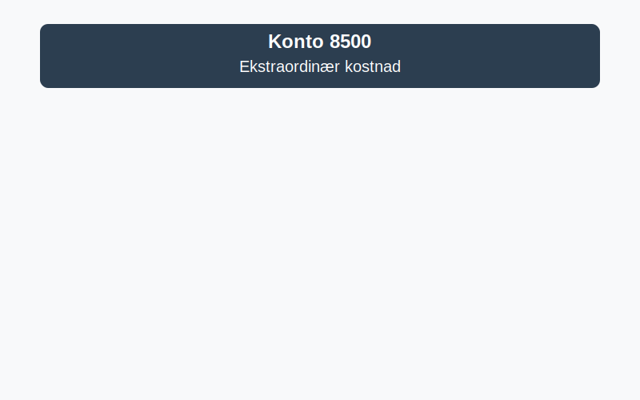

**Konto 8500 - Ekstraordinær kostnad** er en konto i Norsk Standard Kontoplan som brukes til å registrere **ekstraordinær kostnad**, dvs. engangs- eller uforutsigbare utgifter utenom ordinær drift.

## Hva er ekstraordinær kostnad?

*Ekstraordinær kostnad* er kostnader som ikke oppstår fra selskapets ordinære forretningsvirksomhet, men skyldes engangshendelser som tap ved salg av anleggsmidler, erstatningsutbetalinger eller andre uforutsette utgifter.

## Typer ekstraordinær kostnad

* **Tap ved salg av anleggsmidler:** Tap ved salg av driftsmidler som maskiner, kjøretøy eller eiendom.
* **Erstatningsutbetalinger:** Utgifter til forsikringserstatninger eller juridiske avgjørelser.
* **Restruktureringskostnader:** Kostnader knyttet til omorganisering, nedbemanning eller omstrukturering.
* **Andre engangsutgifter:** For eksempel tap ved valutakursendringer utenom ordinær drift.

## Regnskapsføring av ekstraordinær kostnad

| Transaksjon                            | Debet                                        | Kredit                                             |
|----------------------------------------|----------------------------------------------|----------------------------------------------------|
| Tap ved salg av anleggsmidler          | Konto 8400 - Ekstraordinær inntekt¹          | Konto 1230 - Anleggsmidler                         |
| Erstatningsutbetaling                  | Konto 8500 - Ekstraordinær kostnad           | Konto 1500 - Bankinnskudd                          |
| Restruktureringskostnader              | Konto 8500 - Ekstraordinær kostnad           | Konto 2990 - Annen gjeld/restrukturering           |
| Andre engangsutgifter                  | Avhenger av art                              | Konto 8500 - Ekstraordinær kostnad                 |

_*¹ Denne debiteringen nøytraliserer gevinstpostering i inntekt, ved at tap motregnes mot tidligere gevinstposter.*_

## Presentasjon i resultatregnskapet

Ekstraordinære kostnader vises i resultatregnskapet under **ekstraordinære poster**, og påvirker egenkapitalen i balansen etter [god regnskapsskikk](/blogs/regnskap/god-regnskapsskikk "God Regnskapsskikk - Prinsipper, Standarder og Beste Praksis i Norge").

## Se også

* [Hva er Periodisering i Regnskap? Komplett Guide til Periodiseringsprinsippet](/blogs/regnskap/hva-er-periodisering "Hva er Periodisering i Regnskap? Komplett Guide til Periodiseringsprinsippet")
* [Hva er Kostnader? Oversikt over kostnadstyper og regnskapsføring](/blogs/regnskap/hva-er-kostnader "Hva er Kostnader? Oversikt over kostnadstyper og regnskapsføring")

## Relaterte artikler

* [Konto 8400 - Ekstraordinær inntekt](/blogs/kontoplan/8400-ekstraordinaer-inntekt "Konto 8400 - Ekstraordinær inntekt")
* [Konto 7790 - Diverse kostnader](/blogs/kontoplan/7790-diverse-kostnader "Konto 7790 - Diverse kostnader")
* [Hva er anleggsmidler?](/blogs/regnskap/hva-er-anleggsmidler "Hva er anleggsmidler - Guide til anleggsmidler i balanse")

