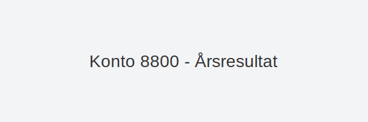
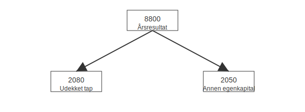

**Konto 8800 - Årsresultat** representerer **årets nettoresultat**, enten **overskudd** eller **underskudd**, før disponering til egenkapitalkontoer.

## Hva er Årsresultat?

*Årsresultat* er netto resultat for regnskapsperioden etter at alle inntekter, kostnader, skatter og avgifter er bokført. Det gir et samlet bilde av virksomhetens lønnsomhet.

## Journalføring av årsresultat

| Scenario                             | Debet                           | Kredit                          |
|--------------------------------------|---------------------------------|---------------------------------|
| Overskudd (årsresultat > 0)          | Konto 8800 - Årsresultat        | Konto 2050 - Annen egenkapital  |
| Underskudd (årsresultat < 0)         | Konto 2080 - Udekket tap         | Konto 8800 - Årsresultat        |

## Prosess for resultatdisponering

## Balansepresentasjon

Årsresultat overføres til egenkapital i balansen under relevant konto:

| Konto | Beskrivelse            |
|-------|------------------------|
| 2050  | Annen egenkapital      |
| 2080  | Udekket tap            |

## Relaterte artikler

* [Konto 2050 - Annen egenkapital](/blogs/kontoplan/2050-annen-egenkapital "Konto 2050 - Annen egenkapital: Annen egenkapital i Norsk Standard Kontoplan")
* [Konto 2080 - Udekket tap](/blogs/kontoplan/2080-udekket-tap "Konto 2080 - Udekket tap: Udekket tap i Norsk Standard Kontoplan")
* [Konto 8990 - Udekket tap](/blogs/kontoplan/8990-udekket-tap "Konto 8990 - Udekket tap: Lukking av underskudd i resultatdisponeringen")
* [Konto 2800 - Avsatt utbytte](/blogs/kontoplan/2800-avsatt-utbytte "Konto 2800 - Avsatt utbytte: Avsetning av utbytte som kortsiktig gjeld i Norsk Standard Kontoplan")
* [Hva er Årsavslutning?](/blogs/regnskap/hva-er-aarsavslutning "Hva er Årsavslutning? En Guide til Årsavslutning i Regnskap")
* [Hva er en Kontoplan?](/blogs/regnskap/hva-er-kontoplan "Hva er en Kontoplan? Komplett Guide til Kontoplaner i Norsk Regnskap")
