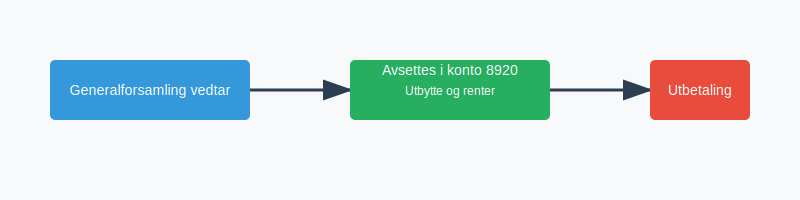
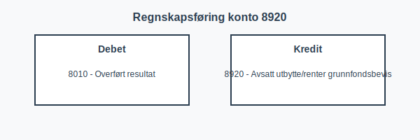

---
title: "8920-avsatt-utbytte-renter-grunnfondsbevis"
meta_title: "8920-avsatt-utbytte-renter-grunnfondsbevis"
meta_description: "**Konto 8920 - Avsatt utbytte/renter grunnfondsbevis** er en konto i Norsk Standard Kontoplan (NS 4102) som brukes til å registrere **avsetning av utbytte og ..."
slug: 8920-avsatt-utbytte-renter-grunnfondsbevis
type: blog
layout: pages/single
---

**Konto 8920 - Avsatt utbytte/renter grunnfondsbevis** er en konto i Norsk Standard Kontoplan (NS 4102) som brukes til å registrere **avsetning av utbytte og renter på grunnfondsbevis** vedtatt av generalforsamlingen som kortsiktig gjeld frem til utbetaling eller renteutbetaling.


## Hva er avsatt utbytte/renter grunnfondsbevis?

*Avsatt utbytte/renter grunnfondsbevis* er beløpet generalforsamlingen har besluttet å utbetale i utbytte og renter på grunnfondsbevis, men som ennå ikke er utbetalt eller utliknet i regnskapet. Konto 8920 viser selskapets forpliktelse til innehavere av grunnfondsbevis frem til utbetaling.

## NÃ¥r benyttes konto 8920?

* Når generalforsamlingen vedtar utbytte og renter på grunnfondsbevis
* Ved årsavslutning for å periodisere kortsiktig gjeld
* For å synliggjøre forpliktelsen til grunnfondsbeviseiere før faktisk utbetaling

## Prosess for avsetning



## Regnskapsføring

Regnskapsføring av avsetning og utbetaling skjer i to trinn:

```
Debet: Konto 8010 - Overført resultat
Kredit: Konto 8920 - Avsatt utbytte/renter grunnfondsbevis

Debet: Konto 8920 - Avsatt utbytte/renter grunnfondsbevis
Kredit: Konto 1920 - Bankinnskudd
```



## Bokføringsposter i tabellform

| Transaksjon                            | Debet                                    | Kredit                                    |
|----------------------------------------|------------------------------------------|-------------------------------------------|
| Avsetning av utbytte og renter         | Konto 8010 - Overført resultat           | Konto 8920 - Avsatt utbytte/renter grunnfondsbevis |
| Utbetaling av utbytte og renter        | Konto 8920 - Avsatt utbytte/renter grunnfondsbevis | Konto 1920 - Bankinnskudd                |

## Relaterte artikler

* [Konto 2800 - Avsatt utbytte](/blogs/kontoplan/2800-avsatt-utbytte "Konto 2800 - Avsatt utbytte: Avsetning av utbytte som kortsiktig gjeld")
* [Konto 1760 - Påløpte renter](/blogs/kontoplan/1760-palopte-renter "Konto 1760 - Påløpte renter: Regnskapsføring av påløpte renteutgifter")
* [Hva er Utbytte?](/blogs/regnskap/hva-er-utbytte "Hva er Utbytte? Regnskapsføring og Skattemessige Konsekvenser")
* [Hva er Renter?](/blogs/regnskap/hva-er-renter "Hva er Renter? Regnskapsføring og Skattemessige Konsekvenser")
* [Konto 8930 - Konsernbidrag](/blogs/kontoplan/8930-konsernbidrag "Konto 8930 - Konsernbidrag: Konsernbidrag mellom selskaper i konsern")
* [Konto 8940 - Aksjonærbidrag](/blogs/kontoplan/8940-aksjonaerbidrag "Konto 8940 - Aksjonærbidrag: Aksjonærbidrag mellom selskap og aksjonær")
* [Konto 8950 - Fondsemisjon](/blogs/kontoplan/8950-fondsemisjon "Konto 8950 - Fondsemisjon: Fondsemisjon i Norsk Standard Kontoplan")
* [Hva er en Kontoplan?](/blogs/regnskap/hva-er-kontoplan "Hva er en Kontoplan? Komplett Guide til Kontoplaner i Norsk Regnskap")
