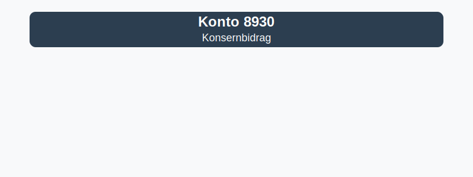

---
title: "Konto 8930 - Konsernbidrag"
meta_title: "8930-konsernbidrag"
meta_description: '**Konto 8930 - Konsernbidrag** er en konto i Norsk Standard Kontoplan som brukes til å registrere **konsernbidrag** mellom selskaper i et konsern.'
slug: 8930-konsernbidrag
type: blog
layout: pages/single
---

**Konto 8930 - Konsernbidrag** er en konto i Norsk Standard Kontoplan som brukes til å registrere **konsernbidrag** mellom selskaper i et konsern.



## Hva er konsernbidrag?

*Konsernbidrag* er en skattemessig ordning som tillater at overskudd i ett selskap i konsernet overføres til et annet selskap med underskudd, slik at konsernet kan optimere skatteposisjonen internt.

## Regnskapsføring av konsernbidrag

Ved bokføring av konsernbidrag skiller man mellom givende og mottakende selskap:

| Transaksjon                        | Debet                                     | Kredit                                  |
|------------------------------------|-------------------------------------------|-----------------------------------------|
| Givende selskap (utbetaling)       | Konto 8930 - Konsernbidrag                | Konto 1920 - Bankinnskudd               |
| Mottakende selskap (inntekt)       | Konto 1920 - Bankinnskudd                 | Konto 8930 - Konsernbidrag              |

## Skattemessig behandling

For at konsernbidrag skal være gyldig, må flere **vilkår** være oppfylt:

* Selskaper må være en del av samme **konsernstruktur**
* Det må være **formelle styrevedtak** i begge selskaper
* Bidraget må ikke overstige skattemessig inntektsgrunnlag i mottaker

## Eksempel på bokføring

Givende selskap yter konsernbidrag på 500 000 kr til datterselskap:

```plaintext
Debet: Konto 8930 - Konsernbidrag   500 000 kr
Kredit: Konto 1920 - Bankinnskudd    500 000 kr
```

## Relaterte artikler

* [Konto 8920 - Avsatt utbytte/renter grunnfondsbevis](/blogs/kontoplan/8920-avsatt-utbytte-renter-grunnfondsbevis "Konto 8920 - Avsatt utbytte/renter grunnfondsbevis: Avsetning av utbytte og renter på grunnfondsbevis")
* [Konto 8910 - Overføringsfond felleseid kapital samme foretak](/blogs/kontoplan/8910-overforingsfond-felleseid-kapital-samme-foretak "Konto 8910 - Overføringsfond felleseid kapital samme foretak: Intern overføring av kapital")
* [Konto 8900 - Overføringsfond vurderingsforskjeller](/blogs/kontoplan/8900-overforingsfond-vurderingsforskjeller "Konto 8900 - Overføringsfond vurderingsforskjeller: Overføring av vurderingsreserver til resultatregnskapet")
* [Konto 8940 - Aksjonærbidrag](/blogs/kontoplan/8940-aksjonaerbidrag "Konto 8940 - Aksjonærbidrag: Aksjonærbidrag mellom selskap og aksjonær")
* [Konto 8950 - Fondsemisjon](/blogs/kontoplan/8950-fondsemisjon "Konto 8950 - Fondsemisjon: Fondsemisjon i Norsk Standard Kontoplan")
* [Hva er Konsernbidrag?](/blogs/regnskap/hva-er-konsernbidrag "Hva er Konsernbidrag? Komplett Guide til Konsernbidrag i Norge")

