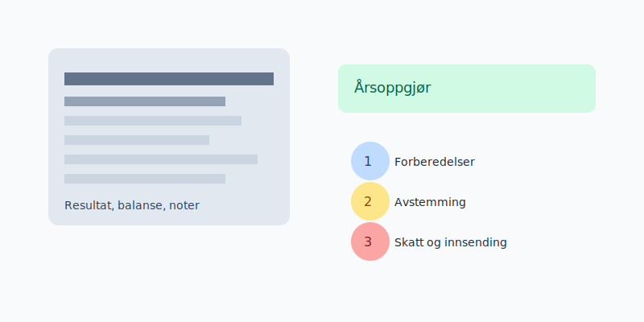
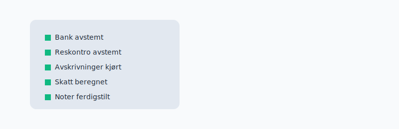

## Om kurset
Dette kurset tar deg gjennom hele prosessen med et komplett **årsoppgjør**: avstemming, periodisering, noteopplysninger, beregning av skatt, og innsending til **Altinn**.

## Hva du vil lære

- Hvordan sette opp tidslinje og sjekkliste for årsoppgjør
- Avstemming av bank, kunder, leverandører og mva
- Avskrivninger, nedskrivninger og vurderingsregler
- Skattemessige justeringer og beregning av betalbar og utsatt skatt
- Ferdigstillelse av årsregnskap, noter og innsending

## Kursplan

| Modul | Tema | Leveranser |
| --- | --- | --- |
| 1 | Forberedelser | Sjekkliste, periodisering |
| 2 | Avstemming | Bank, kundefordringer, leverandørgjeld |
| 3 | Anleggsmidler | Avskrivningsplan, saldolister |
| 4 | Skatt | Skatteberegning, midlertidige forskjeller |
| 5 | Rapportering | Resultat, balanse, noter, innsending |

## Praktisk sjekkliste

- Lås perioden etter avstemming
- Avstem alle reskontroer og bank
- Oppdater avskrivninger og vurder lager
- Beregn og bokfør skatt og MVA
- Generer rapporter og noter, send til signering

## Hvem passer kurset for?
Kurset passer for eiere av små bedrifter, økonomiansvarlige og nye **regnskapsførere** som vil ha en strukturert og praktisk tilnærming.

## Videre læring
- Grunnleggende bokføring: se [Regnskapskurs](/blogs/kurs/regnskapskurs)
- Lønn og arbeidsgiveravgift: se [Lønnskurs](/blogs/kurs/lonnskurs)
- Fakturering og purring: se [Fakturakurs](/blogs/kurs/fakturakurs)
