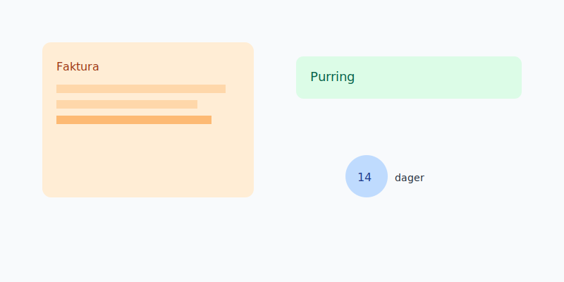

## Om kurset
Dette kurset dekker hele **fakturaprosessen**: fra utstedelse til oppfølging, purring og eventuell **inkasso**.

## Hva du vil lære

- Fakturaoppsett og lovkrav
- Tidsfrister, forfall og delbetaling
- Purring, purregebyr og renter
- Avtalegiro, EHF og eFaktura
- Rutiner for oppfølging og avskrivning

## Praktisk purreløp

| Trinn | Dager | Tiltak |
| --- | --- | --- |
| 1 | 0 | Faktura med 14 dagers forfall |
| 2 | 14 | Første purring med gebyr |
| 3 | 28 | Inkassovarsel |
| 4 | 42 | Oversendelse til inkasso |

## Neste steg
- Bokføring og MVA: se [Regnskapskurs](/blogs/kurs/regnskapskurs)
- Lønn og rapportering: se [Lønnskurs](/blogs/kurs/lonnskurs)
- Årsoppgjør og innsending: se [Årsoppgjørskurs](/blogs/kurs/arsoppgjor-kurs)
